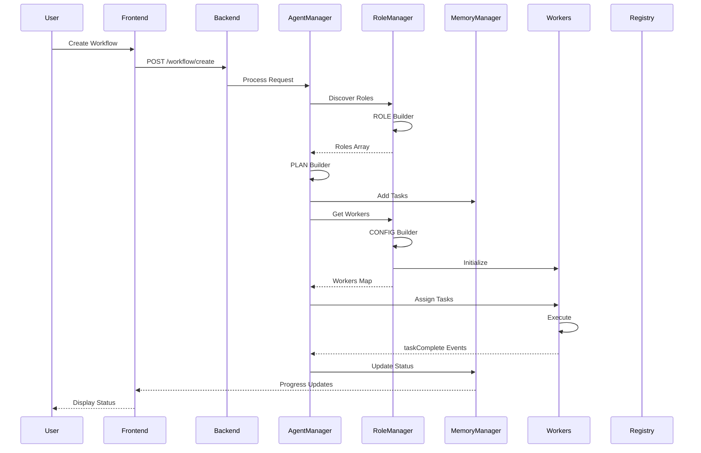

# Ping Documentation Index

## Product Overview
**Ping** is a multi-agent collaboration platform with two integrated modes:
- **Design Mode** (Team Builder) - Create and synthesize agents using Role Manager meta-agent
- **Execution Mode** (Orchestrator) - Orchestrate teams, supervise agents, manage artifacts

> **For Archived Planning Docs**: See [Archive](./archive/) | Legacy docs moved during refactoring

---

## Quick Navigation

### 👥 Product Documentation (User-Facing)
- **[Getting Started](./product/ping/guides/getting-started.md)** - Installation and first steps
- **[Creating Teams](./product/ping/guides/creating-teams.md)** - Team setup and management
- **[Designing Agents](./product/ping/guides/designing-agents.md)** - Using Team Builder
- **[Reviewing Artifacts](./product/ping/guides/reviewing-artifacts.md)** - Approval workflows
- **[Orchestrator API](./product/ping/api/orchestrator-api.md)** - Give goals to teams
- **[Team API](./product/ping/api/team-api.md)** - Manage teams and agents
- **[Artifact API](./product/ping/api/artifact-api.md)** - Access artifacts
- **[WebSocket Events](./product/ping/api/websocket-events.md)** - Real-time agent chat

### 🔧 Developer Guide (Implementation)
- **[Monorepo Architecture](./developer-guide/monorepo-architecture.md)** - pnpm workspace structure
- **[Current State to Ping](./developer-guide/current-state-to-ping.md)** - Migration roadmap
- **[Backend Modules](./developer-guide/modules/)** - Core components
  - [Orchestrator](./developer-guide/modules/orchestrator.md) (AgentManager)
  - [Role Manager](./developer-guide/modules/role-manager.md) (Agent registry)
  - [Memory Manager](./developer-guide/modules/memory-manager.md) (Task tracking)
  - [Agent Worker](./developer-guide/modules/agent-worker.md) (Execution engine)
- **[Frontend](./developer-guide/frontend/)** - Ping UI components
  - [Overview](./developer-guide/frontend/overview.md)
  - [Components](./developer-guide/frontend/components.md)
- **[Patterns](./developer-guide/patterns/)** - Design patterns
- **[Setup](./developer-guide/setup/)** - Development environment

### 🚀 Features (Development Tracking)
**MVP Features** (In Development):
- **[Team Service](./features/team-service/)** - Team scoping & membership (Option A chosen)
- **[Artifact Store](./features/artifact-store/)** - Versioned outputs (Git + S3) - TBD
- **[Real-Time Collaboration](./features/realtime-collaboration/)** - ShareDB + OT/CRDT - TBD
- **[Approval & Governance](./features/approval-governance/)** - Human control layer - TBD
- **[Role Manager Meta-Agent](./features/role-manager-meta-agent/)** - Agent synthesis (Think/Plan/Suggest/Build) - TBD

**Existing Features** (To Be Refactored):
- **Database Persistence** - From [REHYDRATION_STRATEGY.md](./archive/REHYDRATION_STRATEGY.md)
- **Role Discovery** - From [ROLE_DISCOVERY_ENHANCEMENT.md](./archive/ROLE_DISCOVERY_ENHANCEMENT.md)
- **Agent Manager Service** - From [AGENTMANAGERSERVICE_INTEGRATION.md](./archive/AGENTMANAGERSERVICE_INTEGRATION.md)
- **Ping UI Integration** - From [BACKEND_FRONTEND_INTEGRATION.md](./archive/BACKEND_FRONTEND_INTEGRATION.md)

### 📚 Archive
- **[Archived Planning Docs](./archive/)** - Old vision, architecture, and planning documents
  - `ping-vision.md`, `ping-architecture.md`, `ping-team-builder.md` (moved from docs/ping/)
  - `REHYDRATION_STRATEGY.md`, `ROLE_DISCOVERY_ENHANCEMENT.md` (to be transformed into features)
  - Old backend/frontend documentation

---

## System Architecture (High-Level)

```
┌─────────────────────────────────────────────────────────────┐
│                     PING PLATFORM                            │
├─────────────────────────────────────────────────────────────┤
│                                                               │
│  ┌───────────────────┐        ┌───────────────────┐         │
│  │  DESIGN MODE      │        │  EXECUTION MODE   │         │
│  │  (Team Builder)   │───────▶│  (Runtime)        │         │
│  └───────────────────┘        └───────────────────┘         │
│         │                              │                     │
│         │ Role Manager                 │ Teams               │
│         │ Meta-Agent                   │ Orchestration       │
│         │ Agent Synthesis              │ Supervision         │
│         │                              │ Artifacts           │
│         └──────────────────────────────┘                     │
│                                                               │
└─────────────────────────────────────────────────────────────┘
│  │              Worker Runtime System                  │     │
│  │  ┌──────────────┐  ┌─────────────┐  ┌──────────┐ │     │
│  │  │AgentManager  │→ │RoleManager  │→ │Workers   │ │     │
│  │  │- Orchestrate │  │- Discover   │  │- Execute │ │     │
│  │  │- Plan Tasks  │  │- Configure  │  │- Emit    │ │     │
│  │  │- Coordinate  │  │- Initialize │  │  Events  │ │     │
│  │  └──────────────┘  └─────────────┘  └──────────┘ │     │
│  │         ↕                                          │     │
│  │  ┌──────────────────────────────────────────┐     │     │
│  │  │         MemoryManager                     │     │     │
│  │  │  • Task Storage                          │     │     │
│  │  │  • Dependency Tracking                   │     │     │
│  │  │  • Status Management                     │     │     │
│  │  └──────────────────────────────────────────┘     │     │
│  └────────────────────────────────────────────────────┘     │
└─────────────────────────────────────────────────────────────┘
                            ↕ HTTP
┌─────────────────────────────────────────────────────────────┐
│                      Services Layer                          │
│  ┌────────────────────────────────────────────────────┐     │
│  │           Agent Registry Service                    │     │
│  │  • Semantic Agent Discovery                        │     │
│  │  • Capability Matching (Vector Search)             │     │
│  │  • Agent Registration                              │     │
│  │  • MongoDB + Azure OpenAI Embeddings               │     │
│  └────────────────────────────────────────────────────┘     │
└─────────────────────────────────────────────────────────────┘
```

## Technology Stack

### Frontend
| Component | Technology |
|-----------|-----------|
| UI Framework | React 19.2.0 |
| Language | TypeScript 5.8.2 |
| Build Tool | Vite 6.2.0 |
| Desktop App | Electron 39.2.6 |
| Real-time | Socket.IO Client 4.8.1 |
| AI Integration | Google Gemini API |
| Icons | lucide-react |

### Backend Worker
| Component | Technology |
|-----------|-----------|
| Runtime | Node.js with TypeScript |
| Agent Framework | LangGraph |
| LLM | Azure OpenAI (GPT-4) |
| Tools | MCP (Model Context Protocol) |
| Checkpointing | MemorySaver |
| Logging | tslog |

### Agent Registry
| Component | Technology |
|-----------|-----------|
| Database | MongoDB |
| ORM | Mongoose |
| Embeddings | Azure OpenAI (text-embedding-3-small) |
| API Framework | Express.js |
| Vector Search | Cosine Similarity |

## Core Concepts

### 1. Multi-Agent Orchestration
The system dynamically discovers roles, plans tasks, and coordinates multiple AI agents to solve complex problems collaboratively.

**Workflow**:
```
User Request → Role Discovery → Config Generation → Worker Init
→ Plan Generation → Task Assignment → Parallel Execution → Completion
```

### 2. Dynamic Role Discovery
Instead of predefined roles, the system uses a ROLE Builder (LLM-based) to identify necessary roles based on the task description.

**Example**:
```
Task: "Create a blog post about AI"
Roles Discovered: [ResearchAgent, WriterAgent, EditorAgent]
```

### 3. Task Dependencies
Tasks can have prerequisites, enabling complex execution flows:

```typescript
// Sequential
Task 1 (Research) → Task 2 (Write) → Task 3 (Edit)

// Parallel with Merge
Task 1 (Research A) ─┐
Task 2 (Research B) ─┼→ Task 3 (Combine)
Task 3 (Research C) ─┘
```

### 4. Event-Driven Execution
Workers execute tasks asynchronously and emit completion events, enabling non-blocking orchestration.

### 5. Semantic Agent Discovery
Agent Registry uses vector embeddings to match agents with required capabilities, going beyond keyword matching to understand semantic similarity.

## Data Flow

### Complete Request Flow



## Component Responsibilities

### Frontend (AgentChat)
- **UI Layer**: Agent hierarchy, chat interface, task management
- **Real-time Updates**: WebSocket connection for live orchestration monitoring
- **Agent Management**: Create, edit, organize agents and sub-agents
- **Workflow Monitoring**: Display active agents, logs, and progress

### Backend (Worker Runtime)
- **AgentManager**: Orchestrates the entire workflow
- **RoleManager**: Discovers roles, generates configs, initializes workers
- **MemoryManager**: Tracks tasks, dependencies, and execution state
- **AgentWorker**: Executes tasks, maintains context, emits events
- **Agent**: Wraps LangGraph agent with Azure OpenAI and MCP tools

### Services (Agent Registry)
- **Registration**: Store agent metadata and capabilities
- **Discovery**: Find agents by semantic capability matching
- **Matching**: Score agents using vector similarity and skill levels
- **Status**: Track agent availability and health

## Key Features

### ✅ Dynamic Role Discovery
System automatically determines which agent roles are needed for any task.

### ✅ Automatic Task Planning
PLAN Builder creates execution plans with proper dependencies and sequencing.

### ✅ Parallel Execution
Independent tasks execute concurrently for optimal performance.

### ✅ Dependency Management
Complex task dependencies handled automatically with prerequisite tracking.

### ✅ Real-time Monitoring
WebSocket-based live updates of agent status and orchestration events.

### ✅ Semantic Discovery
Find agents using natural language capability descriptions.

### ✅ Context Preservation
Each worker maintains conversation history for contextual responses.

### ✅ Event-Driven Architecture
Non-blocking execution with event-based coordination.

### ✅ Extensible Tool System
MCP integration for dynamic tool loading and execution.

### ✅ Structured Outputs
Enforced response schemas ensure consistent agent outputs.

## Getting Started

### Prerequisites
```bash
# Node.js 18+
node --version

# MongoDB (for Agent Registry)
mongod --version

# Azure OpenAI API Key
# Set in .env files
```

### Installation

#### 1. Frontend
```bash
cd src/AgentChat
npm install
npm run dev
```

#### 2. Backend Worker
```bash
cd src/worker
npm install
npm run build
npm start
```

#### 3. Agent Registry
```bash
cd src/agentRegistry
npm install
npm run build
npm start
```

### Configuration

Create `.env` files in each directory:

**Frontend** (`src/AgentChat/.env`):
```env
VITE_BACKEND_URL=http://localhost:3002
VITE_GEMINI_API_KEY=your_key
```

**Backend** (`src/worker/.env`):
```env
AZURE_OPENAI_ENDPOINT_URL=https://your-endpoint.openai.azure.com
AZURE_OPENAI_API_KEY=your_key
AZURE_OPENAI_API_DEPLOYMENT_NAME=gpt-4
AZURE_OPENAI_API_VERSION=2024-02-15-preview
```

**Registry** (`src/agentRegistry/.env`):
```env
AZURE_OPENAI_EMBEDDINGS_ENDPOINT_URL=https://your-endpoint.openai.azure.com
AZURE_OPENAI_EMBEDDINGS_API_KEY=your_key
MONGODB_URI=mongodb://localhost:27017/agentregistry
```

## Development Workflow

### 1. Create New Feature
- Define task in frontend
- Backend discovers roles automatically
- Plan generated and executed
- Monitor in real-time

### 2. Add Custom Agent
- Define capabilities in Agent Registry
- Register with semantic descriptions
- System discovers automatically when needed

### 3. Debug Workflow
- Check frontend console for WebSocket events
- Review backend logs (tslog)
- Inspect MemoryManager state
- Monitor Agent Registry matches

## API Reference

### Frontend → Backend

#### WebSocket Events
```typescript
// Subscribe to agent
socket.emit('subscribe:agent', { agentRole: 'researcher' });

// Send message
socket.emit('message:agent', { 
  agentRole: 'researcher', 
  content: 'Research topic', 
  messageId: '123' 
});

// Receive updates
socket.on('agent:message', (data) => { /* ... */ });
socket.on('agent:status', (data) => { /* ... */ });
socket.on('orchestration:log', (data) => { /* ... */ });
```

#### HTTP Endpoints
```typescript
// Create workflow
POST /api/workflow/create
Body: { workflowGoal: "Create blog post" }

// Start workflow
POST /api/workflow/start
Body: { workflowId: "123" }
```

### Backend → Agent Registry

#### HTTP Endpoints
```typescript
// Register agent
POST /agents/register
Body: { name, description, capabilities, endpoint }

// Discover agents
GET /agents/discover?capabilities=[...]

// Get agent details
GET /agents/:id
```

## Testing

### Unit Tests
```bash
# Backend
cd src/worker
npm test

# Frontend
cd src/AgentChat
npm test

# Registry
cd src/agentRegistry
npm test
```

### Integration Tests
```bash
# Full workflow test
npm run test:integration
```

### Manual Testing
1. Start all services
2. Open frontend (http://localhost:5173)
3. Create workflow
4. Monitor orchestration panel
5. Verify task completion

## Troubleshooting

### Common Issues

#### 1. WebSocket Connection Failed
- Check backend is running on correct port
- Verify CORS settings
- Check firewall rules

#### 2. Agent Initialization Failed
- Verify Azure OpenAI credentials
- Check deployment name matches
- Ensure API version is correct

#### 3. No Agents Found in Registry
- Check MongoDB is running
- Verify agent registration succeeded
- Lower similarity threshold

#### 4. Task Stuck in Pending
- Check dependencies are correct
- Verify prerequisite tasks completed
- Inspect MemoryManager state

#### 5. Missing thread_id Error
- Ensure all `agent.invoke()` calls include `{ configurable: { thread_id } }`

## Best Practices

### Frontend
1. Subscribe to agents before sending messages
2. Clean up event listeners on unmount
3. Handle connection loss gracefully
4. Use TypeScript for type safety

### Backend
1. Always pass `thread_id` to agent.invoke()
2. Use lowercase for role keys
3. Subscribe with `once()` for one-time events
4. Handle builder failures with fallbacks

### Agent Registry
1. Write detailed capability descriptions
2. Choose appropriate skill levels
3. Update agent status regularly
4. Include relevant metadata

## Performance Tips

### Frontend
- Debounce user inputs
- Lazy load components
- Memoize expensive computations
- Implement virtual scrolling for large lists

### Backend
- Reuse worker instances
- Cache builder results
- Use parallel task execution
- Implement message pruning

### Registry
- Enable embedding caching
- Use batch operations
- Optimize MongoDB indexes
- Implement pagination

## Deployment

### Production Checklist
- [ ] Environment variables configured
- [ ] MongoDB indexes created
- [ ] CORS settings updated
- [ ] SSL certificates installed
- [ ] Logging configured
- [ ] Health checks enabled
- [ ] Monitoring setup
- [ ] Backup strategy in place

### Scaling Considerations
- Horizontal scaling: Multiple worker instances
- Load balancing: Distribute across agents
- Database: MongoDB replica set
- Caching: Redis for embeddings
- CDN: Static assets

## Contributing

### Code Style
- Use TypeScript strict mode
- Follow existing patterns
- Add JSDoc comments
- Include unit tests

### Pull Request Process
1. Fork repository
2. Create feature branch
3. Add tests
4. Update documentation
5. Submit PR with description

## Resources

### Documentation
- [LangGraph Docs](https://langchain-ai.github.io/langgraph/)
- [Azure OpenAI Docs](https://learn.microsoft.com/azure/ai-services/openai/)
- [MCP Docs](https://modelcontextprotocol.io/)
- [React Docs](https://react.dev/)

### Related Projects
- [LangChain](https://github.com/langchain-ai/langchain)
- [Model Context Protocol](https://github.com/modelcontextprotocol)
- [Socket.IO](https://socket.io/)

## License
[Your License Here]

## Support
For issues, questions, or contributions, please refer to the respective documentation sections or open an issue in the repository.

---

**Last Updated**: December 20, 2025
**Version**: 1.0.0
