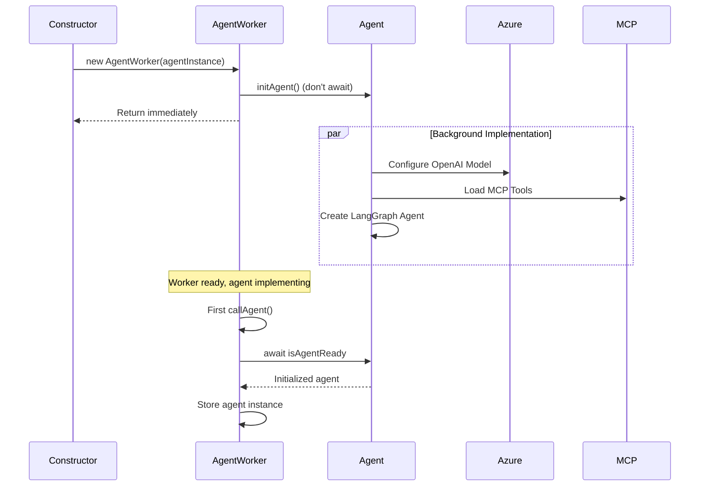

# Agent Implementation

## Overview
Agent implementation is an asynchronous process that sets up the LangGraph agent with Azure OpenAI, MCP tools, and checkpointing capabilities.

## Implementation Flow



## Lazy Implementation Pattern

### Why Lazy?
1. **Non-blocking Constructor**: Worker can be created immediately
2. **Parallel Implementation**: Multiple workers can initialize concurrently
3. **Error Isolation**: Implementation errors don't prevent worker creation
4. **Resource Efficiency**: Only initialize when first task arrives

### Implementation

```typescript
class AgentWorker {
  private agent: any;
  private isAgentReady: Promise<any>;
  
  constructor(agentInstance: Agent) {
    // Start implementation (non-blocking)
    this.isAgentReady = agentInstance.initAgent();
    
    // Constructor returns immediately
    // Agent implements in background
  }
  
  private async callAgent(input: string, thread_id: string) {
    // First call: await implementation
    if (!this.agent) {
      logger.debug("Awaiting agent implementation...");
      try {
        this.agent = await this.isAgentReady;
      } catch (initErr) {
        logger.error("Agent implementation failed:", initErr);
        return { error: `Implementation failed: ${initErr}` };
      }
    }
    
    // Subsequent calls: agent already implemented
    // ... proceed with invocation
  }
}
```

## Implementation Steps

### 1. Azure OpenAI Model Setup
```typescript
const model = new ChatOpenAI({
  azureOpenAIEndpoint: process.env.AZURE_OPENAI_ENDPOINT_URL,
  azureOpenAIApiKey: process.env.AZURE_OPENAI_API_KEY,
  azureOpenAIApiDeploymentName: process.env.AZURE_OPENAI_API_DEPLOYMENT_NAME,
  azureOpenAIApiVersion: process.env.AZURE_OPENAI_API_VERSION,
  temperature: 0.7,
  maxTokens: 2000
});
```

### 2. MCP Tools Loading (Optional)
```typescript
if (agentConfig.mcpClientConfigs) {
  const mcpClient = new MultiServerMCPClient(agentConfig.mcpClientConfigs);
  await mcpClient.connect();
  const tools = await mcpClient.getTools();
  // Bind tools to model
}
```

### 3. Response Format Binding
```typescript
if (agentConfig.responseFormat) {
  model = model.withStructuredOutput(agentConfig.responseFormat);
}
```

### 4. LangGraph Agent Creation
```typescript
const checkpointer = new MemorySaver();
const agent = createReactAgent({
  llm: model,
  tools: tools,
  checkpointer: checkpointer
});
```

### 5. Middleware Setup
```typescript
// Add response extraction middleware
// Add error handling middleware
```

<!-- ## Implementation Timing -->

<!-- ### Typical Duration
- **Without MCP Tools**: 500-1000ms
- **With MCP Tools**: 1000-2000ms
- **Network Issues**: 3000-5000ms -->

### Optimization Strategies

#### 1. Parallel Worker Implementation
```typescript
// Initialize multiple workers concurrently
const workers = await Promise.all(
  roles.map(role => {
    const agent = new Agent(configForRole[role]);
    return new AgentWorker(agent);  // Returns immediately
  })
);

// All agents initialize in parallel
```

#### 2. Pre-warming
```typescript
// Start implementation early
const worker = new AgentWorker(agent);  // Starts init

// Do other work
await someOtherSetup();

// By now, agent might be ready
await worker.createTask("First task");  // Minimal wait
```

#### 3. Connection Pooling
Reuse MCP client connections across multiple agents.

## Error Handling

### Common Implementation Errors

#### 1. Invalid Credentials
```typescript
Error: Azure OpenAI authentication failed
```

**Solution**: Verify `.env` credentials

#### 2. Network Timeout
```typescript
Error: Connection timeout after 30000ms
```

**Solution**: Check network connectivity, increase timeout

#### 3. Invalid Deployment
```typescript
Error: Deployment 'gpt-5' not found
```

**Solution**: Verify deployment name matches Azure configuration

#### 4. MCP Tool Loading Failure
```typescript
Error: Failed to connect to MCP server
```

**Solution**: Check MCP server command and arguments

## Best Practices

### 1. Validate Configuration Before Implementation
```typescript
function validateConfig(config: AgentConfig) {
  if (!config.role) throw new Error("Role required");
  if (!config.systemPrompt) throw new Error("System prompt required");
  if (!process.env.AZURE_OPENAI_API_KEY) {
    throw new Error("Azure API key missing");
  }
}

validateConfig(agentConfig);
const agent = new Agent(agentConfig);
```
<!-- ## Testing Implementation

### Unit Test
```typescript
describe('Agent Implementation', () => {
  it('should implement successfully', async () => {
    const agent = new Agent(validConfig);
    const worker = new AgentWorker(agent);
    
    // Trigger implementation
    await worker.createTask("Test");
    
    // Verify agent implemented
    expect(worker['agent']).toBeDefined();
  });
  
  it('should handle implementation failure', async () => {
    const agent = new Agent(invalidConfig);
    const worker = new AgentWorker(agent);
    
    const result = await worker['callAgent']("Test", "1");
    
    expect(result.error).toBeDefined();
    expect(result.error).toContain("implementation failed");
  });
});
```

### Integration Test
```typescript
it('should implement with MCP tools', async () => {
  const configWithMCP = {
    ...baseConfig,
    mcpClientConfigs: {
      filesystem: { /* ... */ }
    }
  };
  
  const agent = new Agent(configWithMCP);
  const worker = new AgentWorker(agent);
  
  await worker.createTask("List files");
  
  // Verify tools loaded
  expect(worker['agent']).toBeDefined();
});
``` -->

## Related Documentation

- [Agent Overview](./README.md)
- [LangGraph Integration](./langgraph-integration.md)
- [Error Handling](./error-handling.md)
