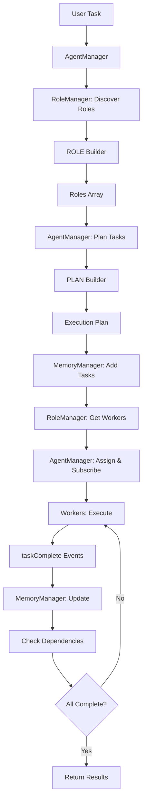

# AgentManager - Core Orchestrator

## Overview
AgentManager is the top-level orchestrator that coordinates multi-agent initialization, task assignment, and communication. It manages the entire workflow from role discovery to task completion.

## Location
`src/worker/agentManager/agentManager.ts`

## Architecture

```
AgentManager
├── RoleManager      # Role discovery and worker management
├── MemoryManager    # Task storage and dependency tracking
└── EventEmitter     # Event-driven communication
```

## Responsibilities

### 1. Role Discovery
Determines which agent roles are needed for a given task.

```typescript
// Delegates to RoleManager
const roles = await this.roleManager.getRoles(taskDescription);
```

### 2. Execution Planning
Generates coordinated task plans with dependencies and priorities.

```typescript
const plan = await this.planTasksForRoles(taskDescription, roles);
// Returns: { tasks: [...], rationale: "..." }
```

### 3. Task Assignment
Distributes tasks to appropriate workers based on roles and readiness.

```typescript
await this.assignTasksToWorkers(plan.tasks);
```

### 4. Event Coordination
Subscribes to task completion events and updates dependencies.

```typescript
worker.events.once('taskComplete', (data) => {
  this.memoryManager.completeTask(taskId, data.content);
});
```

### 5. Completion Monitoring
Waits for all tasks to complete and provides final output.

```typescript
await this.waitForCompletion();
```

## Key Methods

### planTasksForRoles()
Generates execution plan using PLAN Builder.

**Signature**:
```typescript
async planTasksForRoles(
  taskDescription: string,
  roles: RoleDescriptor[]
): Promise<Plan>
```

**Input**:
- `taskDescription`: Overall goal to accomplish
- `roles`: Array of discovered roles

**Output**:
```typescript
{
  tasks: [
    {
      role: "ResearchAgent",
      task: "Research topic X",
      dependencies: []
    },
    {
      role: "WriterAgent",
      task: "Write article based on research",
      dependencies: ["task-1"]
    }
  ],
  rationale: "Research must complete before writing"
}
```

**Fallback**: If plan builder fails, creates default single-task plan for each role.

### assignTasksToWorkers()
Assigns tasks to workers and subscribes to completion events.

**Signature**:
```typescript
async assignTasksToWorkers(tasks: PlanTask[]): Promise<void>
```

**Process**:
1. For each task:
   - Add to MemoryManager with status based on dependencies
   - Get appropriate worker from RoleManager
   - Subscribe to worker's `taskComplete` event
   - Execute task (non-blocking)

**Non-blocking Execution**:
Tasks execute asynchronously. AgentManager doesn't wait for completion in this method.

### waitForCompletion()
Polls MemoryManager until all tasks complete.

**Signature**:
```typescript
async waitForCompletion(pollInterval: number = 1000): Promise<void>
```

**Behavior**:
- Checks `memoryManager.isComplete()` every `pollInterval` ms
- Resolves when all tasks reach `completed` status
- Does not handle failures explicitly (tasks remain in `failed` state)

## Data Flow



## Integration with Other Components

### RoleManager
```typescript
// Get roles for task
const roles = await this.roleManager.getRoles(taskDescription);

// Get initialized workers
const workers = await this.roleManager.getRoleWorkers(taskDescription);
```

### MemoryManager
```typescript
// Add task with dependencies
this.memoryManager.addTask({
  id: taskId,
  description: task.description,
  assigned_role: task.role.toLowerCase(),
  status: hasDependencies ? 'pending' : 'ready',
  prerequisites: new Map(dependencies),
  dependants: []
});

// Update on completion
this.memoryManager.completeTask(taskId, outputData);

// Check if all done
const allComplete = this.memoryManager.isComplete();
```

### AgentWorker
```typescript
// Subscribe to completion
worker.events.once('taskComplete', (data) => {
  this.memoryManager.completeTask(taskId, data.content);
});

// Execute task
worker.createTask(taskDescription);
```

## Event System

AgentManager uses EventEmitter for internal coordination.

**Event Types**:
- `taskComplete`: Emitted by workers when task finishes
- Custom events can be added for inter-agent communication

**Example**:
```typescript
// Subscribe to event
agentManager.events.on('customEvent', (data) => {
  console.log('Custom event received:', data);
});

// Emit event
agentManager.events.emit('customEvent', { message: 'Hello' });
```

## Configuration

### Initialization
```typescript
const agentManager = new AgentManager();
// Automatically initializes:
// - MemoryManager (task storage)
// - RoleManager (role & worker management)
// - EventEmitter (event coordination)
```

### Availability Flag
```typescript
agentManager.isAvailable; // true when ready to accept tasks
```

## Usage Example

### Basic Workflow
```typescript
import { AgentManager } from './agentManager/agentManager';

async function runWorkflow(userGoal: string) {
  const agentManager = new AgentManager();
  
  // 1. Discover roles
  const roles = await agentManager.roleManager.getRoles(userGoal);
  console.log('Roles:', roles.map(r => r.name));
  
  // 2. Generate plan
  const plan = await agentManager.planTasksForRoles(userGoal, roles);
  console.log('Plan:', plan);
  
  // 3. Initialize workers
  const workers = await agentManager.roleManager.getRoleWorkers(userGoal);
  console.log('Workers initialized:', Object.keys(workers));
  
  // 4. Assign tasks
  await agentManager.assignTasksToWorkers(plan.tasks);
  console.log('Tasks assigned');
  
  // 5. Wait for completion
  await agentManager.waitForCompletion();
  console.log('All tasks completed');
  
  // 6. Get results (if needed, query MemoryManager)
  const completedTasks = Array.from(agentManager.memoryManager['tasks'].values())
    .filter(t => t.status === 'completed');
  console.log('Results:', completedTasks.map(t => t.output));
}

// Execute
runWorkflow("Create a blog post about AI agents").catch(console.error);
```

### Advanced: Custom Event Handling
```typescript
const agentManager = new AgentManager();

// Add custom event listener
agentManager.events.on('taskProgress', (data) => {
  console.log(`Task ${data.taskId} progress: ${data.progress}%`);
});

// In worker, emit progress events
worker.events.emit('taskProgress', { taskId: '123', progress: 50 });
```

## Error Handling

### Builder Failures
- ROLE Builder: Falls back to single `GeneralAgent`
- CONFIG Builder: Skips role if config generation fails
- PLAN Builder: Uses default single-task plan per role

### Task Failures
- Tasks marked as `failed` in MemoryManager
- Dependent tasks remain `pending`
- `waitForCompletion()` continues indefinitely

**Recommendation**: Add timeout to `waitForCompletion()`:
```typescript
async waitForCompletion(pollInterval = 1000, timeout = 300000) {
  const startTime = Date.now();
  while (!this.memoryManager.isComplete()) {
    if (Date.now() - startTime > timeout) {
      throw new Error('Workflow timeout');
    }
    await new Promise(resolve => setTimeout(resolve, pollInterval));
  }
}
```

## Best Practices

### 1. Role Naming
Always use lowercase for role keys to ensure worker lookup works:
```typescript
task.assigned_role = role.name.toLowerCase();
```

### 2. Dependency Management
Ensure dependencies reference valid task IDs:
```typescript
prerequisites: new Map(dependencies.map(depId => [depId, false]))
```

### 3. Event Cleanup
Use `once()` instead of `on()` for one-time events:
```typescript
worker.events.once('taskComplete', handler); // Auto-removes
```

### 4. Error Logging
Log errors but don't stop execution:
```typescript
try {
  await worker.createTask(task);
} catch (error) {
  logger.error(`Task failed: ${error}`);
  // Continue with other tasks
}
```

## Testing

### Unit Test Example
```typescript
import { AgentManager } from './agentManager';

describe('AgentManager', () => {
  it('should initialize with required components', () => {
    const manager = new AgentManager();
    expect(manager.memoryManager).toBeDefined();
    expect(manager.roleManager).toBeDefined();
    expect(manager.isAvailable).toBe(true);
  });
  
  it('should generate plan for roles', async () => {
    const manager = new AgentManager();
    const roles = [{ name: 'TestRole', goal: 'Test' }];
    const plan = await manager.planTasksForRoles('Test task', roles);
    expect(plan.tasks).toHaveLength(1);
  });
});
```

## Debugging

### Enable Verbose Logging
```typescript
import { Logger } from 'tslog';
const logger = new Logger({ name: "AgentManager", minLevel: "debug" });
```

### Inspect Internal State
```typescript
// Check current tasks
const tasks = Array.from(agentManager.memoryManager['tasks'].values());
console.log('Tasks:', tasks);

// Check active workers
const workers = agentManager.roleManager.roleWorkers;
console.log('Workers:', Object.keys(workers));
```

### Monitor Events
```typescript
// Log all events
agentManager.events.on('*', (event, data) => {
  console.log(`Event: ${event}`, data);
});
```

## Performance Optimization

### Parallel Task Execution
Tasks with no dependencies execute in parallel automatically:
```typescript
// These run concurrently
{ role: "Role1", dependencies: [] }
{ role: "Role2", dependencies: [] }
```

### Reuse Workers
Workers are reused for multiple tasks of the same role:
```typescript
// Same worker handles both tasks
{ role: "Role1", task: "Task 1" }
{ role: "Role1", task: "Task 2" }
```

## Future Enhancements

1. **Dynamic Role Adjustment**: Add/remove roles during execution
2. **Inter-Agent Messaging**: Direct communication between workers
3. **Hierarchical Orchestration**: Nested agent managers
4. **Rollback/Retry**: Automatic retry on failure
5. **Streaming Results**: Real-time output as tasks complete

## Related Files

- [RoleManager](./roleManager.md)
- [MemoryManager](./memoryManager.md)
- [AgentWorker](./agentWorker.md)
- [Agent Builders](./agentBuilder/README.md)
