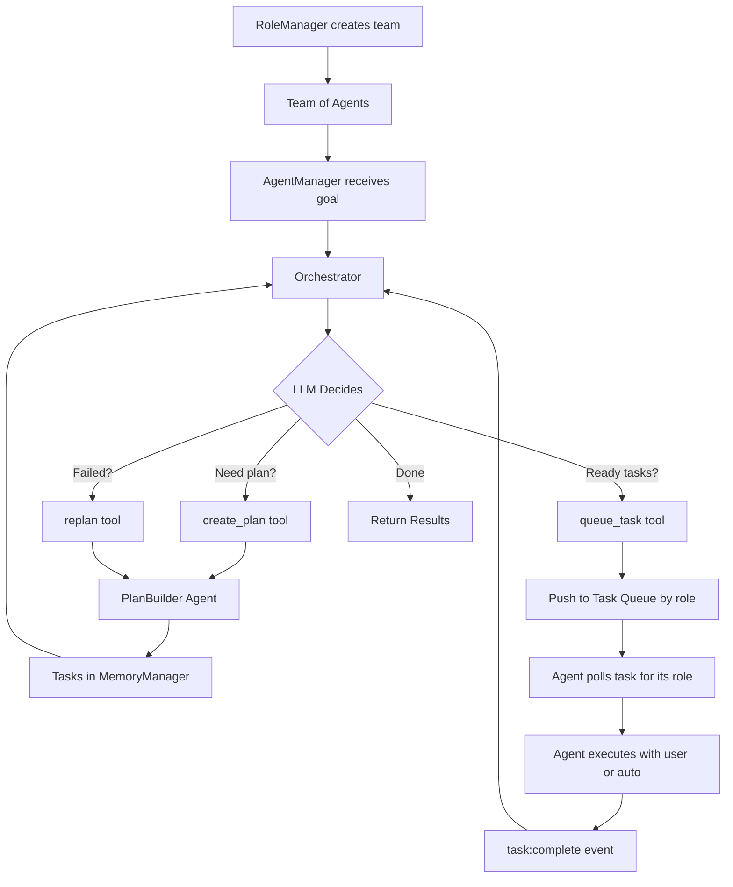

# AgentManager - Team Coordinator

> **Architecture Decision (Jan 22, 2026):** 
> - **RoleManager** creates agents and registers them as a team
> - **AgentManager** coordinates the team: plans tasks, distributes work
> - **Orchestrator** is AgentManager's brain — its tools invoke other agents
> - **Tools = Agent Calls** — `create_plan` calls PlanBuilder agent, `queue_task` adds to TaskQueue

## Overview

**Clear Separation of Concerns:**

| Component | Responsibility |
|-----------|----------------|
| **RoleManager** | Creates agents, registers them as team |
| **AgentManager** | Coordinates team (plan, distribute, chat) |
| **Orchestrator** | AgentManager's brain — tools call agents |

**AgentManager supports two interaction modes:**

| Mode | Purpose | Entry Point |
|------|---------|-------------|
| **Chat Mode** | User talks directly to a team agent | `chatWithAgent(agentId, message)` |
| **Goal Mode** | User gives a goal, team works on it | `handleGoal(teamId, goal)` |

### What AgentManager Holds:
1. `teamAgents` - Map of agents in the team (created by RoleManager)
2. `Orchestrator` - Brain that plans and distributes tasks
3. `MemoryManager` - Task state tracking
4. `AgentFactory` - Creates agents when needed

## Location
`src/worker/agentManager/agentManager.ts`

## Architecture

```
┌─────────────────────────────────────────────────────────────┐
│                      RoleManager                             │
│  • Decides what agents are needed                            │
│  • Uses RoleBuilder agent + ConfigBuilder agent              │
│  • Registers agents as team                                  │
└────────────────────────┬────────────────────────────────────┘
                         │ Team of agents
                         ▼
┌─────────────────────────────────────────────────────────────┐
│  AgentManager                                                │
│  ├── teamAgents: Map<agentId, IAgent>  ← Team members       │
│  ├── orchestrator: InternalAgent       ← Brain               │
│  ├── memoryManager: MemoryManager      ← Task state          │
│  │                                                           │
│  ├── chatWithAgent(agentId, message)   ← Direct chat        │
│  └── handleGoal(teamId, goal)          ← Coordinate team    │
└────────────────────────┬────────────────────────────────────┘
                         │
         ┌───────────────┴───────────────┐
         │                               │
         ▼                               ▼
┌─────────────────────┐      ┌─────────────────────────────────┐
│  MODE 1: Chat       │      │  MODE 2: Orchestrator           │
│                     │      │                                  │
│  User ↔ Agent       │      │  ACTIVE COORDINATION:            │
│  Conversation       │      │  • Assign tasks to agents        │
│  Direct messaging   │      │  • Sync context between agents   │
└─────────────────────┘      │  • Collect & sync artifacts      │
                             └─────────────────────────────────┘
```

### Orchestrator's Core Jobs

**1. Task Queue Management**
- Central **TaskQueue** organized by role
- Orchestrator adds tasks via `queue_task` tool
- Agents **poll** tasks for their role
- Agents can maintain their own internal queue for tracking

**2. Agent Execution Modes**

| Mode | How It Works | Task Ends When |
|------|--------------|----------------|
| **Interactive** (default) | User chats with agent | User says "done" or closes session |
| **Auto** | Agent works independently | Agent completes the work |

**3. Context Sync (Event-Driven)**
```
Agent A (writer)                    Orchestrator                    Agent B (editor)
     │                                   │                               │
     │ ─── task:complete event ───────▶│                               │
     │                                   │── gathers context ─▶          │
     │                                   │                               │
     │                                   │── queue_task (by role) ────▶ TaskQueue
     │                                   │                               │ polls
     │                                   │                               ▼
     │                                   │   (Agent B polls & executes) │
```

**4. Artifact Sync**
- Listens for `task:complete` events from agents
- Stores outputs in ArtifactStore
- Passes context when task is queued (not at execution time)

### Two User Journeys

**Journey 1: Direct Agent Chat**
```
User: "Hey code-analyzer, review this function"
      ↓
AgentManager.chatWithAgent('code-analyzer', message)
      ↓
teamAgents.get('code-analyzer') → agent.execute(message)
      ↓
Agent responds directly to user
```

**Journey 2: Goal Orchestration (Multi-Task)**
```
User: "Build a marketing campaign for Product X"
      ↓
AgentManager.handleGoal(teamId, goal)
      ↓
Orchestrator.create_plan() → PlanBuilder agent
      ↓
Plan: [
  { task: "Research competitors", role: "researcher" },
  { task: "Write copy", role: "writer", dependsOn: ["Research"] },
  { task: "Review copy", role: "editor", dependsOn: ["Write copy"] }
]
      ↓
Orchestrator ASSIGNS tasks (with context from dependencies):
  - researcher.tasks.push({ task, context: [] })  ← no dependencies
  - (waits for task:complete event from researcher)
  - writer.tasks.push({ task, context: [researcherOutput] })
      ↓
Agents EXECUTE (user interaction or auto):
  - Interactive: User chats with agent until "done"
  - Auto: Agent works independently until complete
      ↓
Orchestrator listens for task:complete events, syncs artifacts
```

## AgentManager Class

```typescript
export class AgentManager {
  private factory: AgentFactory;
  private orchestrator: InternalAgent;
  private memoryManager: MemoryManager;
  private teamAgents: Map<string, IAgent>;  // Team agents
  private artifactStore: ArtifactStore;
  
  constructor() {
    this.factory = AgentFactory.getDefault();
    this.memoryManager = new MemoryManager();
    this.artifactStore = new ArtifactStore();
    this.orchestrator = this.createOrchestrator();
    this.teamAgents = new Map();
  }
  
  private createOrchestrator(): InternalAgent {
    return this.factory.create('orchestrator') as InternalAgent;
  }
  
  // =========================================
  // MODE 1: Direct Agent Chat
  // =========================================
  
  /**
   * User chats directly with a specific agent.
   * Agent persists in registry for conversation continuity.
   */
  async chatWithAgent(agentId: string, message: string, threadId: string): Promise<AgentResponse> {
    // Get or create the agent
    let agent = this.agentRegistry.get(agentId);
    if (!agent) {
      agent = this.factory.create(agentId);
      this.agentRegistry.set(agentId, agent);
    }
    
    // Execute with conversation context
    const result = await agent.execute({ 
      message, 
      threadId  // Enables conversation memory
    });
    
    return result;
  }
  
  /**
   * Get all active agents available for chat.
   */
  getActiveAgents(): IAgent[] {
    return Array.from(this.agentRegistry.values());
  }
  
  /**
   * Register a new agent for chat (e.g., after role discovery).
   */
  registerAgent(agent: IAgent): void {
    this.agentRegistry.set(agent.id, agent);
  }
  
  // =========================================
  // MODE 2: Goal Orchestration
  // =========================================
  
  /**
   * User gives a goal. Orchestrator coordinates workflow.
   * May spawn new agents, create plans, execute tasks.
   */
  async handleGoal(teamId: string, goal: string): Promise<void> {
    const result = await this.orchestrator.execute({
      teamId,
      goal,
      factory: this.factory,
      memoryManager: this.memoryManager,
      agentRegistry: this.agentRegistry  // Orchestrator can register spawned agents
    });
    return result;
  }
  
  get isAvailable(): boolean {
    return this.orchestrator !== null;
  }
}
```

## Orchestrator Agent

The Orchestrator is AgentManager's **brain** — an `InternalAgent` (type: internal) with tools. Its tools **invoke other agents**.

> **Important:** Orchestrator does NOT create agents. RoleManager does that. Orchestrator coordinates the existing team.

### Definition (orchestrator.yaml)

```yaml
id: orchestrator
name: "Orchestrator"
role: system/orchestrator
type: internal

goal: "Coordinate team agents to accomplish user goals"

systemPrompt: |
  You are an orchestration agent that coordinates a team of AI agents.
  
  The team already exists (created by RoleManager). Your job:
  1. Create a plan → Call create_plan tool (invokes PlanBuilder agent)
  2. Queue tasks → Call queue_task tool (adds to TaskQueue by role)
  3. Listen for completion events → Agents poll and execute themselves
  4. Sync artifacts → Call sync_artifacts tool (store outputs)
  5. Handle failures → Call replan tool
  
  IMPORTANT: You QUEUE tasks by role. Agents POLL and execute themselves.
  Context is passed when task is queued.
  Think step-by-step. Tools invoke other agents to do the work.

config:
  model:
    provider: azure-openai
    deployment: gpt-4o-2
  tools:
    - create_plan       # Calls PlanBuilder agent
    - queue_task        # Adds task to TaskQueue by role
    - sync_artifacts    # Stores outputs in ArtifactStore
    - get_context       # Gets outputs from completed tasks
    - replan            # Calls PlanBuilder agent with failure context
    - get_status        # Checks task queue and agent status
```

### Orchestrator Tools

| Tool | Purpose | What It Does |
|------|---------|--------------|
| `create_plan` | Planning | Calls PlanBuilder agent → tasks with dependencies |
| `queue_task` | Queuing | Adds task + context to TaskQueue (by role) |
| `sync_artifacts` | Artifact Sync | Stores agent outputs in ArtifactStore |
| `get_context` | Context Inspection | Retrieves outputs from completed tasks |
| `replan` | Recovery | Calls PlanBuilder with failure context |
| `get_status` | Monitoring | Gets TaskQueue status and agent progress |

> **Key:** Orchestrator **queues** tasks by role; agents **poll** for their tasks.

> **Note:** `discover_roles` and `generate_config` are **RoleManager's responsibility**, not Orchestrator's.

### Tool Implementations

```typescript
// create_plan tool — calls PlanBuilder AGENT
const createPlanTool = tool(
  async ({ goal }, { factory, memoryManager, teamAgents }) => {
    const roles = Array.from(teamAgents.keys());
    
    // Call PlanBuilder agent (structured output)
    const planBuilder = factory.create('plan-builder');
    const result = await planBuilder.execute({ goal, roles });
    
    // Store tasks in MemoryManager (with dependencies)
    for (const task of result.structuredResponse.tasks) {
      memoryManager.addTask({
        ...task,
        status: task.dependencies.length > 0 ? 'pending' : 'ready'
      });
    }
    
    return result.structuredResponse;
  },
  {
    name: 'create_plan',
    description: 'Create a task plan by calling PlanBuilder agent',
    schema: z.object({
      goal: z.string().describe('The goal to decompose into tasks')
    })
  }
);

// queue_task tool — adds task to central TaskQueue
const queueTaskTool = tool(
  async ({ taskId }, { taskQueue, memoryManager, artifactStore }) => {
    const task = memoryManager.getTask(taskId);
    
    // GATHER CONTEXT from completed dependencies
    const context = {
      previousOutputs: [],
      artifacts: []
    };
    
    for (const depId of task.dependencies) {
      const depTask = memoryManager.getTask(depId);
      if (depTask.status === 'completed') {
        context.previousOutputs.push({
          taskId: depId,
          role: depTask.assigned_role,
          output: depTask.output
        });
      }
    }
    
    // Get relevant artifacts
    context.artifacts = await artifactStore.getForTask(taskId);
    
    // ADD to central TaskQueue (by role)
    // Agent will poll for it
    taskQueue.enqueue(task.assigned_role, {
      ...task,
      context  // ← Context from dependencies!
    });
    
    // Update status
    memoryManager.updateTask(taskId, { status: 'queued' });
    
    return { success: true, queued: true, role: task.assigned_role };
  },
  {
    name: 'queue_task',
    description: 'Add task to TaskQueue. Agent will poll for tasks matching its role.',
    schema: z.object({
      taskId: z.string().describe('ID of the task to queue')
    })
  }
);

// sync_artifacts tool — stores agent outputs in ArtifactStore
const syncArtifactsTool = tool(
  async ({ taskId, output }, { artifactStore, memoryManager }) => {
    const task = memoryManager.getTask(taskId);
    
    // Store output as artifact
    const artifact = await artifactStore.store({
      taskId,
      agentId: task.assigned_role,
      type: detectArtifactType(output),  // 'code' | 'document' | 'data'
      content: output,
      metadata: {
        createdAt: new Date(),
        taskDescription: task.description
      }
    });
    
    return { artifactId: artifact.id, stored: true };
  },
  {
    name: 'sync_artifacts',
    description: 'Store agent output as an artifact',
    schema: z.object({
      taskId: z.string().describe('ID of the completed task'),
      output: z.any().describe('The output to store')
    })
  }
);

// get_context tool — retrieves outputs from completed dependencies
const getContextTool = tool(
  async ({ taskId }, { memoryManager, artifactStore }) => {
    const task = memoryManager.getTask(taskId);
    
    const context = {
      previousOutputs: [],
      artifacts: []
    };
    
    // Get outputs from dependencies
    for (const depId of task.dependencies) {
      const depTask = memoryManager.getTask(depId);
      if (depTask.status === 'completed') {
        context.previousOutputs.push({
          taskId: depId,
          role: depTask.assigned_role,
          output: depTask.output
        });
      }
    }
    
    // Get artifacts
    context.artifacts = await artifactStore.getForTask(taskId);
    
    return context;
  },
  {
    name: 'get_context',
    description: 'Get context from completed dependency tasks',
    schema: z.object({
      taskId: z.string().describe('ID of the task needing context')
    })
  }
);

// replan tool — calls PlanBuilder AGENT with failure context
const replanTool = tool(
  async ({ taskId, error }, { factory, memoryManager, teamAgents }) => {
    const failedTask = memoryManager.getTask(taskId);
    const roles = Array.from(teamAgents.keys());
    
    // Call PlanBuilder agent with failure context
    const planBuilder = factory.create('plan-builder');
    const result = await planBuilder.execute({ 
      goal: failedTask.description,
      roles,
      failureContext: { taskId, error }
    });
    
    // Update tasks in MemoryManager
    memoryManager.updateTasks(result.structuredResponse.tasks);
    
    return result.structuredResponse;
  },
  {
    name: 'replan',
    description: 'Create a new plan after task failure',
    schema: z.object({
      taskId: z.string().describe('ID of the failed task'),
      error: z.string().describe('Error message from failure')
    })
  }
);
```

## Data Flow



## Task Queue Architecture

```
┌─────────────────────────────────────────────────────────────┐
│                    TASK QUEUE (by role)                       │
│                  Managed by AgentManager/Orchestrator          │
├────────────────────┬───────────────────┬───────────────────┤
│  writer: [task1]     │  editor: [task3]    │  researcher: []   │
│          [task2]     │                     │                   │
└──────────┬─────────┴─────────┬─────────┴─────────┬─────────┘
           │ polls              │ polls              │ polls
           ▼                     ▼                     ▼
    ┌───────────┐       ┌───────────┐       ┌─────────────┐
    │  Writer   │       │  Editor   │       │  Researcher  │
    │  Agent    │       │  Agent    │       │  Agent       │
    └───────────┘       └───────────┘       └─────────────┘
```

**Key Concepts:**
- **Task Queue**: Central queue managed by Orchestrator, organized by role
- **Agents poll**: Agents pull tasks for their role from the queue
- **Agent's own queue** (optional): Agents can maintain internal queue for tracking

## Task Queue Implementation

```typescript
// TaskQueue — Central queue managed by Orchestrator
class TaskQueue {
  private queues: Map<string, TaskWithContext[]> = new Map();  // role -> tasks
  private events: EventEmitter = new EventEmitter();
  
  // Orchestrator adds tasks to queue by role
  enqueue(role: string, task: TaskWithContext) {
    if (!this.queues.has(role)) {
      this.queues.set(role, []);
    }
    this.queues.get(role)!.push(task);
    this.events.emit('task:available', { role, taskId: task.id });
  }
  
  // Agent polls for tasks matching its role
  poll(role: string): TaskWithContext | undefined {
    const queue = this.queues.get(role);
    if (queue && queue.length > 0) {
      return queue.shift();
    }
    return undefined;
  }
  
  // Check if tasks available for role
  hasTasksFor(role: string): boolean {
    const queue = this.queues.get(role);
    return queue ? queue.length > 0 : false;
  }
  
  // Subscribe to task availability
  onTaskAvailable(callback: (data: { role: string, taskId: string }) => void) {
    this.events.on('task:available', callback);
  }
}
```

## Agent Polls Tasks

```typescript
// Agent polls from central TaskQueue for its role
class AgentInstance {
  private role: string;
  private internalQueue: Task[] = [];  // Optional: agent's own tracking
  private taskQueue: TaskQueue;  // Reference to central queue
  
  constructor(config: AgentConfig, taskQueue: TaskQueue) {
    this.role = config.role;
    this.taskQueue = taskQueue;
    
    // Listen for tasks available for this role
    this.taskQueue.onTaskAvailable(({ role }) => {
      if (role === this.role) {
        this.checkForTasks();
      }
    });
  }
  
  // Poll for tasks
  private async checkForTasks() {
    const task = this.taskQueue.poll(this.role);
    if (task) {
      // Add to internal queue for tracking (optional)
      this.internalQueue.push(task);
      
      // Start working on task
      await this.startTask(task);
    }
  }
  
  // Agent works on task (interactive or auto mode)
  private async startTask(task: TaskWithContext) {
    // ... (same as before - chat with user or auto execute)
  }
}
```

### Orchestrator Manages TaskQueue

```typescript
// Orchestrator owns the TaskQueue
class Orchestrator {
  private taskQueue: TaskQueue;
  private memoryManager: MemoryManager;
  private artifactStore: ArtifactStore;
  
  constructor() {
    this.taskQueue = new TaskQueue();
  }
  
  // queue_task tool implementation
  async queueTask(taskId: string) {
    const task = this.memoryManager.getTask(taskId);
    
    // Gather context from dependencies
    const context = await this.gatherContext(task.dependencies);
    
    // Add to central queue by role
    this.taskQueue.enqueue(task.assigned_role, {
      ...task,
      context
    });
    
    this.memoryManager.updateTask(taskId, { status: 'queued' });
  }
  
  // Listen for agent completions
  setupAgentListeners(agents: Map<string, AgentInstance>) {
    for (const [role, agent] of agents) {
      agent.on('task:complete', async ({ taskId, output }) => {
        // Update MemoryManager
        this.memoryManager.completeTask(taskId, output);
        
        // Store artifact
        await this.artifactStore.store({ taskId, output });
        
        // Queue next ready tasks
        const readyTasks = this.memoryManager.getReadyTasks();
        for (const task of readyTasks) {
          await this.queueTask(task.id);
        }
      });
    }
  }
}
```

## Why This Architecture?

### Before: Everything in AgentManager
```typescript
// Old AgentManager - did everything
const roles = await roleBuilder.execute(goal);      // Role discovery
const configs = await configBuilder.execute(roles); // Config generation
const plan = await planBuilder.execute(configs);    // Planning
await executeAllTasks(plan);                        // Execution
```

**Problems:**
- RoleManager and AgentManager responsibilities mixed
- Hardcoded pipeline (couldn't skip steps)
- Couldn't replan on failure
- Massive AgentManager class

### After: Clear Separation
```typescript
// RoleManager creates the team (separate concern)
const team = await roleManager.createTeam(teamDescription);

// AgentManager coordinates the team
await agentManager.handleGoal(team.id, goal);
// Orchestrator internally:
// 1. create_plan → calls PlanBuilder agent
// 2. queue_task → adds tasks to TaskQueue (agents poll)
// 3. replan → calls PlanBuilder on failure
```

**Benefits:**
- Clear separation: RoleManager creates, AgentManager coordinates
- Tools invoke agents (not just functions)
- Replan on failure via PlanBuilder agent
- LLM decides workflow dynamically

## Integration with Other Components

### RoleManager (Creates Team)
```typescript
// RoleManager uses builder agents to create team
const roles = await roleBuilder.execute({ description });  // Agent call
const configs = await configBuilder.execute({ roles });    // Agent call

// Register agents as team
for (const config of configs) {
  const agent = factory.create(config);
  roleManager.registerAgent(teamId, agent);
}
```

### AgentManager (Receives Team)
```typescript
// AgentManager receives team from RoleManager
const team = roleManager.getTeam(teamId);
agentManager.setTeam(team);

// Now can coordinate
await agentManager.handleGoal(teamId, goal);
```

### MemoryManager
```typescript
// Orchestrator tools update MemoryManager
memoryManager.addTask(task);
memoryManager.completeTask(taskId, output);
memoryManager.failTask(taskId, error);
```

### Builder Agents (InternalAgents with responseFormat)
```typescript
// PlanBuilder is an InternalAgent with structured output
const planBuilder = factory.create('plan-builder');
// planBuilder.config.responseFormat = 'AgentPlanSchema'

const result = await planBuilder.execute({ goal, roles });
const tasks = result.structuredResponse.tasks; // Typed output
```

## Event System

Orchestrator emits events for tool calls and task progress:

**Event Types**:
- `toolCall`: Emitted when Orchestrator calls a tool (which calls an agent)
- `taskUpdate`: Emitted when task status changes
- `planUpdate`: Emitted when plan is created/modified

**Example**:
```typescript
// Subscribe to orchestrator events
orchestrator.events.on('toolCall', (data) => {
  console.log(`Tool called: ${data.tool}`, data.args);
});

orchestrator.events.on('taskUpdate', (data) => {
  console.log(`Task ${data.taskId}: ${data.status}`);
});
```

## Configuration

### Initialization
```typescript
const agentManager = new AgentManager();
// Automatically initializes:
// - AgentFactory (agent creation)
// - MemoryManager (task storage)
// - Orchestrator (InternalAgent with tools)
```

### Availability Flag
```typescript
agentManager.isAvailable; // true when orchestrator is ready
```

## Usage Example

### Basic Workflow (New Architecture)
```typescript
import { AgentManager } from './agentManager/agentManager';

async function runWorkflow(teamId: string, userGoal: string) {
  const agentManager = new AgentManager();
  
  // Just call handleGoal - Orchestrator decides everything
  await agentManager.handleGoal(teamId, userGoal);
  
  // Orchestrator internally:
  // 1. Calls discover_roles if needed
  // 2. Calls generate_config if needed
  // 3. Calls create_plan
  // 4. Calls spawn_agent + queue_task for each task
  // 5. Agents poll tasks and execute
  // 6. Calls replan if any task fails
  
  console.log('Workflow completed');
}

// Execute
runWorkflow("team-123", "Create a blog post about AI agents").catch(console.error);
```

### Direct Orchestrator Access
```typescript
// For more control, access orchestrator directly
const manager = new AgentManager();
const orchestrator = manager.orchestrator;

// Stream events
for await (const event of orchestrator.execute({ teamId, goal })) {
  console.log('Event:', event.type, event.data);
}
```

### Custom Tools
```typescript
// Add custom tools to orchestrator
const customTool = tool(
  async ({ param }) => {
    // Custom logic
    return result;
  },
  {
    name: 'custom_tool',
    description: 'Does something custom',
    schema: z.object({ param: z.string() })
  }
);

// Register with factory
factory.registerTool('custom_tool', customTool);
```

## Error Handling

### Orchestrator-Based Recovery
The Orchestrator agent handles failures dynamically via the `replan` tool:

```typescript
// Orchestrator's internal reasoning:
// "Task 3 failed with error X. Let me replan..."
// → Calls replan tool with failure context
// → Gets new plan that works around the failure
// → Continues execution
```

### Tool Failures
Each tool handles its own errors and returns structured results:

```typescript
const executeTaskTool = tool(
  async ({ agentId, task }, context) => {
    try {
      const result = await agent.execute(task);
      return { success: true, result };
    } catch (error) {
      return { success: false, error: error.message };
    }
  },
  { /* ... */ }
);
```

### Graceful Degradation
- `discover_roles` fails → Orchestrator uses default "GeneralAgent"
- `create_plan` fails → Orchestrator creates single-task plan
- `queue_task` fails → Orchestrator retries or calls `replan`
- Agent fails task → Orchestrator calls `replan`

## Best Practices

### 1. Keep AgentManager Thin
Don't add orchestration logic to AgentManager. Add tools to Orchestrator instead:

```typescript
// ❌ Don't do this
class AgentManager {
  async handleGoal(goal) {
    const roles = await this.roleBuilder.execute(goal);  // Logic in AgentManager
    const plan = await this.planBuilder.execute(roles);  // More logic
  }
}

// ✅ Do this
class AgentManager {
  async handleGoal(goal) {
    return this.orchestrator.execute({ goal });  // Orchestrator decides
  }
}
```

### 2. Use Typed Tool Schemas
```typescript
const discoverRolesTool = tool(
  async ({ goal, teamId }) => { /* ... */ },
  {
    name: 'discover_roles',
    schema: z.object({
      goal: z.string().describe('The user goal'),
      teamId: z.string().describe('Team context')
    })
  }
);
```

### 3. Pass Context to Tools
```typescript
// Pass factory and memoryManager via context
await orchestrator.execute({
  goal,
  context: { factory, memoryManager }
});
```

## Testing

### Unit Test Example
```typescript
import { AgentManager } from './agentManager';

describe('AgentManager', () => {
  it('should initialize with orchestrator', () => {
    const manager = new AgentManager();
    expect(manager.orchestrator).toBeDefined();
    expect(manager.factory).toBeDefined();
    expect(manager.isAvailable).toBe(true);
  });
  
  it('should route goals to orchestrator', async () => {
    const manager = new AgentManager();
    // Mock orchestrator
    manager.orchestrator.execute = jest.fn().mockResolvedValue({ success: true });
    
    await manager.handleGoal('team-1', 'Test goal');
    
    expect(manager.orchestrator.execute).toHaveBeenCalledWith({
      teamId: 'team-1',
      goal: 'Test goal',
      context: expect.any(Object)
    });
  });
});
```

## Debugging

### Enable Verbose Logging
```typescript
import { Logger } from 'tslog';
const logger = new Logger({ name: "AgentManager", minLevel: "debug" });
```

### Inspect Orchestrator State
```typescript
// Check orchestrator's decision log
const orchestrator = agentManager.orchestrator;
console.log('Tools called:', orchestrator.toolCallHistory);

// Check memory state
const tasks = Array.from(agentManager.memoryManager['tasks'].values());
console.log('Tasks:', tasks);
```

### Monitor Tool Calls
```typescript
// Subscribe to orchestrator tool calls
orchestrator.events.on('toolCall', ({ tool, args, result }) => {
  console.log(`Tool: ${tool}`, args, '→', result);
});
```

## Performance Optimization

### Parallel Task Execution
Orchestrator can queue independent tasks in parallel:
```typescript
// Orchestrator reasons: "Tasks 1, 2, 3 have no dependencies, queue in parallel"
// Calls queue_task tool 3 times concurrently
// Agents poll and execute their tasks independently
```

### Caching
Orchestrator can skip steps if results are cached:
```typescript
// Orchestrator reasons: "I already have roles for this goal type, skip discover_roles"
```

## Future Enhancements

1. **Tool Caching**: Cache tool results to skip redundant calls
2. **Multi-Orchestrator**: Hierarchical orchestrators for complex workflows
3. **Human-in-the-Loop Tools**: `await_approval` tool for human checkpoints
4. **Streaming Results**: Real-time output as tasks complete
5. **Metrics Dashboard**: Track tool call patterns and performance

## Related Files

- [Agent Architecture](../../ping/agent.md) - Unified agent system
- [AgentFactory](./agentFactory.md) - Agent creation
- [MemoryManager](./memoryManager.md) - Task state management
- [InternalAgent](./internalAgent.md) - Agent implementation
