# Ping Platform — Master Architecture

**Status:** Living Document  
**Date:** April 12, 2026  
**Scope:** Unified reference for how all features work together  
**Audience:** Anyone building or understanding Ping

---

## 1. System Overview

Ping is a multi-agent orchestration platform. Users describe goals, a Planner decomposes them into tasks, Chat Agents manage sessions and context, and Workers execute the actual work. Workers can be Ping's own (Crush CLI agent) or external (Claude Code, Copilot, OpenClaw, another Ping team).

### The Three-Layer Model

> Diagram: [diagrams/01-three-layer-overview.mmd](worker-architecture/diagrams/01-three-layer-overview.mmd)

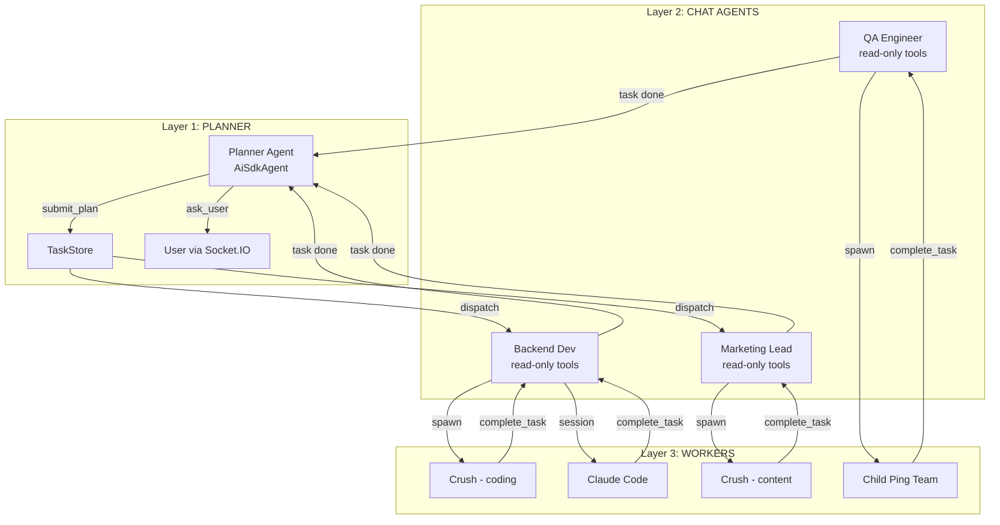

### Layer Responsibilities

| Layer | What | Lifecycle | Tools | Persistence |
|-------|------|-----------|-------|-------------|
| **L1: Planner** | Strategy, planning, monitoring | Persistent (one per team) | submit_plan, ask_user, research_domain, get_status, update_task, replan | Conversation in MongoDB |
| **L2: Chat Agent** | Task tracking, domain chat, two modes | Persistent (one per role) | **Write mode:** like now — direct execution with all tools. **Read mode:** read-only workspace, needs workers for changes | Conversation in MongoDB + Memory (CRDT) |
| **L3: Worker** | Execute task, write code/content | Transient (one per task) | Crush: view/write/edit/bash/LSP + Ping MCP. External: own tools + Ping MCP | Activity in Memory (CRDT) |

### Storage Model

**One git repo** (workspace) + **CRDT for persistent memory** + **ephemeral scratchpad per task**:

| Storage | What | Technology | Lifetime | Who Accesses |
|---------|------|-----------|----------|-------------|
| **Workspace Repo** (git) | Shared deliverables — code, docs, artifacts | Git (branch per task) | Permanent (merged to main) | Chat Agent: read-only. Worker: read+write on task branch. |
| **Agent Workspace** (clone) | Worker's working copy — where it writes code, creates files | Git clone of workspace repo on task branch | **Survives task** — commits are the deliverables, merged or kept for review | **Planner: can provision for research sub-agents.** Worker: read+write. |
| **Scratchpad** | Rough thinking, temp data, throwaway notes | `.scratch/` in clone (gitignored) or in-memory map | **Dies with task** — not committed, not merged | **Planner: available for research tasks.** Worker: read+write. |
| **Memory** (CRDT) | Per-role persistent knowledge — identity, preferences, learnings | CRDT (same infra as L2 collab) | Permanent | Chat Agent: read+write. Worker: read+write. |
| **Team Knowledge** (CRDT) | Team-wide knowledge — expertise, patterns, lessons | CRDT (L2 collab) | Permanent | Chat Agent: read+write. Worker: read+write. |
| **Conversations** (MongoDB) | Chat history per agent per user | MongoDB | Permanent | Planner: read+write. Chat Agent: read+write. |

**Workspace clone vs Scratchpad — they're NOT the same:**
```
workspaces/{teamId}-clones/task-{taskId}/     ← Agent Workspace (git-tracked)
├── src/auth/middleware.ts                     ← COMMITTED — this is the deliverable
├── src/auth/routes.ts                         ← COMMITTED — merged to main on approval
├── tests/auth.test.ts                         ← COMMITTED — part of the work
└── .scratch/                                  ← GITIGNORED — dies with task
    ├── notes.md                               ← "trying approach X..."
    ├── api-response.json                      ← temp test data
    └── draft-v1.ts                            ← throwaway prototype
```

**Scratchpad → Memory promotion:** If an agent finds something worth keeping during a task, it promotes from scratchpad to Memory (CRDT). Everything left in scratchpad is discarded when the task ends.

```
During task:
  Worker scribbles: scratch("trying batch API...")        ← scratchpad (ephemeral)
  Worker discovers: scratch("batch API is 10x faster!")    ← scratchpad (ephemeral)
  Worker promotes:  memory_write("lessons", "batch-api")   ← Memory CRDT (persists)
  Worker shares:    collab_write("lessons-api", ...)        ← Team Knowledge (persists)

Task ends:
  Scratchpad discarded (clone deleted)
  Memory CRDT persists → available for next task
  Team Knowledge persists → available for all agents
```

**Why CRDT for memory instead of a git repo:**
- No git merge conflicts when Chat Agent + Worker both write simultaneously
- Real-time sync — worker writes activity, Chat Agent sees it immediately
- Same infrastructure as L2 team knowledge (already built)
- Scoped by namespace, not by repo

**CRDT namespace layout:**
```
collab/
├── team/{docName}                     ← Team knowledge (existing L2)
│   "expertise-pricing", "lessons-api", "style-guide"
│
└── memory/{roleId}/                   ← Per-role memory (replaces git memory repo)
    ├── identity                       ← role, capabilities, tools (seeded on creation)
    ├── notes                          ← scratch, preferences, tool tips
    ├── activity/{taskId}              ← per-task activity log
    ├── experiments/{taskId}           ← per-task experiments
    └── profile                        ← personal approach, style preferences
```

**Worker identification:** Workers are scoped by `roleId + taskId`. When a worker writes `memory/{roleId}/activity/{taskId}`, it's uniquely scoped to that task execution. Multiple workers for the same role write to different task-scoped documents — no conflicts.

### Chat Agent Two Modes

```
WRITE MODE (like now — direct execution):
  Chat Agent has full tool access. Reads workspace, writes memory,
  searches collab, executes directly. This is how agents work today.
  
  User: "What auth library did you use?"
  Chat Agent: *reads workspace* "Passport.js with bcrypt"
  Chat Agent: *reads memory* "In T-001 I noted JWT with 1h expiry"
  Chat Agent: *writes memory* note: "User prefers JWT over sessions"
  → Direct response. No worker needed. Fast.

READ MODE (workspace is read-only — needs workers for changes):
  Chat Agent can read everything but cannot modify the workspace.
  When user asks for changes, Chat Agent creates a task thread
  and delegates to a worker.
  
  User: "Add rate limiting to the API"
  Chat Agent: *reads workspace to understand current state*
  Chat Agent: "I'll create a task for that."
  → Creates task thread
  → Pushes task to worker (Crush, Claude Code, etc.)
  → Worker does the work on task branch
  → Chat Agent tracks status in thread
  → Chat Agent still writes memory (notes, tracking) in read mode
```

**Chat Agent always writes to memory** (both modes). It never writes to workspace directly — workspace changes always go through workers on task branches.

---

## 2. End-to-End Flow: Goal to Done

> Diagram: [diagrams/02-end-to-end-flow.mmd](worker-architecture/diagrams/02-end-to-end-flow.mmd)

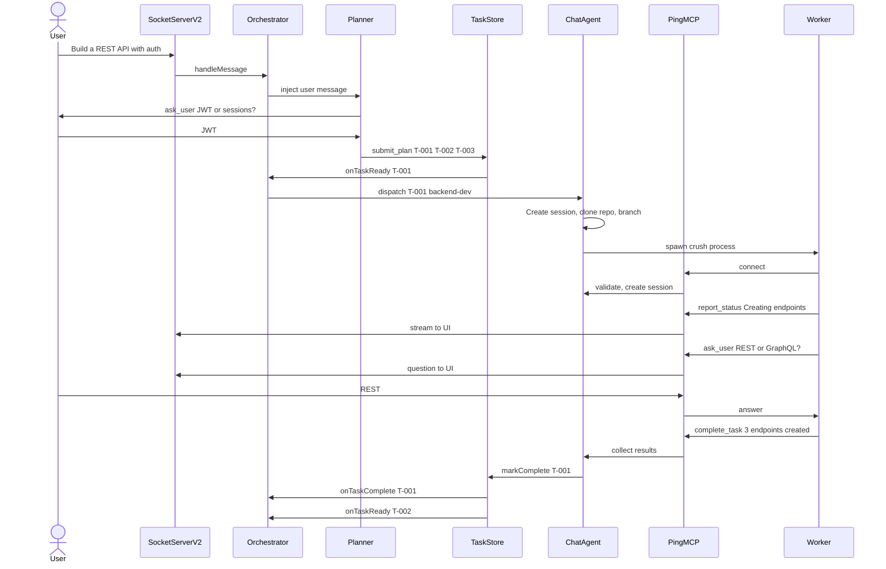

---

## 3. Chat Agent — 7 Responsibilities

The Chat Agent is the critical middle layer. It makes every worker feel seamless.

> Diagram: [diagrams/03-chat-agent-responsibilities.mmd](worker-architecture/diagrams/03-chat-agent-responsibilities.mmd)

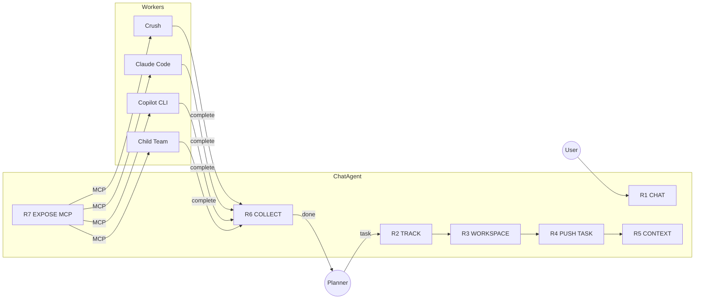

### R1: CHAT — Always-On Conversation

```
User can talk to any Chat Agent at any time.
No active task needed. Read-only tools available.

User: "What auth library did you use?"
Chat Agent: *reads workspace* "Passport.js with bcrypt"

Tools: read_workspace, search_files, search_collab,
       search_knowledge, get_task_history, get_plan_context
```

### R2: TRACK — Task Tracking (Not Session Management)

**Workers own their own sessions.** Crush has its own session management. Claude Code has its own. Child Ping teams have their own. Ping does NOT manage worker sessions internally.

Ping's Chat Agent only tracks:
- Which worker is handling which task
- The worker's external session reference (so Ping can query status)
- Task status (pushed / accepted / working / paused / completed / failed)

### Multi-Task Conversation Model — Threads

A Chat Agent can have **multiple tasks running simultaneously** — each with a different worker. The conversation uses a **thread model** (like Microsoft Teams or Slack) to keep things organized:

- **Main conversation** = chat with the Chat Agent (R1). Always available.
- **Task thread** = one per task. Status, questions, and results live inside the thread.
- User can reply inside any thread or post in the main conversation.

```
┌─ Chat Agent: Backend Dev ──────────────────────────────────────┐
│                                                                │
│  MAIN CONVERSATION                                             │
│                                                                │
│  💬 User: "What auth library are you using?"                   │
│  💬 Agent: "Passport.js with bcrypt, see /src/auth/"           │
│                                                                │
│  ┌─ 📋 Task T-001: "Build auth API" ─ Crush ─ 🔄 working ───┐│
│  │  ▸ Creating auth endpoints...                              ││
│  │  ▸ Writing middleware...                                   ││
│  │  ❓ JWT expiry: 1h or 24h?  [1h] [24h]                    ││
│  │  [Open thread ▸ 4 updates]                                 ││
│  └────────────────────────────────────────────────────────────┘│
│                                                                │
│  ┌─ 📋 Task T-004: "Rate limiting" ─ Claude Code ─ 🔄 ──────┐│
│  │  ▸ Analyzing request patterns...                           ││
│  │  ❓ Rate limit: 100/min or 1000/min?  [100] [1000]         ││
│  │  [Open thread ▸ 2 updates]                                 ││
│  └────────────────────────────────────────────────────────────┘│
│                                                                │
│  ┌─ 📋 Task T-007: "Refactor DB" ─ Crush ─ ✅ done ──────────┐│
│  │  Summary: "Connection pooling, 3 files changed"            ││
│  │  [View changes] [Approve merge] [Open thread ▸ 12 updates]││
│  └────────────────────────────────────────────────────────────┘│
│                                                                │
│  💬 User: "How's the rate limiting going?"                     │
│  💬 Agent: *checks T-004* "Claude Code is analyzing patterns.  │
│     It asked about the limit — check the thread."              │
│                                                                │
│  [Type a message...]                                           │
└────────────────────────────────────────────────────────────────┘

Opening T-001 thread:
┌─ Thread: Task T-001 "Build auth API" ─ Crush ─────────────────┐
│                                                                │
│  🤖 Worker: Analyzing requirements...                          │
│  🤖 Worker: Found 3 endpoints needed: login, register, refresh│
│  🤖 Worker: Creating /api/auth/login endpoint                  │
│  🤖 Worker: Creating /api/auth/register endpoint               │
│  ❓ Worker: JWT expiry: 1h or 24h?  [1h] [24h]                │
│  💬 User: "1h for access token, 7d for refresh"                │
│  🤖 Worker: Got it — using 1h access + 7d refresh tokens       │
│  🤖 Worker: Writing middleware...                               │
│                                                                │
│  [Reply in thread...]                                          │
└────────────────────────────────────────────────────────────────┘
```

**Thread model — like Microsoft Teams:**

| Teams concept | Ping equivalent |
|---|---|
| Channel | Chat Agent conversation (main) |
| Thread reply | Task thread (scoped by taskId) |
| Post in channel | Chat with agent (R1) |
| Reply in thread | Answer worker question / add context to task |
| Thread notification badge | Task card shows update count |

**How events route to threads:**

| Event from worker | Where it appears |
|---|---|
| `report_status({ taskId })` | Appended inside that task's thread |
| `ask_user({ taskId, question })` | Question shown in thread + bubbled to main as card notification |
| `complete_task({ taskId, summary })` | Thread marked complete, card in main shows summary |
| User types in thread | Routed to worker via MCP (ping/redirect) |
| User types in main | Goes to Chat Agent (R1), not to any worker |

**Key: `taskId` is the thread key.** Every MCP call from a worker includes `taskId`. Ping routes the event to the correct thread. Multiple workers running concurrently produce independent threads — no interference.

> Diagram: [diagrams/04-session-lifecycle.mmd](worker-architecture/diagrams/04-session-lifecycle.mmd)

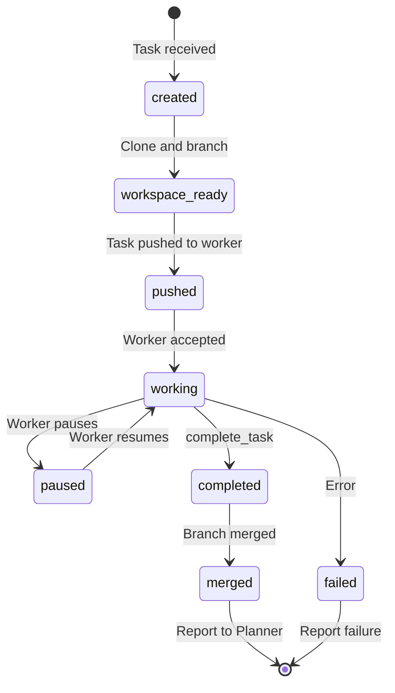

### R3: WORKSPACE — Prepare Isolated Environment

```
For EVERY task, before ANY worker starts:

1. Clone team repo
   workspaces/{teamId}/ → workspaces/{teamId}-clones/task-{taskId}/

2. Create task branch
   git checkout -b task-{taskId}

3. Generate AGENTS.md
   Role identity + task instructions + context

4. Generate crush.json (for Crush workers)
   Ping MCP endpoint + model config + tool permissions

5. Set workspace permissions
   What the worker can read/write
```

### R4: PUSH TASK — Send Task to Worker

Workers are already running. Chat Agent pushes the task to whichever worker the user selected (or the default).

> Diagram: [diagrams/05-worker-connect-handshake.mmd](worker-architecture/diagrams/05-worker-connect-handshake.mmd)

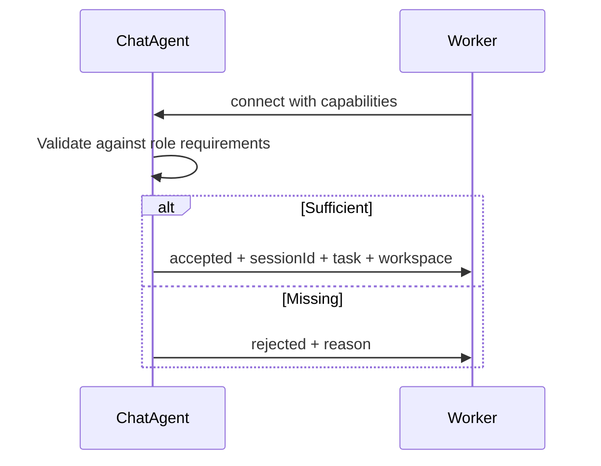

The worker connects to Ping's MCP endpoint when it's ready to accept work. Ping doesn't start the worker — the worker is already running and connects on its own. Crush is installed on the server, Claude Code is in the user's VS Code, child Ping team is running elsewhere.

### R5: CONTEXT — Provide Task Context

```
When worker calls get_task():

Chat Agent provides:
├── Task instructions (from plan)
├── Dependency outputs (summaries from upstream tasks)
├── Workspace path (prepared clone)
├── Role identity (from agent .md definition)
├── Available skills (from registry)
└── Team context (relevant collab docs)

On-demand: get_context({ detail: 'full' }) for deep context
```

### R6: COLLECT — Results & Merge

> Diagram: [diagrams/06-collect-and-merge.mmd](worker-architecture/diagrams/06-collect-and-merge.mmd)

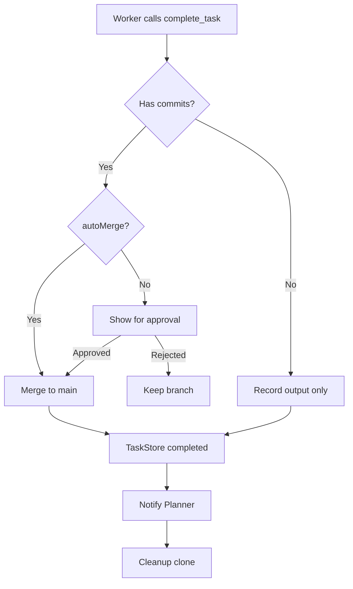

### R7: EXPOSE MCP — Protocol Layer

```
MCP Endpoint: /mcp/teams/{teamId}/roles/{roleId}

┌─────────────────────────────────────────────────────┐
│ Coordination Tools (all workers)                     │
│  connect, get_task, report_status, complete_task,    │
│  ask_user                                            │
├─────────────────────────────────────────────────────┤
│ Collaboration Tools (all workers)                    │
│  collab_read, collab_write, collab_discuss,          │
│  get_decisions, get_context                          │
├─────────────────────────────────────────────────────┤
│ Skills (all workers)                                 │
│  invoke_skill, get_capabilities                      │
├─────────────────────────────────────────────────────┤
│ Workspace Tools (only if worker lacks file tools)    │
│  workspace_read, workspace_write, workspace_commit,  │
│  workspace_publish                                   │
└─────────────────────────────────────────────────────┘

Capability negotiation: Ping detects worker's own tools
and only serves what's missing.
```

---

## 4. Task Lifecycle

> Diagram: [diagrams/07-task-lifecycle.mmd](worker-architecture/diagrams/07-task-lifecycle.mmd)

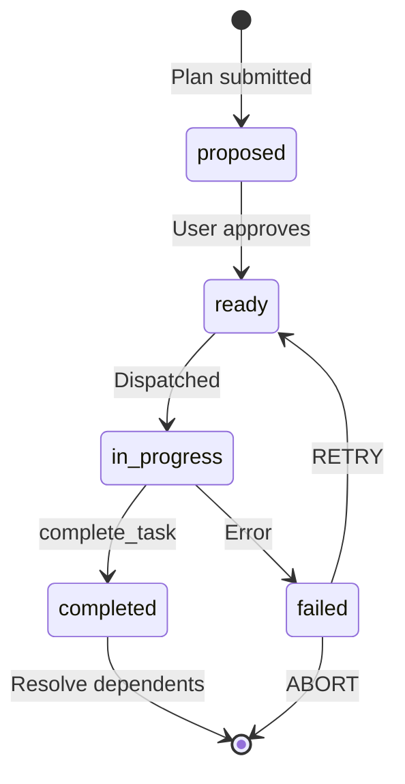

### DAG-Based Task Dependencies

> Diagram: [diagrams/08-dag-task-dependencies.mmd](worker-architecture/diagrams/08-dag-task-dependencies.mmd)

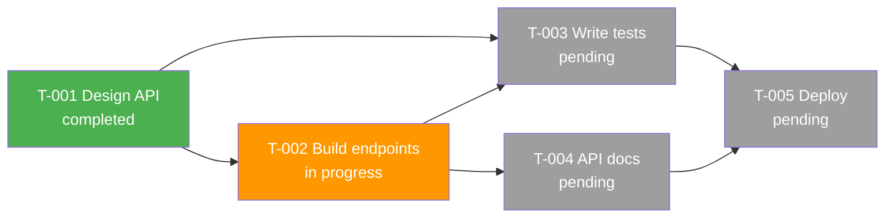

### Context Injection (Lazy)

```
When T-002 starts:
  Prompt includes: "T-001 completed: 'Designed 5 REST endpoints using OpenAPI spec'"
  (one-line summary only — prevents context bloat)

Agent needs details?
  → Calls get_context({ taskId: "T-001", detail: "full" })
  → Gets full output: schema definitions, endpoint specs, etc.
```

---

## 5. Worker Connection Protocol

All workers (internal and external) connect via the same MCP protocol. The `SubAgentAdapter` normalizes each worker type into a common event stream.

> Diagram: [diagrams/09-worker-connection-protocol.mmd](worker-architecture/diagrams/09-worker-connection-protocol.mmd)

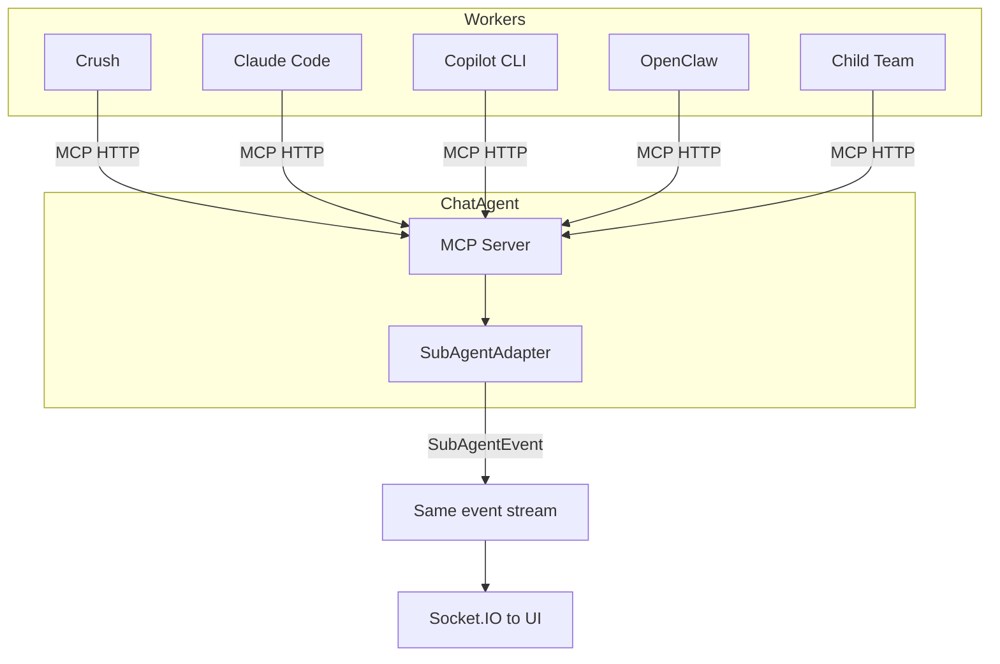

### SubAgentAdapter Interface

```typescript
interface SubAgentAdapter {
  start(task: SubAgentTask): AsyncGenerator<SubAgentEvent>;
  send(message: SubAgentMessage): void;   // ping, redirect, answer
  cancel(): Promise<void>;
  isRunning(): boolean;
}

// All adapters output the same event type:
type SubAgentEvent =
  | { type: 'stream_part'; part: StreamPart }
  | { type: 'ask_user'; questionId: string; question: string }
  | { type: 'progress'; message: string }
  | { type: 'complete'; result: SubAgentResult }
  | { type: 'error'; error: string }
```

### Worker Comparison

| | Crush | Claude Code | Copilot CLI | OpenClaw | Child Team |
|---|---|---|---|---|---|
| **Lifecycle** | Already installed | Already running in VS Code | Already installed | Already running remotely | Already running |
| **Who starts it** | User installs once | User launches VS Code | User installs once | Ops team deploys | Another team runs it |
| **Ping's role** | Push task via MCP | Push task via MCP | Push task via MCP | Push task via MCP | Push task via MCP |
| **Session owner** | Crush (internal) | Claude Code (internal) | Copilot (internal) | OpenClaw (internal) | Child Ping (internal) |
| **Ping knows** | Session ref + status | Session ref + status | Session ref + status | Session ref + status | Session ref + status |
| **Own tools** | view,write,bash,LSP | Read,Write,Bash,LSP | Built-in | Built-in | Full 3-layer |
| **Ping provides** | Coordination+collab | Coordination+collab | Coordination+collab | Coordination+collab | Coordination only |
| **User feels** | Identical | Identical | Identical | Identical | Identical |

---

## 6. Event & Streaming Architecture

> Diagram: [diagrams/10-event-streaming.mmd](worker-architecture/diagrams/10-event-streaming.mmd)

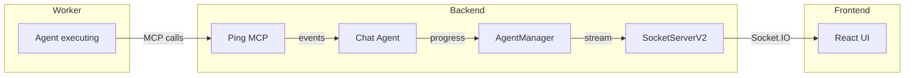

### Socket.IO Channels

| Channel | Direction | Payload | Use |
|---------|-----------|---------|-----|
| `stream` | Server → Client | AI SDK stream parts (text-delta, tool-call, tool-result) | Live agent output |
| `state` | Server → Client | Plan/task state changes | Dashboard updates |
| `progress` | Server → Client | Tool notifications, thinking indicators | Status bar |
| `message` | Bidirectional | User ↔ agent messages | Chat |
| `action` | Client → Server | approve-plan, start-task, etc. | User commands |

---

## 7. Feature Map — How Everything Connects

> Diagram: [diagrams/11-feature-dependency-map.mmd](worker-architecture/diagrams/11-feature-dependency-map.mmd)

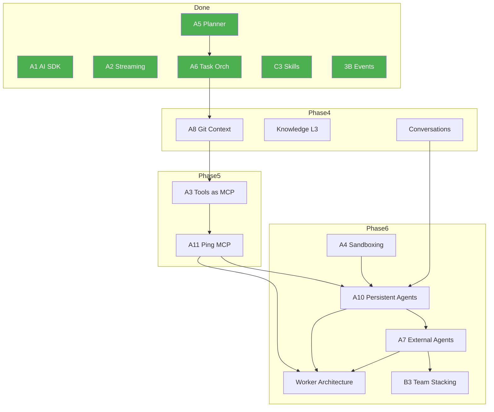

### Feature Dependency Table

| Feature | Depends On | Feeds Into | Status |
|---------|-----------|------------|--------|
| **A5: Planner-as-Agent** | — | A6, A10 | ✅ Done |
| **A6: Task Orchestration** | A5 | A8, WA | ✅ Done |
| **A8: Git Task Context** | A6 | A3, A10 | Phase 4 |
| **Conversation Persistence** | — | A10 | Phase 4 |
| **A3: Tools as MCP** | A8 | A11 | Phase 5 |
| **A11: Ping MCP Server** | A3 | A10, WA | Phase 5 |
| **A10: Persistent Agents** | A11, Conv.Pers. | A7, B3, WA | Phase 6 |
| **A7: External Agent Invocation** | A10 | B3, WA | Phase 6 |
| **A4: Worker Sandboxing** | — | A10 (optional) | Phase 6 |
| **B3: Team Stacking** | A7 | WA | Phase 6 |
| **Worker Architecture** | A10, A7, A11 | — | Consolidation |

---

## 8. Current → Target Architecture Mapping

### What Exists Today

```
AgentManager (per team)
├── OrchestratorService (state machine + planner dispatch)
│   └── PlannerAgent (AI SDK agent with plan tools)
├── WorkerPool (creates AiSdkAgent per task, disposes after)
│   └── AiSdkAgent (transient, task-scoped)
├── MemoryManager / TaskStore (flat task map)
├── RoleTaskQueue (role-based event queue)
└── PluginRegistry (skills, tools)
```

### What Target Looks Like

```
AgentManager (per team)
├── PlannerAgent (PERSISTENT — Layer 1)
│   └── Cognitive loop: clarify → research → plan → monitor
│   └── Suspend/wake pattern (zero tokens while waiting)
├── ChatAgentPool (PERSISTENT — Layer 2, one per role)
│   ├── Chat Agent: backend-dev
│   │   ├── Read-only tools (workspace, collab, knowledge)
│   │   ├── MCP Server at /mcp/teams/{teamId}/roles/backend-dev
│   │   ├── Session management (TaskSession per task)
│   │   └── Spawns/accepts Workers (Layer 3)
│   ├── Chat Agent: qa-engineer
│   └── Chat Agent: marketing-lead
├── TaskStore (DAG-aware, goalId-scoped)
├── Orchestrator (STATELESS dispatcher — no longer state machine)
└── PluginRegistry (skills, tools, MCP configs)
```

### Migration Path

| Phase | What Changes | Risk |
|-------|-------------|------|
| **Phase 4** | Add git workspace isolation + conversation persistence | Low — additive |
| **Phase 5** | Extract tools into packages + deploy MCP servers | Medium — refactor |
| **Phase 6a** | Add ChatAgentPool alongside WorkerPool | Low — additive |
| **Phase 6b** | Route tasks through Chat Agents instead of direct dispatch | Medium — rewiring |
| **Phase 6c** | Crush as default worker via MCP | Medium — new integration |
| **Phase 6d** | External agent connections via same MCP | Low — same protocol |
| **Phase 6e** | Planner becomes persistent + parallel goals | High — state model change |

---

## 9. Key Design Decisions

| # | Decision | Rationale |
|---|----------|-----------|
| 1 | **Crush as default worker** (not custom AiSdkAgent) | Crush has file/bash/LSP tools built in. No need to build workspace tools. Same MCP integration as Claude Code. |
| 2 | **One MCP protocol for all workers** | Crush, Claude Code, Copilot, OpenClaw all connect the same way. User sees identical UI. |
| 3 | **Chat Agent = MCP server** | Session owner exposes endpoint. Workers connect to it. Capability negotiation determines what tools to serve. |
| 4 | **Workers own their sessions** | Crush, Claude Code, child teams maintain their own internal sessions. Ping tracks only an opaque session reference + status. |
| 5 | **Direct streaming (L3 → UI)** | Workers stream to UI directly. Chat Agent only gets summary. Prevents token bloat in L2. |
| 6 | **SubAgentAdapter for all workers** | One interface, all worker types. Adding new worker = implement 4 methods. |
| 7 | **Workspace clone per task** | Isolated git branch in cloned repo. Workers can't touch main. Chat Agent merges after review. |
| 8 | **Lazy context injection** | Upstream task outputs = one-line summaries. Agent calls get_context() for full details on demand. |
| 9 | **Planner suspend/wake** | Zero tokens while workers are executing. Wakes only on task complete/fail/user message. |
| 10 | **Worker sandboxing = container around Crush** | Crush runs entirely inside Docker/Microsandbox. Not tool-call proxying. |

---

## 10. Glossary

| Term | Definition |
|------|-----------|
| **Planner** | Layer 1 persistent agent. Decomposes goals into plans. One per team. |
| **Chat Agent** | Layer 2 persistent agent. Session owner per role. Read-only workspace access. |
| **Worker** | Layer 3 transient agent. Does actual work. Fresh context per task. |
| **Crush** | Open-source CLI coding agent (charmbracelet/crush). Default internal worker. |
| **SubAgentAdapter** | Universal interface for all worker types (4 methods). |
| **TaskStore** | DAG-aware task storage. Source of truth for task state. |
| **Ping MCP** | MCP server exposed by Chat Agent for worker connections. |
| **GoalContext** | Per-goal state for parallel plan management. |
| **TaskSession** | Per-task session created by Chat Agent. Links agent ↔ worker. |
| **AGENTS.md** | File placed in workspace clone with role identity + task instructions. |

---

## References

### Core Feature Docs
- [Worker Architecture](worker-architecture/feature_architecture.md) — 3-layer model, worker types, packaging
- [Persistent Agents (A10)](persistent-agents/feature_architecture.md) — full hierarchy, sub-agent patterns
- [Sub-Agent Protocol](persistent-agents/sub-agent-protocol.md) — SubAgentAdapter, streaming, ask_user

### Protocol & Integration
- [Ping MCP Server (A11)](ping-mcp-server/feature_architecture.md) — MCP tools, capability negotiation
- [External Agent Invocation (A7)](external-agent-invocation/feature_architecture.md) — ExternalAgent, MCP client
- [Team Stacking (B3)](team-stacking/feature_architecture.md) — child teams as workers

### Infrastructure
- [Git Task Context (A8)](git-task-context/feature_architecture.md) — workspace isolation, memory repos
- [Worker Sandboxing (A4)](worker-sandboxing/feature_architecture.md) — container isolation
- [Conversation Persistence](conversation-persistence/feature_architecture.md) — per-agent threads

### Tools & Collaboration
- [Tools as MCP (A3)](tools-as-mcp/feature_architecture.md) — package split, MCP servers
- [Collaboration Toolkit](collaboration-toolkit/feature_architecture.md) — discuss, request_task, decisions

### Planning & Tasks
- [Planner-as-Agent (A5)](planner-as-agent/feature_architecture.md) — cognitive loop, 14 tools
- [Task Orchestration (A6)](task-orchestration/feature_architecture.md) — DAG dispatch, lifecycle
- [Markdown Tasks](task-orchestration/markdown-tasks/feature_architecture.md) — tasks as .md files

### Audit
- [Feature Alignment Audit](worker-architecture/feature-alignment-audit.md) — conflict resolution, redundancy map
