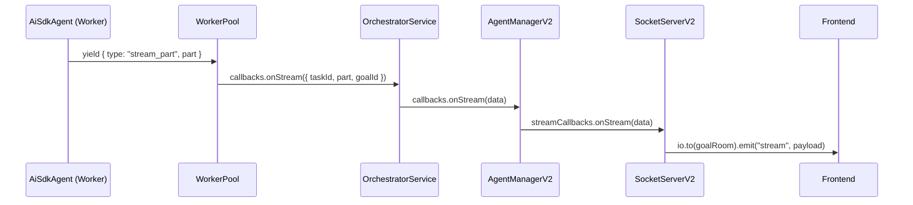
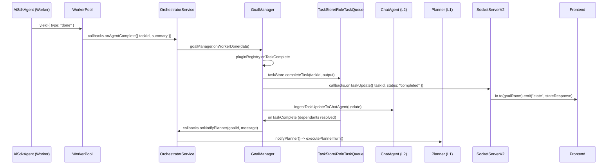

# Callback Refactoring — Research And Guard Rails

## Purpose

This document holds the callback-chain research, sequence diagrams, and migration guard rails that should not live inside the v5 communication-layer implementation plan. It exists to protect runtime behavior while callback ownership is refactored.

Related docs:
- `feature_architecture.md` — feature options and recommendation
- `../communication-layer-refactor/v5.0/feature_implementation_planning.md` — broader transport/service-layer refactor that depends on this audit

## Current Callback Paths

### Channel A — Worker Stream

### Channel B — Worker Completion / Planner Escalation

## Callback Ownership Matrix

### Backend runtime callbacks

| Callback / event | Current owner | Non-forwarding side effects that must survive |
|---|---|---|
| `onStream` | WorkerPool -> OrchestratorService -> AgentManagerV2 | Carries goal-scoped stream payload to SocketServer path |
| `onTaskUpdate` | WorkerPool | Synthesizes `started`, `progress`, `tool_milestone`, `completed`, `failed` from worker execution |
| `onStatusUpdate` | OrchestratorService | Tracks `lastReportedStatus`, converts `report_status` into Channel B blocked/progress |
| `onAgentComplete` | OrchestratorService -> GoalManager | Calls `onWorkerDone`, which merges workspace, completes task, persists state |
| `onTaskCreated` | OrchestratorService | Emits task update, notifies planner, may dispatch newly ready tasks |
| `onBounce` | OrchestratorService | Emits blocked event, triggers dependency failure handling, may notify planner |
| `onMentionedRoles` | OrchestratorService | Spawns collab workers immediately |
| `onNotifyPlanner` | GoalManager and ChatAgent | Two current producers of planner-facing summaries |

### Frontend-facing event channels

| Channel | Current emitter | Purpose |
|---|---|---|
| `stream` | SocketServerV2 `onStream` + lifecycle stream chips | Full-fidelity live output for active thread |
| `state` | SocketServerV2 `onTaskUpdate` / plan actions / restore | Full task list + session coherence |
| `task_update` | SocketServerV2 `onWorkerTaskUpdate` | Low-volume Channel B for sidebar/logs/ChatAgent parity |
| `goal:stateChange` | SocketServerV2 goal status callbacks | Plan list / goal summary refresh |
| `goal:created` | SocketServerV2 orchestrator message handling | Goal-room join trigger |
| `discussion:activity` | Collaboration path via SocketServerV2 | Local UI badge updates |

## Planner Escalation Split

### Current direct GoalManager escalations

- Research complete / failed
- All tasks complete
- Failure escalation with blocked downstream context

### Current ChatAgent escalations

- Task blocked
- Task failed
- Role-level completion summary

### Guard rail

Before any flattening, choose one policy:

1. GoalManager remains the lifecycle escalation owner, ChatAgent only adds role summaries.
2. ChatAgent becomes the primary escalation owner for worker-level outcomes, GoalManager keeps only goal-level lifecycle transitions.

Do not implement callback flattening until one of those policies is chosen explicitly.

## Frontend Subscription Classification

| Subscription | Current location | Category | Target destination |
|---|---|---|---|
| `onMessage` | `App.tsx` | Goal-scoped state | socket middleware |
| `onState` | `App.tsx` | Goal-scoped state | socket middleware |
| `onOutput` | `App.tsx` | Goal-scoped state/log | socket middleware |
| `onError` | `App.tsx` | Goal-scoped state/log | socket middleware or error service |
| `onStream` | `App.tsx` | Goal-scoped state | socket middleware |
| `onTaskUpdate` | `App.tsx` | Goal-scoped state/log | socket middleware |
| `onGoalStateChange` | `App.tsx` | Goal-scoped state | socket middleware |
| `onGoalCreated` | `App.tsx` | Room-management side effect tied to goal state | Zustand-owned socket effect layer |
| `onDiscussionActivity` | `App.tsx` | Event-driven UI state | Zustand discussion store / slice |
| `onHttpError` | `App.tsx` | Transport / toast policy | error service |

### Updated frontend guard rail

If a frontend behavior is event-driven state, it should move into a Zustand-owned layer even if it also triggers a transport side effect. The only frontend event concern that stays outside Zustand is global error presentation, which belongs to the dedicated error service.

## Refactor Invariants

- Channel A must still reach the frontend with full `stream_part` fidelity.
- Channel B must still deliver blocked/progress/tool milestone/completed/failed updates.
- `state` and `task_update` remain separate channels unless the frontend contract is redesigned first.
- Goal-room subscription behavior must remain intact for `goal:created` and reconnect flows, even after that logic moves under Zustand-owned socket effects.
- ChatAgent streaming and persistence cannot be dropped during `SocketServerV2` splitting.
- Planner escalation must have one explicit owner per scenario.

## Recommended Use

Use this document as the checklist for any callback refactor PR. The implementation plan should reference this document instead of duplicating the diagrams and callback audit inline.