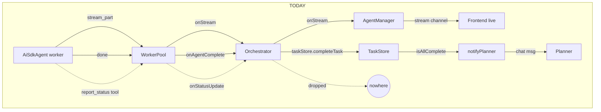
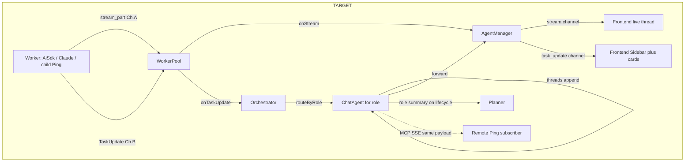
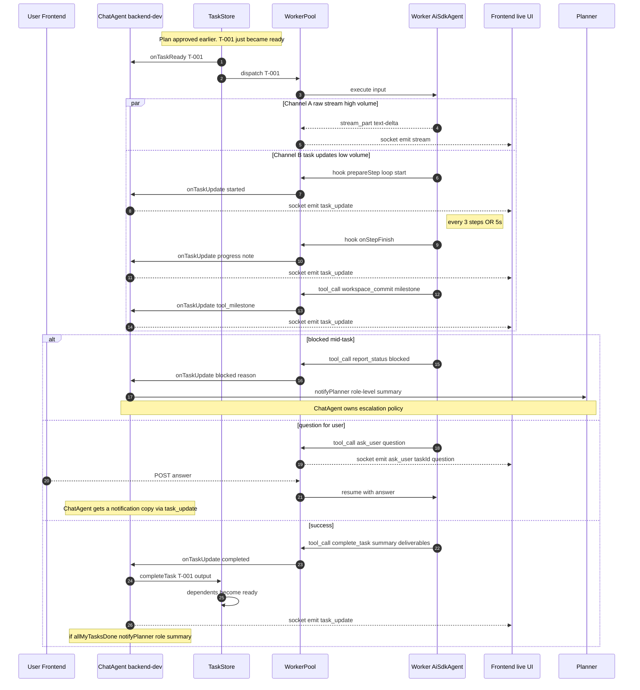

# Chat Agent Layer (L2) — Architecture

**Date:** 2026-04-22 · **Status:** Design · **Risk:** High (changes dispatch path eventually)

Implements **Layer 2** from [MASTER-ARCHITECTURE.md §1](../MASTER-ARCHITECTURE.md). Today the system has L1 (Planner) and L3 (transient `AiSdkAgent` workers) but **no persistent L2 between them**. This feature introduces persistent per-role Chat Agents that own task tracking, user conversations, and worker dispatch.

## Problem

Today's flow (verified against code, not docs — `EVENT_ARCHITECTURE_ANALYSIS.md` is stale):
```
Planner → TaskStore → WorkerPool spawns transient AiSdkAgent → dies after task
```

Consequences:
- **No persistent role identity** — each task gets a fresh agent with no memory of prior tasks
- **No user-to-role chat** — user can only chat with the Planner; cannot ask "backend-dev, what did you build?"
- **No task threads** — worker stream events flow into a single chat history per agent, with no per-task grouping
- **Workers are anonymous** — task output is forgotten the moment the worker exits

## Event flow today (the truth) — and what changes

Common misconception: *"all worker events go to the Planner."* **False.** Verified in code:

| Event class | % of volume | Goes to | Path |
|---|---:|---|---|
| `stream_part` (text deltas, tool calls, reasoning) | ~95% | **Frontend only** | `AiSdkAgent` AsyncGen → `WorkerPool.callbacks.onStream` → `OrchestratorService.callbacks.onStream` → `AgentManager.streamCallbacks.onStream` → `SocketServerV2` `stream` channel |
| `done` / completion summary | ~5% | **Frontend + Planner** | `WorkerPool.callbacks.onAgentComplete` → `OrchestratorService.onWorkerDone` → `taskStore.completeTask` → `onTaskComplete`. Planner is notified **only when `taskStore.isAllComplete()`** via `notifyPlanner(...)`. |
| `error` / failure | edge | **Frontend + Planner** | Same path; planner gets a `"⚠️ N tasks failed: ..."` message |

The Planner receives discrete summaries as chat messages, not real-time streams. There is no internal event bus — AsyncGenerator + callbacks. Socket.IO is the only bus, and only at the edge.

## Two distinct event channels (the design)

ChatAgent is **at the same abstraction level as a remote Ping team subscribing via MCP**, or as Claude Code reporting back through the Ping MCP Server. Those external recipients **do not receive raw token streams** — they receive discrete task-level updates ([team-stacking decision #1](../team-stacking/feature_architecture.md): "Black box. Parent sees only planner-level status updates."; [ping-mcp-server `report_status` / `complete_task`](../ping-mcp-server/feature_architecture.md): "External agents explicitly call these to report meaningful events").

ChatAgent is the **in-team analogue of a remote subscriber.** It gets the same coarse-grained signal, not the raw stream.

| Channel | Granularity | Emitter | Recipients |
|---|---|---|---|
| **A. Raw stream** | Token-level (text deltas, tool calls, reasoning chunks, `stream_part`) | Internal `AiSdkAgent` only — external workers do not produce this | **Frontend only** (live UX). Never goes to ChatAgent, never to Planner, never to a remote Ping. |
| **B. Task updates** | Task-level (`started`, `progress {pct, note}`, `tool_milestone`, `ask_user`, `blocked`, `completed {summary, deliverables, nextSteps}`, `failed {error}`) | All worker types — internal `AiSdkAgent` synthesizes these from its own loop; external workers call `report_status` / `complete_task` via MCP; child Ping teams emit them as MCP SSE | **ChatAgent (primary)**. ChatAgent then chooses what to forward to Frontend (e.g. as thread cards) and what to escalate to Planner. Also visible to remote Ping subscribers via MCP SSE — same payload. |

**Why this matters:**
- **Symmetry across worker types.** Internal `AiSdkAgent`, Claude Code (external), and child Ping team (stacked) all present ChatAgent the same Channel-B interface. ChatAgent doesn't care which it is talking to.
- **Symmetry across team boundaries.** A remote Ping connecting to our team via MCP sees exactly what an in-team ChatAgent sees — Channel B. No special casing.
- **ChatAgent stays cheap.** It never has to LLM-process token deltas. Its context only fills with meaningful, summarizable events. Cost scales with task count, not token count.
- **Frontend keeps full fidelity.** UX still gets the rich live stream for the active thread (Channel A). Channel B drives the Sidebar/badges/state.
- **No new transport.** Channel A keeps today's `worker:stream` Socket.IO path unchanged. Channel B is a new, low-volume callback (`onTaskUpdate`) that internal workers synthesize and external workers fill via existing MCP `report_status`.

### Today vs. target





**How to read the TARGET diagram (top-right corner of the rendered SVG):**

| Edge label | Meaning |
|---|---|
| `forward` | ChatAgent passes Channel B events through to AgentManager so the Frontend can update its Sidebar/badges. ChatAgent doesn't transform them — it just forwards (and also keeps a copy in `threads`). |
| `threads append` | Self-loop on ChatAgent indicating "appends event to `threads[taskId]` log". This is the local record kept for R1 chat context and replan summaries. Not a network call. |
| `role summary on lifecycle` | When the **role** (not a single task) hits a milestone — all-my-tasks-done, role blocked, replan needed — ChatAgent sends one summary message to the Planner. Compare to today, where the Planner is pinged on every task completion. |
| `MCP SSE same payload` (dotted) | Same Channel B payloads are also published over MCP Server-Sent Events to remote subscribers (a parent Ping in a stacked team, or a Claude Code instance subscribing to this team). Dotted = optional, only when an MCP subscriber is connected. |

### How a parent Ping connects to a child Ping (team stacking)

> **Status:** 100% designed, 0% implemented. No MCP server code exists. `fastmcp` is a dependency in `packages/backend/package.json` but unused. `ExternalAgent` import in `AgentFactory.ts` is commented out. Dependency chain: A7 (External Agent Invocation) → A11 (Ping MCP Server) → B3 (Team Stacking).

**Protocol:** MCP Streamable HTTP (spec 2025-03-26). One protocol — no Socket.IO, no custom HTTP between teams. SSE streaming is native to the spec. Connection is resumable (`Last-Event-ID`), session-managed (`Mcp-Session-Id`).

**Which agent handles the interaction — both sides:**

| Side | Component | Role | Planned file |
|---|---|---|---|
| **Parent** | `ChatAgent` (L2, persistent) | Dispatches task to `TeamSubAgent` adapter — same way it dispatches to an internal worker | L2 layer (this feature) |
| **Parent** | `TeamSubAgent` (implements `SubAgentAdapter`) | MCP **client** that wraps a child team. POSTs `submit_goal` to child's MCP endpoint, iterates SSE response, normalizes events → `SubAgentEvent` | `packages/backend/agent/external/ExternalAgent.ts` → later `TeamSubAgent` |
| **Child** | `McpTeamServer` (per-team MCP server) | Receives `submit_goal`, hands goal to child team's own **Planner** (L1) | `packages/backend/team/McpTeamServer.ts` (planned) |
| **Child** | Full 3-layer hierarchy | Child team's Planner breaks down the goal → its own ChatAgents → its own Workers. Parent has no visibility into child's internal agents. | Existing planner + this feature |

**Key point:** The parent's **ChatAgent** owns the interaction, not the Planner directly. Planner assigns a task to a role; ChatAgent dispatches it; one of the dispatch targets can be a `TeamSubAgent` (child team) instead of an internal `AiSdkAgent`. ChatAgent doesn't know or care — same `SubAgentAdapter` interface.

**Connection flow:**

```
Parent Team (Product)                           Child Team (Engineering)
────────────────────                            ────────────────────────
Planner assigns "Build auth" to backend-dev
  ↓
ChatAgent (backend-dev) dispatches
  ↓
TeamSubAgent (MCP client)
  → POST submit_goal to child's /mcp endpoint
                                                McpTeamServer receives goal
                                                  ↓
                                                Child Planner breaks down
                                                  ↓
                                                Child ChatAgents dispatch workers
                                                  ↓ (internal, invisible to parent)
  ← SSE: { type: 'progress', note: '4 tasks planned' }
  ← SSE: { type: 'progress', note: 'Task 1/4 started' }
  ← SSE: { type: 'ask_user', question: '...' }      ← only if child planner bubbles up
  ← SSE: { type: 'completed', summary, artifacts }
  ↓
TeamSubAgent normalizes SSE → SubAgentEvent
  ↓
ChatAgent receives same Channel B as internal workers
  ↓
Frontend Sidebar shows child team progress (same UI as any task)
```

**What flows over the MCP SSE connection:**

| Direction | Transport | Payload | Notes |
|---|---|---|---|
| Parent → Child | MCP tool calls | `submit_goal`, `get_status`, `answer_question`, `send_message`, `cancel` | 5 tools exposed by child's `McpTeamServer` |
| Child → Parent | MCP SSE stream | `TaskUpdate` (same Channel B shape) — `progress`, `ask_user`, `completed`, `failed` | **NOT raw token streams.** Child is a black box ([team-stacking decision #1](../team-stacking/feature_architecture.md): "Black box. Parent sees only planner-level status updates.") |

**What the parent does NOT get:**
- Channel A (`stream_part`, text-delta, tool calls, reasoning) from child's workers — hidden
- Individual child task breakdowns — hidden
- Child's internal ChatAgent conversations — hidden

The parent sees the child team as **one worker** that emits Channel B events. Same abstraction as any other worker type.

**`ask_user` routing across teams:**

Per-team policy on the child side (configurable: `handle_locally | bubble_up | auto`):
- `handle_locally` — child team's own user answers questions (default for separate operators)
- `bubble_up` — question propagates as MCP SSE `ask_user` event → parent's ChatAgent gets it as a Channel B notification copy → Frontend shows it to parent's user
- `auto` — child Planner decides based on question context

**Recursive depth:** configurable (default 3). Each level adds its `teamId` to a `delegationChain[]` array to prevent cycles.

**Same Channel B payloads for all subscriber types:**

| Subscriber | Transport | Gets Channel B? | Gets Channel A? |
|---|---|---|---|
| In-team ChatAgent | Direct callback (`onTaskUpdate`) | ✅ | ❌ |
| Frontend Sidebar | Socket.IO `task_update` channel | ✅ | ❌ (only live thread gets `stream`) |
| Parent Ping team | MCP SSE from child's `McpTeamServer` | ✅ same `TaskUpdate` shape | ❌ |
| Claude Code / external IDE | MCP SSE from Ping MCP Server (A11) | ✅ same `TaskUpdate` shape | ❌ |

This is why the dotted line in the TARGET diagram says "MCP SSE same payload" — no special casing. One `TaskUpdate` type, four delivery mechanisms, same content.

### Event trace — one task end-to-end

Sequence view showing how Channel A and Channel B run in parallel through one task lifecycle. This depicts the **Step 3 transition** — ChatAgent receives notifications but WorkerPool still dispatches. After Step 4, `TS→WP` dispatch is replaced by `TS→Orchestrator→CA→WP`. Use the flowcharts above for the full Step 4+ topology.



Three things to notice:
- Steps **5 and 6** show Channel A and Channel B leaving the worker in parallel — neither waits for the other. ChatAgent never appears in the Channel A path.
- Step **9 (every 3 steps OR 5s)** — `onStepFinish` heartbeat, no LLM cost, ChatAgent gets one event per chunk of work, not per token.
- The `ask_user` branch routes **direct to the user** (Frontend) and only sends ChatAgent a *notification copy*. ChatAgent does not stand between the worker and the user — see [Open questions resolved](#open-questions-resolved) for the rationale.

### Synthesizing Channel B — use existing AI SDK hooks, no extra LLM cost

Internal `AiSdkAgent` already runs `streamText()` with several hooks wired for logging only. We promote each from "log line" to "Channel B emit":

| AI SDK hook (already used) | Today | Becomes Channel B event |
|---|---|---|
| `prepareStep` (loop start) | trims context | also: `{ type: 'started', taskId }` on first invocation |
| `experimental_onToolCallStart` | logs tool name | `{ type: 'tool_milestone', tool, phase: 'start' }` only for milestone-tagged tools (`complete_task`, `workspace_commit`, `collab_write_block`, `report_status`) |
| `experimental_onToolCallFinish` | logs tool + duration | `{ type: 'tool_milestone', tool, phase: 'end', summary, durationMs }` |
| `onStepFinish` | logs `finishReason` + tokens | every Nth step (default N=3) or every M seconds (default 5s) → `{ type: 'progress', note, stepIdx, tokensSoFar }` (whichever fires first) |
| `onError` (currently NOT wired) | — | wire it: `{ type: 'failed', error, lastStep }` |
| Final `result` (after streamText resolves) | yields `done` to AsyncGen | also: `{ type: 'completed', summary, deliverables, nextSteps }` |

Plus the existing **lifecycle tools** the agent calls itself produce Channel B events directly:

| Existing lifecycle tool | WorkerPool callback (already exists) | Channel B event |
|---|---|---|
| `report_status` | `onStatusUpdate` (✱ defined but currently dropped in socket routing) | `{ type: 'progress' \| 'blocked', note, pct? }` |
| `complete_task` | `onAgentComplete` (✱ defined but currently unused) | `{ type: 'completed', summary, deliverables, nextSteps }` |
| `bounce_task` | `onBounce` | `{ type: 'blocked', reason, suggestedRole? }` (and Orchestrator still reassigns) |
| `request_task` | `onTaskCreated` | (not Channel B — this is a *write* via Step 5's `create_agent_task` path) |
| `ask_user` (planned) | new | `{ type: 'ask_user', questionId, question }` — emitted on Channel B as a **notification copy** (so ChatAgent records it in the thread); the actual Q&A goes **direct to the Frontend** via a separate `ask_user` Socket.IO event. ChatAgent does not mediate the conversation. |

**Net new code is small:** one event type (`TaskUpdate`), one new WorkerPool callback (`onTaskUpdate`) that fans the above into a single stream, ChatAgent subscriber, one new Socket.IO channel (`task_update`) for the Sidebar. No new transport, no new LLM call, no new event bus.

### What ChatAgent does with Channel B

```ts
class ChatAgent {
  ingestTaskUpdate(update: TaskUpdate) {
    // 1. Always: append to thread (cheap, no LLM). Used for R1 chat context + replan summaries.
    this.threads[update.taskId].push(update);

    // 2. Forward to Frontend (Sidebar badges, thread cards).
    this.emitToFrontend('task_update', update);

    // 3. Role-level reactions — these are the ONLY paths to the Planner:
    switch (update.type) {
      case 'blocked':
        this.maybeEscalateReplan(update);                 // → notifyPlanner("task X blocked: reason")
        break;
      case 'failed':
        this.maybeEscalateReplan(update);                 // → notifyPlanner("task X failed: error")
        break;
      case 'completed':
        this.promoteToRoleMemory(update);                 // extract key outputs into roleContext
        if (this.allMyTasksDone())
          this.notifyPlanner(this.summarizeRole());        // → "role done: N tasks, summary of outputs"
        break;
      // 'started', 'progress', 'tool_milestone' → thread-only, no Planner notification
      // 'ask_user' → direct worker↔user via Frontend; ChatAgent only records in thread
    }
  }
}
```

**All ChatAgent → Planner notification scenarios:**

| Trigger | Condition | What ChatAgent sends | Planner action |
|---|---|---|---|
| Task blocked | `mode !== 'manual'` | `request_replan(reason, taskId, context)` | Decides: `add_tasks`, `update_task`, `reassign_task`, or `replan` |
| Task failed | `mode !== 'manual'` | `request_replan(reason, taskId, error)` | Same decision set |
| All role tasks done | Always (any mode) | `summarizeRole()` → one message with outputs, deliverables, next steps | Planner updates its plan status; may trigger next phase |
| All role tasks done but some failed | Always | `summarizeRole()` including failure details | Planner decides to replan or accept partial |
| User explicitly requests in R1 chat | User says "we need to replan" | `request_replan(userReason)` | Same decision set |

**What does NOT go to Planner:**
- Individual task `started` / `progress` / `tool_milestone` → thread-only
- Individual task `completed` (unless all role tasks done) → thread + memory promotion only
- `ask_user` → direct to Frontend, notification copy in thread

ChatAgent does **not** subscribe to Channel A. The Frontend does that directly via Socket.IO `stream`, as it does today.

## Event delta: NEW / REROUTED / SAME

Concrete diff against today's event surface (verified via code inventory):

### 🆕 NEW events / channels

| What | Where | Why |
|---|---|---|
| `TaskUpdate` discriminated union (8 variants) | shared types | Channel B unified shape; matches what external workers emit via MCP and what child Ping teams emit via SSE |
| `WorkerPool.callbacks.onTaskUpdate` | WorkerPool.ts | Single fan-in point for hook-synthesized + lifecycle-tool events |
| `OrchestratorService.callbacks.onTaskUpdate` | OrchestratorService.ts | Routes by `task.assigned_role` to `agentManager.getChatAgent(role)` |
| Socket.IO `task_update` channel | SocketServerV2.ts | Drives Sidebar badges + thread cards. Low volume. Per-team room. |
| MCP SSE `task_update` event (same payload) | ping-mcp-server | Lets remote Ping subscribers and external IDE clients see the same per-role progress |

### 🔁 REROUTED (existing event, new destination)

| Event | Today's destination | New destination | Note |
|---|---|---|---|
| `WorkerPool.onAgentComplete` | **actively used** → `OrchestratorService.onWorkerDone` → marks task complete, triggers dependents | → also emits `onTaskUpdate('completed')` → ChatAgent + Frontend `task_update` | Currently drives the task completion flow; we ADD a Channel B copy, not replace |
| `WorkerPool.onStatusUpdate` (from `report_status` tool) | **dropped in socket routing** | → `onTaskUpdate('progress'\|'blocked')` → ChatAgent + Frontend `task_update` | The lifecycle tool already exists; we just stop dropping its output |
| `OrchestratorService.notifyPlanner(...)` on `taskStore.isAllComplete()` | direct → Planner (per-task noise on every all-complete) | Step 4: ChatAgent owns the call; planner gets **role-level** summaries (one per role lifecycle, not per task) | Orchestrator's all-complete check stays as safety net |
| `WorkerPool.onBounce` | only Orchestrator (reassign) | also `onTaskUpdate('blocked')` → ChatAgent | ChatAgent gets visibility into role-level bouncing |

### ✅ SAME (unchanged path)

| Event | Path | Why unchanged |
|---|---|---|
| `stream_part` (text-delta, tool-input-delta, reasoning-delta, etc.) | `AiSdkAgent` → `WorkerPool.onStream` → `OrchestratorService.onStream` → `AgentManager.streamCallbacks.onStream` → Socket.IO `stream` → Frontend | This is **Channel A**. ChatAgent does not subscribe. Frontend live UI keeps full token fidelity. |
| `progress` channel + `WORKER_EVENT_ROUTES` (legacy `thinking`, `planning`, `tool_start`, `tool_result`) | Unchanged | Used by legacy AgentManager panel; will deprecate after Channel B replaces it on Frontend |
| `state` channel (plan, session state, tasks list) | Unchanged | Coarse plan-level state; orthogonal to per-task updates |
| `onTaskReady` / `onTaskComplete` / `onTaskFailed` (TaskStore lifecycle) | OrchestratorService consumes → dispatches workers | Internal task DAG plumbing. ChatAgent **also** subscribes (mechanism #1 in three-mechanisms table) but doesn't replace the existing consumer. |
| `onTaskCreated` (from `request_task` tool) | Orchestrator creates task in TaskStore | Same path; Step 5's `create_agent_task` is a *separate* tool with self-role validation, but uses the same downstream callback |
| All HTTP REST read endpoints | Unchanged | ChatAgent adds its own GET endpoints (Step 1), doesn't modify existing ones |
| `discussion:activity` / `discussion:mention` | CollabServer → Frontend | Orthogonal to task events |

## Hooks the codebase doesn't yet use — opportunities

| Hook | Why it would help |
|---|---|
| `onChunk` | Backpressure / batched socket emit if a worker floods Channel A |
| `onFinish` | Final cost/latency summary into Channel B `completed` payload |
| `onError` | Currently caught in try/catch; wiring this gives us per-provider circuit-breaker hooks and cleaner `failed` Channel B events |
| `experimental_telemetry` | OpenTelemetry traces per task, free observability layer |
| `toolChoice` (mid-stream override) | If a worker starts "talking past" its tools, ChatAgent could nudge it via `toolChoice='required'` on next step |

These are **non-blocking** for Channel B. List them so we don't reinvent them later.

## Implication for Planner

Today the Planner receives `notifyPlanner(...)` from the Orchestrator on `taskStore.isAllComplete()`. After Channel B lands:

- Per-task completion noise stops reaching the Planner.
- ChatAgent emits **role-level summaries** to the Planner (e.g. "backend-dev: 4 tasks done, 1 blocked on missing API spec, requesting replan").
- Planner's context grows by O(roles), not O(tasks). Planner can actually scale.

This matches team-stacking decision #3 ("redirect propagation only to child planner") at the in-team scale: workers report only to their owning ChatAgent; ChatAgent decides what bubbles to the Planner.

## Open questions resolved

Stepping back to clarify what ChatAgent **is** and **isn't**, and what scope can be added cheaply now vs. deferred. These resolve drift from earlier drafts.

### Q1: Why does ChatAgent need `ask_user` if the user can already chat via Frontend?

**Answer: it doesn't *handle* `ask_user` — it only *records* it.**

`ask_user` from a worker is a **direct worker ↔ user** interaction. Routing it through ChatAgent would add latency and create a confusing impedance mismatch (the user already has a Frontend channel; bouncing through an LLM-mediator is overkill).

| Concern | Path |
|---|---|
| Worker needs an answer from the user | Worker calls `ask_user` tool → backend emits Socket.IO `ask_user` event → Frontend modal/chip → user answers via `POST /api/v2/tasks/:id/answer` → resumes worker. **No LLM in the middle.** |
| ChatAgent should know a question was asked (for context, summaries, R1 chat) | The `ask_user` event also fires Channel B `{ type: 'ask_user' }` → ChatAgent appends to `threads[taskId]` for read-only context. |
| User wants to chat about a role's work | User opens R1 chat with the ChatAgent (Step 2). This is a *separate* surface from `ask_user`. |

So `ask_user` is a **direct-line tool**, and Channel B carries a notification copy for ChatAgent's records. ChatAgent never relays the conversation.

### Q2: Why a local `myTasks` Map in ChatAgent? Doesn't TaskStore already own this?

**Answer: it shouldn't. TaskStore is the source of truth — ChatAgent should call `taskStore.getByRole(role)` (already exists in code at `TaskStore.ts` L113).**

This is the SOLID-correct shape and the doc has been updated. ChatAgent caches **only what TaskStore doesn't own**:

| State | Owner | Why |
|---|---|---|
| Task fields (status, prerequisites, output) | **TaskStore** | Single writer, state machine validation, DAG queries already implemented |
| Per-task event timeline (`TaskUpdate[]`) | **ChatAgent.threads** OR Task itself | Append-only log; not part of TaskStore's responsibility today. Open: could move to `task.updates` for true single-source-of-truth — see Scope expansion. |
| Cross-worker shared role memory | **ChatAgent.roleContext** (v1: in-memory string; v2: dedicated memory store) | Persists across workers within a session; not a property of any single task. v1 lost on restart — acceptable. v2 persisted to dedicated store (NOT yjs/CRDT). |
| User R1 conversation history | **ChatAgent.userConversation** | Per-role, persistent; not a task-level concern |
| Mode (auto/review/manual) | **ChatAgent.mode** | Per-role policy |

ChatAgent subscribing to TaskStore callbacks is for **reaction** (kick off an LLM turn, write a thread entry), not for **mirroring state**. No duplicated map.

### Q3: Modes — per-agent autonomy control

User's call-out: each Chat Agent should have a mode that controls how autonomously it acts. Three modes, simple progression:

| Mode | User experience | Behavior |
|---|---|---|
| **`auto`** | Things just happen | ChatAgent dispatches workers immediately on `onTaskReady`; auto-creates same-role tasks via Step 5; auto-escalates blockers to Planner |
| **`review`** (default) | Sidebar shows pending actions; user clicks Approve | Same as auto, but each worker dispatch / `create_agent_task` / Planner escalation lands in a **review queue** first. User can edit/approve/reject. |
| **`manual`** | Nothing happens without an explicit user prompt | Tasks land in the role's queue but no worker spawns. User says "go" in R1 chat → ChatAgent dispatches one task. |

Mode lives in ChatAgent (`mode: 'auto' \| 'review' \| 'manual'`), persisted per role per team in MongoDB (v1.x extension). No new feature gate needed beyond a default — `review` is the safe default.

Implementation cost: a single `if (this.mode === 'manual') return;` style guard at three decision points. Trivial.

### Q4: Replans — who triggers them?

Today only Planner replans. After Channel B + Step 4, ChatAgent can request a replan via a new `request_replan(reason, context)` tool that calls `notifyPlanner(...)` with structured input. Triggers:

- ChatAgent receives `{ type: 'blocked' }` for one of its tasks AND `mode !== 'manual'`
- User explicitly says "we need to replan this" in R1 chat
- All-tasks-done with unexpected outputs (ChatAgent's optional review)

Planner remains the only entity that calls `submit_plan`. ChatAgent only **requests** replans; it does not execute them. Matches the upward-tool pattern of `create_agent_task` (validated by Orchestrator, single-writer rule preserved).

### Q4a: How does the Planner actually plan / replan / add tasks today?

Verified in code (`OrchestratorService.ts`, `submitPlan.ts`, `planMutationTools.ts`). The Planner already has 15 tools today, of which **6 mutate the plan**. Important to know what exists before designing ChatAgent's upward path.

**Initial plan creation:**
```
User goal → OrchestratorService.handleMessage → onPlannerInput → Planner LLM turn
  → Planner calls submit_plan(tasks[])
    → submitPlan tool auto-approves (sets state='executing')
    → approvePlan() loops: taskStore.create({ status:'pending', prerequisites: Map<depId,false> })
    → DAGResolver.rebuild() (validates no cycles)
    → TaskStore fires onTaskReady for tasks with no prereqs
    → OrchestratorService.onTaskReady → dispatch (subject to MAX_CONCURRENT_DISPATCHES=2)
```

**Replan / mutation tools (Planner-only, all routed through `OrchestratorService` → `TaskStore`):**

| Tool | What it does | Preserves in-progress? |
|---|---|---|
| `submit_plan` | Initial plan; auto-approves; loops `taskStore.create` | N/A (only called when no plan exists) |
| `add_tasks` | Inject new tasks into running plan; normalizes IDs to `task-N`; `dagResolver.rebuild()` | ✅ in-progress tasks untouched |
| `update_task` | Patch title/description/role/priority/dependencies of a **pending** task | ✅ guard: throws if `in_progress`/`completed` |
| `remove_task` | Mark task as `discarded` (not deleted — audit trail); optionally cascade orphaned dependants | ✅ guard: only pending |
| `reassign_task` | Move task to different role; if status was `failed`, resets to `ready` | ✅ in-progress untouched; failed → ready |
| `replan` | Mark all `pending`/`ready` as `discarded`, then `add_tasks` for new plan | ✅ **in-progress tasks keep running** |

**Replan trigger (today):** *Not automatic.* When `taskStore.isAllComplete()` and any failed, Orchestrator sends:
```
"⚠️ All tasks finished but N failed: ...
ACTION REQUIRED — call a tool NOW:
- Call `replan` to replace the plan"
```
Planner receives this as a chat message and **must explicitly call** `replan`. No silent recovery.

**ChatAgent's role in this:** ChatAgent never calls these tools. It calls `request_replan(reason)` (NEW) which invokes `notifyPlanner(...)` with a structured prompt. Planner then decides whether to use `add_tasks` (small fix), `update_task` (tweak), or `replan` (full restart). ChatAgent is the *signal*, Planner is the *decider*.

**Why this preserves SOLID:** Single writer to TaskStore = OrchestratorService (via tools). Planner is the single planner. ChatAgent is per-role coordinator. No overlapping responsibilities.

### Q4b: Do Chat Agents start workers? Yes — that's Step 4.

Today's flow: `TaskStore.onTaskReady → OrchestratorService.onTaskReady → workerPool.runTask(task)` directly.

After Step 4: `TaskStore.onTaskReady → OrchestratorService.onTaskReady → agentManager.getChatAgent(role).handleTask(task)` → ChatAgent decides what to do based on its `mode`:

| Mode | Action on `onTaskReady` |
|---|---|
| `auto` | Calls `this.spawnWorker(task)` immediately |
| `review` (default) | Adds to review queue; user clicks Approve in Sidebar; then `spawnWorker(task)` |
| `manual` | Adds to "waiting" list in R1 chat; user must say "go" |

`spawnWorker` is the same `WorkerPool.runTask` call that exists today, just initiated by ChatAgent instead of OrchestratorService directly. Foundation already supports this — see `OrchestratorService.dispatchTask` at line ~910 of `OrchestratorService.ts`.

### Q4c: Multiple worker threads per ChatAgent — concurrency model

User asked: "Chat Agents can start multiple threads of workers." Confirmed — and important to plan now because **today's code has a global cap of 2 concurrent workers across all roles** (`MAX_CONCURRENT_DISPATCHES = 2` at `OrchestratorService.ts:36`). That's a serious bottleneck for Step 4.

**Target model — per-role concurrency owned by ChatAgent:**

Today's global cap: `MAX_CONCURRENT_DISPATCHES = 2` at `OrchestratorService.ts:36`. `deferredDispatches` queue at line ~117.

```ts
class ChatAgent {
  readonly role: string;
  private maxConcurrentWorkers = 3;          // configurable per role
  private active = new Set<string>();         // taskIds currently running
  private queue: Task[] = [];                 // ready tasks waiting for a slot

  async handleTask(task: Task) {
    if (this.mode === 'manual') { this.waiting.push(task); return; }
    if (this.mode === 'review') { this.reviewQueue.push(task); return; }
    if (this.active.size >= this.maxConcurrentWorkers) { this.queue.push(task); return; }
    await this.spawnWorker(task);
  }

  private async spawnWorker(task: Task) {
    this.active.add(task.id);
    try {
      await this.workerPool.runTask(task);   // existing API — unchanged
    } finally {
      this.active.delete(task.id);
      const next = this.queue.shift();
      if (next) this.spawnWorker(next);       // drain
    }
  }
}
```

**Why per-role concurrency belongs to ChatAgent (not OrchestratorService):**
- ChatAgent already owns the role. SOLID — it's the natural place.
- Different roles have different cost profiles. `code-reviewer` (cheap) might run 5 in parallel; `architect` (expensive thinking model) maybe 1.
- Removes the global `MAX_CONCURRENT_DISPATCHES = 2` bottleneck. After Step 4, OrchestratorService no longer dispatches; ChatAgents do, each with their own cap.
- **Deferred dispatches queue at OrchestratorService becomes obsolete** (the `deferredDispatches` array at L75) — replaced by per-ChatAgent queues.

**Per-team total cap:** sum of `chatAgent.maxConcurrentWorkers` across roles. Default conservative: `1` per role. Configurable per-team in Mongo override.

**Threads in UI vs. threads in execution:**
- *UI thread* = visual grouping of events for one task (Slack-style)
- *Execution thread* = an actual running worker
- These map 1:1: each running worker has one UI thread; ChatAgent can have N of each simultaneously.

### Q5: Cross-worker shared memory — design deferred

ChatAgent needs persistent cross-worker memory so role knowledge survives across tasks. In-memory `roleContext: string` would be lost on restart. But the yjs/CRDT collab system is for **planner memory and team collaboration** — agent memory is a different concern and deserves its own design.

**What we know:**
- Agent memory must persist across restarts
- Workers need key facts injected into their system prompt (cheap, index-style)
- Users should be able to pin/unpin facts from R1 chat
- External workers (Claude Code) and MCP subscribers should be able to read it
- The storage mechanism should NOT be yjs/CRDT (that's planner/collab scope)

**Candidate approaches (to be researched in a separate feature doc):**

| Approach | Pros | Cons |
|---|---|---|
| MongoDB `role_memory` collection | Simple CRUD, queryable, already have Mongo | No live sync to subscribers; need new API |
| Filesystem `.md` notes per role | Human-readable, git-trackable, workspace-visible | No structured index; concurrency risk |
| SQLite per team (embedded) | Fast, structured, supports FTS/vector later | New dependency; not accessible via existing tools |
| Dedicated memory service | Clean separation, purpose-built API | Over-engineering for v1 |

**Interim v1 design:** ChatAgent holds `roleContext: string` in memory. Promoted from `complete_task` summaries. Lost on restart — acceptable for v1. Persisted to MongoDB in v1.5.

**v2 design:** Dedicated agent memory system — separate feature doc when we get there. Must support: structured index + entries, semantic search, user-pinned decisions, MCP-readable.

### Q6: Scope expansion — what fits naturally without scope creep?

Stepping back: the L2 layer creates several near-free capabilities. Document them so we don't lose them, but ship Steps 1–5 first.

| Capability | Effort | Why it fits |
|---|---|---|
| **Cross-worker shared memory** (Q5) | Small (v1: in-memory string); Medium (v2: dedicated memory service) | ChatAgent appends summary on each `completed` event; next worker gets it in prompt. Solves: "every worker is amnesiac." v1 = `roleContext: string`. v2 = separate feature doc. |
| **Mode toggle** (Q3) | Trivial | Single field + 3 guards. Big UX win. |
| **Per-role concurrency cap** (Q4c) | Small | ChatAgent owns `maxConcurrentWorkers`. Removes today's global `MAX_CONCURRENT_DISPATCHES = 2` bottleneck. |
| **Task pause/resume** | Small | ChatAgent owns the worker handle (Step 4). Add `pauseTask(id)` → cancel current worker but keep TaskStore status as `in_progress`; `resumeTask(id)` → spawn new worker with replay context. |
| **Task replay with extra context** | Small | After failure, user can add a hint in R1 chat → ChatAgent rewinds task to `ready` and respawns worker with hint prepended. |
| **Move thread events onto Task** | Small refactor | Replace `ChatAgent.threads[taskId]` with `task.updates[]` on the Task itself (TaskStore-owned, append-only). Stronger SOLID; lets MCP subscribers and frontend rehydrate from a single source. **Recommended** but defer to v1.5 to keep Step 3 small. |
| **Per-role MCP server** (R5) | Medium | Each ChatAgent exposes its own MCP endpoint mirroring `report_status`/`complete_task` for *its workers*. Lets Claude Code instances per role connect to the right ChatAgent without team-level routing. Aligns with [ping-mcp-server](../ping-mcp-server/feature_architecture.md). |
| **Role-level metrics dashboard** | Trivial UI | Channel B is already structured. Frontend can compute per-role: avg task duration, blocked rate, replan count. No backend change. |
| **Replay log for debugging** | Trivial | `threads[taskId]` is an append-only log. Persist to MongoDB (deferred v2). Devs get full task replay. |
| **Memory pin/unpin from chat** | Trivial | User in R1 chat says "remember: X" → ChatAgent appends to `roleContext`. v2: structured decisions list in dedicated memory store. |

**Not in scope** (resist scope creep):
- Multi-agent dialog *between* ChatAgents — Planner mediates instead
- ChatAgent owning workspace state — workspace tools are worker-side
- ChatAgent doing planning — Planner's job, ChatAgent only requests replans
- Agent memory persistence layer — separate feature doc (NOT yjs/CRDT; that's for planner/collab)

## Decision

Add `ChatAgent` as a persistent per-role L2 entity. The layer rolls out in **5 incremental steps**, each behind feature gates so it can land independently without breaking today's flow.

## Mental model: ChatAgent = Role; Workers = its sub-agents

A ChatAgent is the **persistent embodiment of a single role** (e.g. `backend-dev`). One ChatAgent per role per team. The role is not a label — it's an actor.

Workers are **not independent agents.** They are sub-agents spawned by the ChatAgent to execute one specific task. Each worker:
- Inherits the ChatAgent's role identity (same system prompt seed, same skills)
- Has its own transient context (won't pollute future workers)
- Reports back into the ChatAgent's threads (R6 of MASTER §3)
- Dies when the task ends; the ChatAgent persists

```
ChatAgent: backend-dev (persistent, one per team)
├── reads tasks via taskStore.getByRole('backend-dev')   ← source of truth (no local cache)
├── owns: roleContext (cross-worker memory, v1: in-memory string, v2: dedicated store)
├── owns: userConversation, threads, mode, concurrency state
├── Worker for T-001 (transient sub-agent)
├── Worker for T-002 (transient sub-agent)
└── Worker for T-003 (transient sub-agent, up to maxConcurrentWorkers)
```

**Consequence:** ChatAgent's identity, memory, and conversation history persist across all its tasks. Workers are stateless executors. The same role-knowledge informs every task without context bloat.

This matches [team-stacking](../team-stacking/feature_architecture.md) where each *child team* is a black box with its own internal hierarchy. A ChatAgent is the in-team analogue: a black box per role with its own internal worker pool.

## Scope of `create_agent_task`: SELF-ROLE ONLY

A ChatAgent can only create tasks **for its own role.** Cross-role coordination is the Planner's job, not the ChatAgent's.

| Scenario | Path |
|---|---|
| User asks `backend-dev` to add a new auth endpoint | `backend-dev` ChatAgent calls `create_agent_task({ title, description })` — role is implicit = self — task added to its own queue |
| User asks `backend-dev` to also update the frontend | `backend-dev` cannot create a `frontend-dev` task. Two options: (a) tell user "that needs Planner", or (b) call a separate `request_planner_task(role, ...)` tool that goes to Planner first |
| Worker mid-task realizes it needs a sibling sub-task in same role | Worker asks its ChatAgent via MCP `request_subtask` → ChatAgent uses `create_agent_task` for self |
| Worker mid-task realizes it needs work from another role | Worker bubbles up to its ChatAgent → ChatAgent escalates to Planner |

**Why self-role only:**
- **No authorization matrix needed.** No allowlist of which roles can create tasks for which other roles.
- **Preserves Planner's authority** as the only cross-role coordinator (matches MASTER §3 L1 responsibility).
- **Mirrors team-stacking decision #3** ("redirect propagation only to child planner") — cross-boundary work goes through the planner.
- **Simpler tool schema.** `create_agent_task({ title, description })` — no `assignedRole` field. The orchestrator infers role from the calling ChatAgent.
- **Self-contained validation.** DAG check is bounded to the role's own task subgraph.

## How Chat Agent connects to Orchestrator (vs. Planner)

Planner's connection is the proven pattern. Chat Agent should follow the **same shape** but with **different semantics**:

| | Planner (L1, today) | Chat Agent (L2, target) |
|---|---|---|
| Tool | `submit_plan` | `create_agent_task` (NEW) |
| Payload | Full DAG of tasks across all roles | One tactical task **for self-role only** |
| Approval | User-gated `approve_plan` step | Either auto-approved or gated by per-team flag |
| Triggers | User goal | User asks ChatAgent for a same-role change; or worker requests sibling sub-task |
| Cross-role authority | Yes — can target any role | **No** — own role only |
| Writer of TaskStore | Orchestrator (after approve) | Orchestrator (after validation) |

**Critical constraint:** Orchestrator stays the **single writer** of TaskStore. Chat Agent never mutates TaskStore directly — always via the tool. This preserves DAG validation, single-source-of-truth, and audit capabilities established by today's Planner pattern.

```
DOWNWARD (existing — unchanged):
  Planner.submit_plan → Orchestrator.approve → TaskStore → onTaskReady(role) → ChatAgent

UPWARD (NEW in Step 5):
  User → ChatAgent (R1 chat) → ChatAgent.create_agent_task tool
    → Orchestrator validates → TaskStore → onTaskReady(otherRole) → another ChatAgent
```

The `onTaskCreated` callback already exists in `OrchestratorService` (~line 177), so the upward path has a foundation. It only needs the new tool + a permission check.

### Why not a direct method call or direct TaskStore write?

| Option considered | Rejected because |
|---|---|
| `orchestrator.createTaskFromAgent(...)` direct call | Breaks tool abstraction; no audit; ChatAgent has to know orchestrator internals |
| `taskStore.create(...)` direct write | Violates single-writer rule; bypasses DAG validation |
| Reuse `submit_plan` for ChatAgent | Wrong semantics — ChatAgent isn't proposing a strategy; it's adding tactical work |

The new `create_agent_task` tool mirrors `submit_plan`'s shape (zod schema, validation, factory function in `orchestrator/tools/`) but is registered for L2 agents only.

## Three task-awareness mechanisms (the core question)

A Chat Agent learns about tasks **and worker progress** through three complementary mechanisms. None of them subscribe to the raw token stream (Channel A) — all use Channel B (task updates).

| # | Mechanism | When | Source | Used in step |
|---|---|---|---|---|
| 1 | **Push: task assigned** | Task assigned to my role | `TaskStore.onTaskReady(role)` (already filtered by role) | Step 1+ |
| 2 | **Pull: query tasks** | User asks "what are you working on?" | `taskStore.getByRole(this.role)` — already exists in code (TaskStore.ts L113). **No local cache** — ChatAgent stays stateless w.r.t. task data. | Step 2+ |
| 3 | **Push: task updates (Channel B)** | Worker emits task-level lifecycle event for my task | Synthesized by `AiSdkAgent` at step boundaries; called explicitly by external workers via MCP `report_status` / `complete_task`; emitted by child Ping teams as MCP SSE | Step 3+ |

Mechanism 3 is **coarse-grained**: started, progress (heartbeat), tool_milestone, ask_user, blocked, completed, failed. Not stream_part. The Frontend keeps its own direct subscription to Channel A for live UX.

## Topology

```
AgentManager (per team)
├── PlannerAgent (existing, unchanged in this feature)
├── chatAgents: Map<string, ChatAgent> + getChatAgent(role) lazy-create
│   ├── Chat Agent: backend-dev (persistent)
│   │   ├── (no local task map — reads taskStore.getByRole on demand)
│   │   ├── roleContext: string                            ← cross-worker shared memory (v1: in-memory; v2: dedicated store)
│   │   ├── userConversation: Message[]                    ← from R1 chat
│   │   ├── threads: Map<taskId, TaskUpdate[]>             ← from Channel B (mechanism #3)
│   │   ├── mode: 'auto' | 'review' | 'manual'             ← see Modes section
│   │   ├── maxConcurrentWorkers: number                   ← per-role concurrency cap
│   │   ├── active: Set<taskId>, queue: Task[]             ← dispatch state (Step 4)
│   │   └── workerHandle: Map<taskId, Worker>              ← when dispatching
│   ├── Chat Agent: frontend-dev
│   └── ...
├── TaskStore (existing, gains role-keyed listeners API; remains source of truth for tasks)
└── WorkerPool (existing — ChatAgent calls runTask on it; per-role concurrency at ChatAgent layer)
```

## Step-by-step incremental rollout

Each step is independently shippable. Ship behind a flag, soak, enable, then move on.

### Step 1 — Chat agents map on AgentManager (no spawn)

**Gate:** `ENABLE_CHAT_AGENTS=false` (default off)

```ts
class ChatAgent {
  readonly role: string;
  private readonly taskStore: TaskStore;
  // No myTasks cache. TaskStore is the source of truth.
  // ChatAgent only owns what TaskStore doesn't: role context, threads, conversation, mode.

  constructor(role: string, taskStore: TaskStore) {
    this.role = role;
    this.taskStore = taskStore;
    // Subscribe for *notification* (so we can react), but do NOT mirror state.
    taskStore.onTaskReady(role,    (t) => this.onMyTaskReady(t));
    taskStore.onTaskComplete(role, (t) => this.onMyTaskComplete(t));
    taskStore.onTaskFailed(role,   (t) => this.onMyTaskFailed(t));
  }

  getMyTasks(): Task[] { return this.taskStore.getByRole(this.role); }   // existing API
}
```

**What changes:** AgentManager gains `chatAgents: Map<string, ChatAgent>` + `getChatAgent(role)` lazy-create helper. WorkerPool unchanged. New endpoint `GET /api/v2/teams/{id}/roles/{role}/tasks` exposes the data behind the gate.

**Verifiable:** Hit the endpoint, see real-time task list per role. Zero user-facing behavior change.

### Step 2 — User chats with Chat Agent (R1 read-only)

**Gate:** `ENABLE_CHAT_AGENT_CHAT=true`, restricted by `CHAT_AGENT_ROLES=backend-dev` (start with one role)

Add an LLM loop to ChatAgent with read-only tools:
```
Tools: get_my_tasks, get_task_detail, read_workspace, search_collab, search_knowledge
```

New endpoint `POST /api/v2/teams/{id}/roles/{role}/messages` — same shape as the existing manager messages endpoint. Frontend's existing agent-chat path can route here when the role is gated on.

**What user sees:** First time the user can chat with a *role* and get a real answer grounded in the role's tasks + workspace.

**What it cannot do:** Modify workspace. If asked, replies "I'd need to push that as a task to a worker."

### Step 3 — Channel B task updates route to ChatAgent (R2 + R6 wire-up)

**Gate:** `ENABLE_TASK_THREADS=true`

Introduces **Channel B** (task-level updates) as a separate, low-volume stream. Channel A (raw `stream_part`) keeps its existing direct path to the Frontend.

**Backend changes:**
- New event type `TaskUpdate = { type: 'started' | 'progress' | 'tool_milestone' | 'ask_user' | 'blocked' | 'completed' | 'failed', taskId, role, payload }`
- `AiSdkAgent` synthesizes `TaskUpdate` events at step boundaries (no extra LLM cost) and yields them on its AsyncGen alongside `stream_part`
- `WorkerPool` adds `callbacks.onTaskUpdate` and forwards it; `stream_part` keeps going through `onStream` unchanged
- `OrchestratorService` looks up `task.assigned_role` and dispatches `TaskUpdate` to `agentManager.getChatAgent(role).ingestTaskUpdate(...)`
- Channel A (`onStream`) **continues going directly to Frontend** — unchanged from today

**Frontend changes:**
- New `task_update` Socket.IO channel (low-volume, per-team room) drives Sidebar badges and per-thread state cards
- Existing `stream` channel keeps driving the active thread's live token rendering
- Router splits: `task_update` events into thread state; `stream` events into thread token UI; both keyed by `taskId`

**What user sees:** Per-task threads under each Chat Agent. Sidebar updates from Channel B (cheap, always on). Active thread shows live token rendering from Channel A (rich, only when viewing).

**What ChatAgent does NOT do:** subscribe to Channel A. It never receives `stream_part`. Its memory cost stays bounded by task count, not token count. This makes ChatAgent symmetric with how a remote Ping team or Claude Code receives updates.

### Step 4 — Chat Agent dispatches workers + owns Planner notification (R3 + R4)

**Gate:** `ENABLE_CHAT_AGENT_DISPATCH=true`

`OrchestratorService.onTaskReady` dispatches to `chatAgent.handleTask(task)` instead of `workerPool.startTask(task)`. The Chat Agent:
1. Records the task assignment in its thread (NOT a duplicate of `task.status` — that lives in TaskStore)
2. Prepares workspace clone (R3) — initially: reuse existing workspace setup; later: full git isolation
3. Spawns the worker (R4) — initially: today's `AiSdkAgent`; later: Crush via MCP
4. Receives all worker events (already routed in Step 3) into the thread (R6)
5. On worker completion, calls `orchestrator.completeTask(taskId, output)` — NOT `taskStore.markComplete` directly (preserves single-writer rule; Orchestrator validates and triggers dependents)
6. **Owns Planner-notification policy:** decides when to call `notifyPlanner(...)`. Today the Orchestrator notifies the Planner whenever `taskStore.isAllComplete()`. After Step 4, the per-role decision is the ChatAgent's: e.g. "all my role's tasks done—notify", "task X blocked on missing input—notify", "task succeeded but produced unexpected output—ask Planner to review". The Orchestrator's all-complete check still fires as a safety net.

**Risk:** This rewires the dispatch path AND the upward notification policy. Per-team flag override needed so we can canary on one team first.

**What user sees:** Same UI as Step 3, but now the Chat Agent is *actually responsible* for the task — it can answer "why did this task take so long?" because it owns the thread, and the Planner stops getting per-task noise.

### Step 5 — Chat Agent pushes tasks upward (`create_agent_task` tool)

**Gate:** `ENABLE_CHAT_AGENT_TASK_CREATION=true`

Adds a new tool callable by Chat Agents (and only Chat Agents) — `create_agent_task` — that mirrors Planner's `submit_plan` pattern but creates one tactical task **for the calling ChatAgent's own role only.**

**Tool shape:**
```ts
create_agent_task({
  title: string,
  description: string,
  prerequisites?: string[],   // existing task IDs in same role
})
// assignedRole is implicit = caller's role; injected by Orchestrator
```

**Triggers:**
- User says "add rate limiting" in `backend-dev`'s R1 conversation → ChatAgent calls `create_agent_task(...)` → task added to backend-dev's queue
- A worker asks its ChatAgent for a sub-task via MCP `request_subtask` (deferred — needs MCP layer)

**Validation done by Orchestrator:**
- Calling agent is a registered ChatAgent (not Planner, not a worker)
- `assignedRole = caller.role` (set by orchestrator, ignored from input)
- Prerequisites all exist and belong to same role (no cross-role deps)
- No circular prerequisites within the role's subgraph
- Optional: cap on tasks-per-conversation to prevent runaway agents

**Out of scope (escalates to Planner):**
- Tasks for other roles → ChatAgent calls separate `request_planner_task(role, ...)` tool (deferred to v1.5)
- Plan-level changes (reordering, replanning) → always Planner

**What user sees:** Asking a Chat Agent for a same-role change actually creates a task in the plan. Task appears in Sidebar (per redesign), gets executed by a fresh worker spawned by the same ChatAgent. Closes the loop on MASTER §3 R1.

[task-005-create-agent-task-tool](./tasks/task-005-create-agent-task-tool.md)

## Feature gate scaffolding

Two layers, used together:

**Backend env (kill switch):**
```ts
// packages/backend/src/config/features.ts
export const FEATURES = {
  chatAgents:          process.env.ENABLE_CHAT_AGENTS === 'true',
  chatAgentChat:       process.env.ENABLE_CHAT_AGENT_CHAT === 'true',
  taskThreads:         process.env.ENABLE_TASK_THREADS === 'true',
  chatAgentDispatch:   process.env.ENABLE_CHAT_AGENT_DISPATCH === 'true',
  chatAgentTaskCreation: process.env.ENABLE_CHAT_AGENT_TASK_CREATION === 'true',
  chatAgentRoles:      (process.env.CHAT_AGENT_ROLES ?? '').split(',').filter(Boolean),
} as const;

export function chatAgentEnabledFor(role: string): boolean {
  if (!FEATURES.chatAgents) return false;
  if (FEATURES.chatAgentRoles.length === 0) return true; // all roles
  return FEATURES.chatAgentRoles.includes(role.toLowerCase());
}
```

**Per-team override (optional, MongoDB):**
```ts
team.featureFlags = { chatAgents: true, taskThreads: false }
```

Resolution order: per-team override → env var → default false.

**Frontend gate** (Vite env):
```ts
// packages/frontend/lib/features.ts
export const FEATURES = {
  chatAgentChat:  import.meta.env.VITE_ENABLE_CHAT_AGENT_CHAT === 'true',
  taskThreads:    import.meta.env.VITE_ENABLE_TASK_THREADS === 'true',
};
```

Frontend gates only the *UI*. Backend gates the *behavior*. Both must be on for a feature to be visible.

## Coexistence with the frontend redesign

The current [frontend-redesign-goal-first](../frontend-redesign-goal-first/feature_architecture.md) feature does **not** depend on Chat Agents. The redesign reads tasks from existing `useOrchestration().tasks` (which is fed by today's WorkerPool path).

When Step 3 (task threads) lands, the redesign's DetailPanel `Logs` tab can be split into per-thread views. Until then, the redesign treats stream events as it does today.

## Data shapes

```ts
type Task = {
  id: string;
  title: string;
  description: string;
  assignedRole: string;       // lowercase
  status: 'pending' | 'ready' | 'in_progress' | 'completed' | 'failed';
  prerequisites: Map<string, boolean>;
  output?: string;
  createdAt: number;
};

type TaskUpdate =                  // CHANNEL B — what ChatAgent receives
  | { type: 'started';        taskId: string; role: string; ts: number }
  | { type: 'progress';       taskId: string; role: string; note: string; pct?: number; ts: number }
  | { type: 'tool_milestone'; taskId: string; role: string; tool: string; summary: string; ts: number }
  | { type: 'ask_user';       taskId: string; role: string; questionId: string; question: string; ts: number }
  | { type: 'blocked';        taskId: string; role: string; reason: string; ts: number }
  | { type: 'completed';      taskId: string; role: string; summary: string; deliverables?: string[]; nextSteps?: string[]; ts: number }
  | { type: 'failed';         taskId: string; role: string; error: string; lastStep?: string; ts: number };

// Same shape is published to remote MCP subscribers (team-stacking parent teams).
// CHANNEL A (raw stream_part) does NOT appear here — it flows worker→frontend directly.

type ChatAgentSnapshot = {
  role: string;
  mode: 'auto' | 'review' | 'manual';
  maxConcurrentWorkers: number;
  roleContext: string;                       // cross-worker memory (v1: in-memory string; v2: dedicated store)
  myTasks: Task[];                           // computed: taskStore.getByRole(role) — NOT cached
  threads: Record<string, TaskUpdate[]>;     // ChatAgent's view: only Channel B events
  active: string[];                          // taskIds currently running workers
  queued: string[];                          // taskIds waiting for a slot
};
```

## Trade-offs

| Trade-off | Why accepted |
|---|---|
| Persistent in-memory state per role | Fits today's per-team `AgentManager` lifetime; persistence to MongoDB deferred to v2 |
| Step 4 changes dispatch path | Highest-risk step; canary per team via override flag |
| Child Ping is a black box — no drill-in | Matches team-stacking decision #1; keeps parent cheap; child operates independently |
| Workers still our `AiSdkAgent` initially | Crush/MCP integration is a separate feature; this layer is independent |

## Versioning

| Version | Step | Gate |
|---|---|---|
| **v1.0** | Step 1 — ChatAgent Map + read endpoint | `ENABLE_CHAT_AGENTS` |
| **v1.1** | Step 2 — R1 read-only chat | `ENABLE_CHAT_AGENT_CHAT` + `CHAT_AGENT_ROLES` |
| **v1.2** | Step 3 — UI threads | `ENABLE_TASK_THREADS` |
| **v1.3** | Step 4 — Dispatch through Chat Agent | `ENABLE_CHAT_AGENT_DISPATCH` (per-team override) |
| **v1.4** | Step 5 — `create_agent_task` tool (upward path) | `ENABLE_CHAT_AGENT_TASK_CREATION` |
| **v2.0** (deferred) | MCP workers (Crush, Claude Code), real workspace isolation, MongoDB persistence | Separate features |
