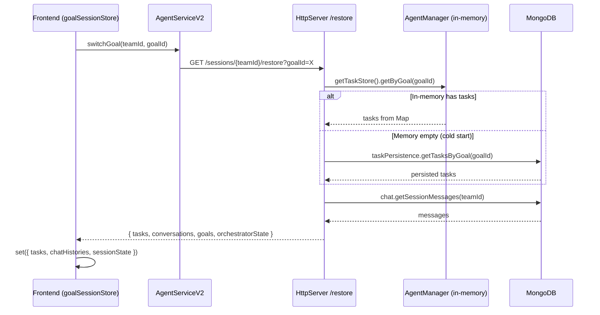
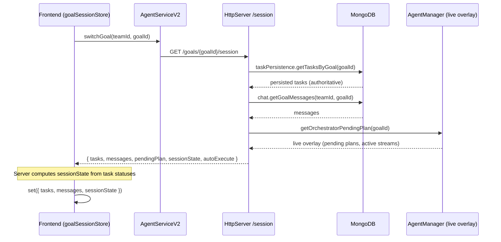
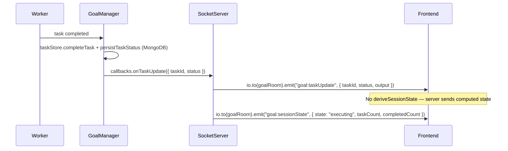

# v4.0 — Server-Owned Sessions

## Branch
`feature/v4-server-sessions`

## Scope
Server becomes the single source of truth for all session state. Frontend becomes a stateless view that fetches on load and receives incremental updates via Socket.IO. Any tab, any device sees the same state.

## Prerequisites
- [x] v2.0 GoalSessionStore (single frontend store)
- [x] v2.5 goalId explicit everywhere
- [x] v3.0 Task + goal persistence in MongoDB
- [ ] v3.1 CRDT/File cleanup (recommended but not blocking)

## Steps

- [ ] **Step 1: Session snapshot endpoint**
  - `GET /api/v2/goals/{goalId}/session` — returns complete session state
  - Response: `{ goalId, title, status, tasks, messages, autoExecute, repoUrl, repoBranch, allGoalSummaries }`
  - Replaces current restore endpoint (HttpServer.ts L422-555) which reads from in-memory AgentManager first, DB fallback second
  - v4.0 inverts this: DB is primary (tasks are persisted since v3.0), in-memory provides live execution overlay (active streams, pending approvals)
  - Files: `HttpServer.ts` (new endpoint or refactor existing restore)

- [ ] **Step 2: Incremental state protocol**
  - Replace current 13 untyped Socket.IO events with specific typed events:
    - Current events: `stream`, `state`, `error`, `progress`, `task_update`, `goal:stateChange`, `goal:created`, `discussion:activity`, `discussion:mention`, `output`, `message`, `registered`
    - Target: typed `ServerToClientEvents` / `ClientToServerEvents` generics on Socket.IO
    - Replace catch-all `state` event (used for plan updates, task updates, session state) with specific events
  - Files: `SocketServerV2.ts` (1641 lines), frontend event handlers

- [ ] **Step 3: Frontend read-only stores**
  - `goalSessionStore.switchGoal()` (L204): fetches from session endpoint instead of `agentServiceV2.restoreSession()`
  - `goalSessionStore.restoreTeam()` (L281): same — uses session endpoint
  - Socket.IO events update store incrementally — replace `handleStateEvent` catch-all (L656) with specific event handlers
  - `isForActiveGoal` check stays — only accept events for the active goal
  - 10 subscriptions in App.tsx (L269-410) wire events to store — these become middleware in v5.0
  - Files: `goalSessionStore.ts`, `AgentServiceV2.ts`

- [ ] **Step 4: Remove frontend-side state derivation**
  - Server computes `sessionState` (no more `deriveSessionState` on frontend)
  - Server computes `taskCount`/`completedCount` for plan summaries
  - Frontend is pure render: receives state, displays it
  - Files: `goalSessionStore.ts`, `SocketServerV2.ts`

## Design

### Current Restore Flow (v3.0)

### Target Restore Flow (v4.0)

### Incremental Update Flow (v4.0)

## Design Decisions

**Why server-owned:** Frontend and backend can currently disagree on goal/task state. Server-owned eliminates this class of bugs entirely.

**DB-primary restore:** Tasks are persisted to MongoDB since v3.0 (14 mutation paths). The in-memory TaskStore is a live cache, not the source of truth. On restore, DB provides the complete picture; in-memory only adds live execution state (pending approvals, active streams).

**Incremental vs full snapshot:** Full snapshots on every change would be wasteful. Specific typed events (`goal:taskUpdate`, `goal:sessionState`) allow the frontend to apply deltas efficiently.

**Offline/reconnect:** On reconnect, client fetches full snapshot from the session endpoint, then resumes incremental updates. Same pattern as ChatGPT.
