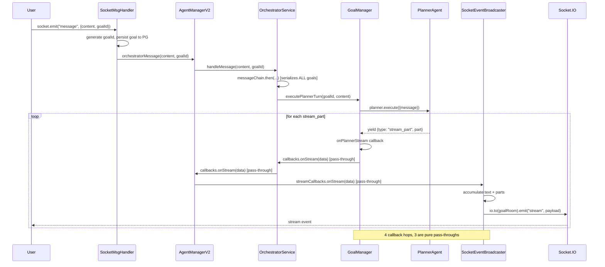
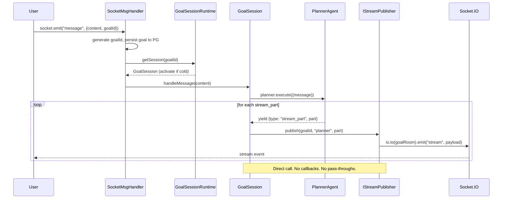
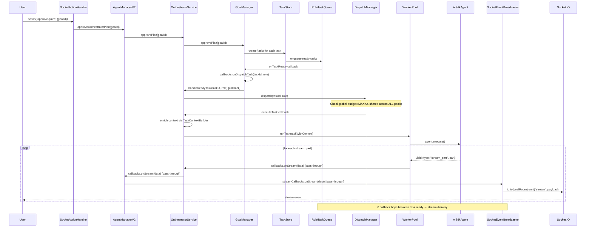
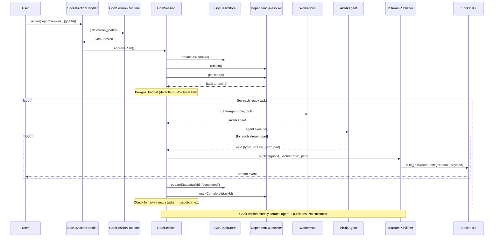
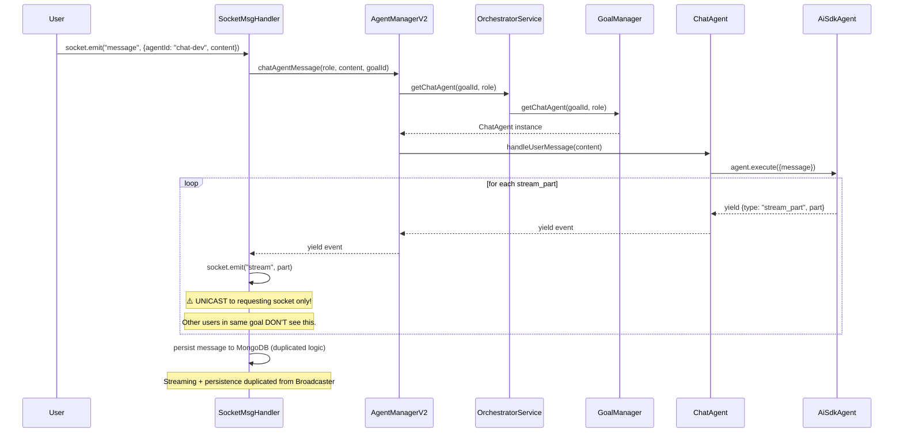
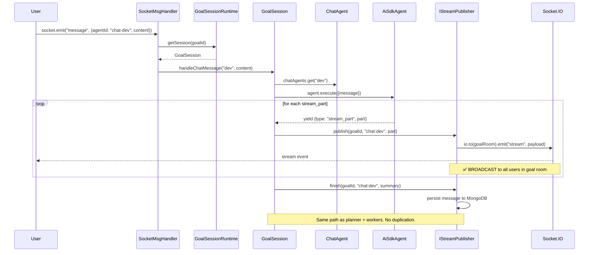
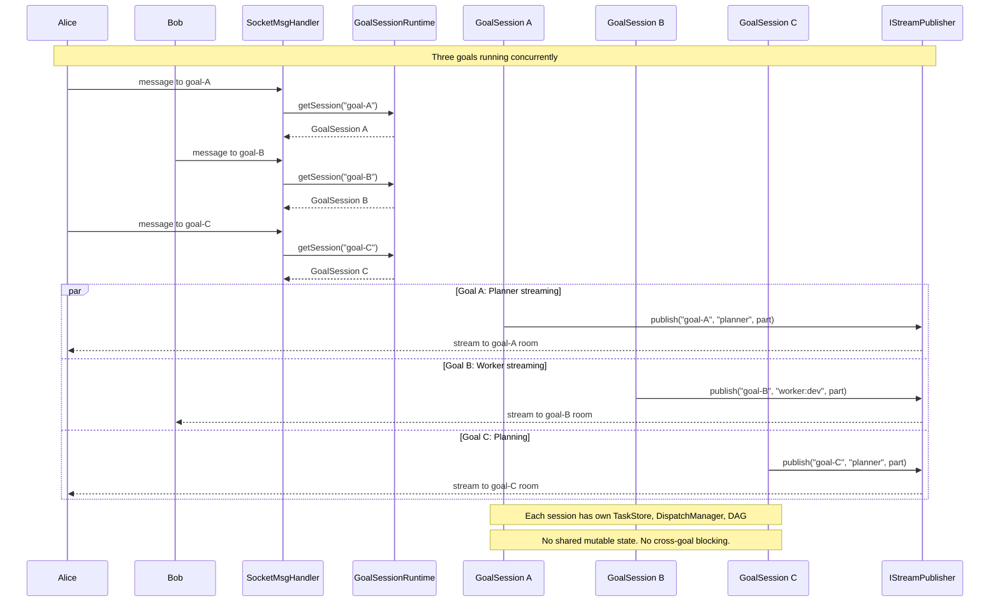
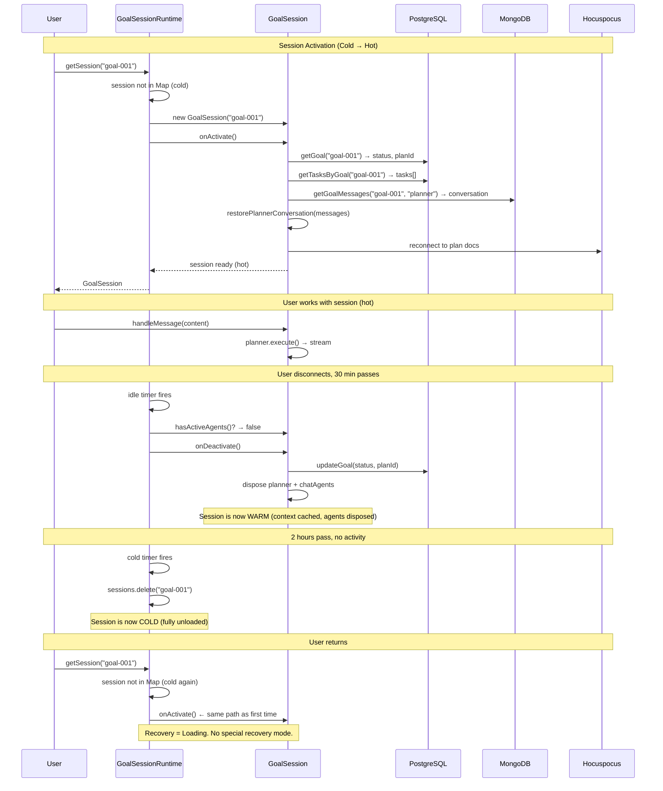

# Multi-User Multi-Goal Session Platform — Implementation Plan

**Date:** May 6, 2026
**Status:** Planning
**Purpose:** Production-ready implementation plan for multi-user, multi-goal sessions with per-agent streaming.
**Research:** [goal-isolation-research.md](../process-isolation/goal-isolation-research.md)
**Architecture:** Virtual Actor Runtime (Orleans-inspired)

---

## Target State

```
Alice (browser)                              Bob (browser)
  ├── Goal: "Build auth" [executing]           ├── Goal: "API docs" [executing]
  │    ├── Planner (streaming)                 │    ├── Planner (idle)
  │    ├── Worker: backend-dev (streaming)     │    └── Worker: tech-writer (streaming)
  │    └── ChatAgent: researcher (idle)        │
  │                                            └── Goal: "iOS push" [planning]
  ├── Goal: "Rate limiting" [planning]              └── Planner (streaming)
  │    └── Planner (streaming)                 
  │                                            
  └── Goal: "Dashboard" [ready]               
       └── (idle — no agents active)           
                                               
All goals:                                     
  ✅ Independent — one crash doesn't affect others
  ✅ Concurrent — multiple planners active simultaneously  
  ✅ Persistent — survive disconnects, server restarts
  ✅ Per-agent streaming — each agent has its own token stream
  ✅ Multi-user — Alice and Bob share "Backend" team, see different goals
  ✅ Fair — per-user concurrency budgets, no starvation
```

---

## Current Architecture (Verified)

### Component Ownership Graph

```
┌──────────────────────────────────────────────────────────────────┐
│                     SINGLETON LAYER (1 per process)              │
├──────────────────────────────────────────────────────────────────┤
│                                                                  │
│  AgentManagerRegistry ──────── Map<teamId, AgentManager>         │
│       │                        (lazy, cached)                    │
│       │                                                          │
│  SocketServerV2                                                  │
│       ├── SocketEventBroadcaster ← goal-scoped rooms ✅          │
│       ├── SocketMessageHandler   ← stateless, routes by goalId  │
│       └── SocketActionHandler    ← stateless                    │
│                                                                  │
└──────────────────────────────────────────────────────────────────┘
                              │
              creates one per team (lazy, cached)
                              ▼
┌──────────────────────────────────────────────────────────────────┐
│                     PER-TEAM LAYER (1 per team)                 │
├──────────────────────────────────────────────────────────────────┤
│                                                                  │
│  AgentManager                                                    │
│       │                                                          │
│       ├── WorkerPool ← definitions + workers by taskId           │
│       │     └── ⚠️ currentGoalId (scalar, last-set-wins)        │
│       │                                                          │
│       ├── TaskStore ← Map<taskId, Task> (ALL goals mixed)        │
│       │     ├── RoleTaskQueue (shared across goals)              │
│       │     └── roleListeners (not goal-filtered)                │
│       │                                                          │
│       ├── DependencyResolver ← rebuilt per mutation              │
│       ├── NotificationQueue ← per-goalId buckets ✅              │
│       ├── GoalEventBus ← events carry goalId ✅                  │
│       ├── PluginRegistry ← team-scoped plugins                  │
│       │                                                          │
│       └── OrchestratorService                                    │
│             ├── ⚠️ messageChain (serializes ALL goals)           │
│             │                                                    │
│             ├── DispatchManager                                  │
│             │     ├── ⚠️ activeDispatches (global Set, max=2)   │
│             │     └── ⚠️ deferredDispatches (global queue)      │
│             │                                                    │
│             └── GoalManager                                      │
│                   ├── goals: Map<goalId, GoalContext>             │
│                   ├── ⚠️ activeGoalId (scalar fallback)         │
│                   └── ⚠️ FF_PARALLEL_PLANS gate                 │
│                                                                  │
└──────────────────────────────────────────────────────────────────┘
                              │
              creates per goal (via factories in GoalManager)
                              ▼
┌──────────────────────────────────────────────────────────────────┐
│                     PER-GOAL LAYER                              │
├──────────────────────────────────────────────────────────────────┤
│                                                                  │
│  GoalContext                                                     │
│    ├── goalId, state, pendingPlan, currentPlanId                 │
│    ├── planner: PlannerAgent (lazy, stateful LLM conversation)  │
│    └── chatAgents: Map<role, ChatAgent>                          │
│                                                                  │
│  PlannerAgent (per-goal) ← tools scoped to goalId               │
│  ChatAgent (per-goal-role) ← own dispatch queue                 │
│  AiSdkAgent (per-task, ephemeral) ← created by WorkerPool      │
│                                                                  │
└──────────────────────────────────────────────────────────────────┘

  ⚠️ = multi-goal blocker (must fix)
  ✅ = already multi-goal safe
```

### Data Flow: User Message → Agent Response

```
User sends "Build an auth system"
  │
  ▼
┌─SocketServerV2 ─────────────────────────────────────────────────┐
│  socket.on("message") → SocketMessageHandler.handleMessage()    │
│    │                                                             │
│    ├── Auth: socket.data.userId (from better-auth cookie)       │
│    ├── Generate goalId (server-side, if new goal)               │
│    ├── Persist goal row to PostgreSQL                           │
│    ├── Join socket to room: team:{teamId}:goal:{goalId}         │
│    │                                                             │
│    └── Route by agentId:                                        │
│         ├── "manager"/"orchestrator" → handleOrchestratorMsg()  │
│         ├── "chat-{role}" → handleChatAgentMsg()                │
│         └── "{role}" → handleWorkerMsg()                        │
└──────────────────────────────────────┬──────────────────────────┘
                                       │
                                       ▼
┌─ AgentManager (per-team) ────────────────────────────────────────┐
│  orchestrator._handleMessage(goalId, content)                    │
│    │                                                             │
│    ├── goalManager.getOrCreateGoal(goalId)                       │
│    │     └── Creates GoalContext if new                          │
│    │                                                             │
│    ├── goalManager.executePlannerTurn(goalId, content)           │
│    │     │                                                       │
│    │     ├── planner = getOrCreatePlanner(goalId)                │
│    │     │     └── PlannerAgent(goalId, tools, model)            │
│    │     │                                                       │
│    │     └── for await (event of planner.execute()):             │
│    │           │                                                 │
│    │           ├── stream_part → onPlannerStream callback        │
│    │           │                    │                             │
│    │           │                    ▼                             │
│    │           │   SocketEventBroadcaster.handleStream()          │
│    │           │     → io.to(goalRoom).emit("stream", part)     │
│    │           │     → on finish: persist to MongoDB             │
│    │           │                                                 │
│    │           ├── tool_call: submit_plan → approvePlan()        │
│    │           │     → dispatchManager.dispatch(tasks)           │
│    │           │                                                 │
│    │           └── done → state transition                       │
│    │                                                             │
│    └── [if plan approved] dispatchManager.dispatch()             │
│          │                                                       │
│          ├── Check: activeDispatches.size < MAX_CONCURRENT?     │
│          │   YES → workerPool.runTask(task)                     │
│          │   NO  → deferredDispatches.push(task)                │
│          │                                                       │
│          └── workerPool.runTask(task):                           │
│                ├── Create AiSdkAgent for role                   │
│                ├── for await (event of agent.execute()):         │
│                │     stream_part → callbacks.onStream()         │
│                │       → SocketEventBroadcaster                 │
│                │         → io.to(goalRoom).emit("stream")       │
│                └── done → onDone callback → mark complete       │
│                     → drain deferred queue                      │
│                                                                  │
└──────────────────────────────────────────────────────────────────┘
```

### Multi-Goal Concurrency (Current vs Target)

```
CURRENT: Sequential (one goal blocks others)
═══════════════════════════════════════════

Goal A: ████████ planner turn ████████ → approve → ██ worker 1 ██ → ██ worker 2 ██
Goal B:                                waiting...                  waiting...
         ◄── messageChain blocks ──►           ◄── dispatch budget=2 shared ──►


TARGET: Parallel (goals independent)
═══════════════════════════════════════════

Goal A: ████ planner ████ → approve → ██ worker 1 ██ ─┐
                                       ██ worker 2 ██ ─┤ budget=3 per goal
                                       ██ worker 3 ██ ─┘
Goal B: ████ planner ████ → approve → ██ worker 1 ██ ─┐
                                       ██ worker 2 ██ ─┤ budget=3 per goal
                                                       ─┘
Goal C: ████ planner ████ →                             (concurrent)
```

### Session Lifecycle (Virtual Actor Model)

```
                    ┌─────────────────────────────────────────┐
                    │            IGoalSession                  │
                    │                                          │
                    │  handleMessage(content, agentId?)        │
                    │  approvePlan()                            │
                    │  rejectPlan(feedback)                     │
                    │  cancel()                                │
                    │  getState() → GoalSessionState            │
                    │                                          │
                    │  onActivate()  ← called by runtime       │
                    │  onDeactivate() ← called by runtime      │
                    └──────────────────┬──────────────────────┘
                                       │
                    ┌──────────────────┴──────────────────────┐
                    │          GoalSessionRuntime              │
                    │                                          │
                    │  getSession(goalId) → IGoalSession       │
                    │    ├── cold? → activate (load from DB)   │
                    │    ├── hot?  → return direct ref         │
                    │    └── remote? → return proxy (Phase 5+) │
                    │                                          │
                    │  Sessions: Map<goalId, GoalSession>      │
                    │  IdleTimers: Map<goalId, Timeout>        │
                    │                                          │
                    │  RUNTIME env var:                         │
                    │    local  → all in-process               │
                    │    redis  → Redis Streams for tokens     │
                    │    fork   → child_process per session    │
                    │    distributed → cross-server routing    │
                    └─────────────────────────────────────────┘
```

### Production Architecture (Phase 6)

```
┌────────────────────────────────────────────────────────────────────────────┐
│                              USERS                                        │
│  Alice (laptop)    Bob (desktop)    Carol (phone)                         │
└───────┬────────────────┬────────────────┬─────────────────────────────────┘
        │ WebSocket      │ WebSocket      │ WebSocket
        ▼                ▼                ▼
┌────────────────────────────────────────────────────────────────────────────┐
│                         GATEWAY (stateless)                               │
│                                                                           │
│  Socket.IO + Express + Auth                                               │
│  ├── SessionRouter: goalId → hostId (Redis directory)                     │
│  ├── StreamMux: XREAD BLOCK on all active stream keys                     │
│  └── Socket.IO Redis Adapter: cross-server broadcast                      │
│                                                                           │
│  Can scale horizontally: N gateway instances behind load balancer         │
└───────────────────────────┬───────────────────────────────────────────────┘
                            │ Redis (streams, pub/sub, directory, BullMQ)
                            ▼
┌──────────────────┐  ┌──────────────────┐  ┌──────────────────┐
│  Session Host A  │  │  Session Host B  │  │  Session Host C  │
│                  │  │                  │  │                  │
│ ┌──────────────┐ │  │ ┌──────────────┐ │  │ ┌──────────────┐ │
│ │ Goal: auth   │ │  │ │ Goal: API    │ │  │ │ Goal: iOS    │ │
│ │ (Alice, hot) │ │  │ │ (Bob, hot)   │ │  │ │ (Bob, hot)   │ │
│ │              │ │  │ │              │ │  │ │              │ │
│ │ Planner ►str │ │  │ │ Writer ►str  │ │  │ │ Planner ►str │ │
│ │ Worker1 ►str │ │  │ │              │ │  │ │              │ │
│ │ Worker2 ►str │ │  │ │              │ │  │ │              │ │
│ └──────────────┘ │  │ └──────────────┘ │  │ └──────────────┘ │
│                  │  │                  │  │                  │
│ ┌──────────────┐ │  │ ┌──────────────┐ │  │                  │
│ │ Goal: rate   │ │  │ │ Goal: dash   │ │  │                  │
│ │ (Alice, hot) │ │  │ │ (Alice,warm) │ │  │                  │
│ │ Planner ►str │ │  │ │ (idle 25min) │ │  │                  │
│ └──────────────┘ │  │ └──────────────┘ │  │                  │
│                  │  │                  │  │                  │
│ Shared:          │  │ Shared:          │  │ Shared:          │
│ PG + Mongo + Redis  │ PG + Mongo + Redis  │ PG + Mongo + Redis │
└──────────────────┘  └──────────────────┘  └──────────────────┘

  ►str = publishes to Redis Stream: stream:{teamId}:{goalId}:{agentKey}
  
  StreamMux (in Gateway) reads ALL active streams via single XREAD BLOCK
  → routes to Socket.IO goal rooms → user's browser
```

### Per-Agent Stream Keys

```
Each agent has its own Redis Stream key:

stream:team-backend:goal-001:planner         ← planner tokens
stream:team-backend:goal-001:worker:dev      ← worker for dev role
stream:team-backend:goal-001:worker:devops   ← worker for devops role  
stream:team-backend:goal-001:chat:researcher ← chat agent tokens
stream:team-backend:goal-002:planner         ← different goal, own stream
stream:team-backend:goal-002:worker:writer   ← different goal's worker

Why per-agent?
  ✅ No interleaving — each agent's tokens are ordered
  ✅ Independent lifecycle — agent finishes → stream cleaned up
  ✅ Selective subscribe — frontend can follow specific agents
  ✅ Backpressure — slow consumer doesn't affect other agents
```

---

### 7 Critical Blockers for Multi-Goal

| # | Component | Blocker | Fix |
|---|-----------|---------|-----|
| B1 | GoalManager | `FF_PARALLEL_PLANS` clears all goals when 2nd arrives | Remove gate |
| B2 | GoalManager | `activeGoalId` scalar — 8 methods use it as default | Require explicit goalId |
| B3 | DispatchManager | `MAX_CONCURRENT_DISPATCHES=2` is global, not per-goal | Move to per-goal GoalSession |
| B4 | DispatchManager | `deferredDispatches` queue has no goal fairness | Move to per-goal GoalSession |
| B5 | OrchestratorService | `messageChain` serializes ALL planner turns | Per-goal chains |
| B6 | WorkerPool | `currentGoalId` scalar overwritten on each `approvePlan()` | Resolve per-task from TaskStore |
| B7 | WorkerPool | `crdtTaskSync` scalar — wrong goal's CRDT context | Resolve per-task from GoalSession |

### Component Ownership Refactoring

The fundamental shift: **goal session is the unit of composition, not the team.** Team provides shared config (agent definitions, plugins). Execution state lives in the session.

```
CURRENT (per-team, shared)               TARGET (per-goal, in GoalSession)
═══════════════════════════               ════════════════════════════════

AgentManager (per-team)                   AgentManager (per-team)
├── TaskStore ← all goals mixed           ├── WorkerPool ← shared factory ✅
├── WorkerPool ← shared                   │     └── creates AiSdkAgent per task
├── DependencyResolver ← all goals        ├── PluginRegistry ← shared config ✅
├── PluginRegistry ← shared               │
├── NotificationQueue ← goalId keys       └── GoalSessionRuntime
├── GoalEventBus ← shared handlers            ├── Map<goalId, GoalSession>
├── DispatchManager ← global budget            │
└── OrchestratorService                        └── GoalSession (per-goal) ← THE ACTOR
    └── GoalManager                                ├── TaskStore ← this goal only
        └── Map<goalId, GoalContext>               ├── DependencyResolver ← this goal's DAG
                                                   ├── DispatchManager ← this goal's budget
                                                   ├── NotificationQueue ← this goal's notifs
                                                   ├── GoalEventBus ← this goal's events
                                                   ├── PlannerAgent ← stateful LLM
                                                   ├── ChatAgents ← per-role
                                                   └── GoalContext (state machine)
```

#### What Moves Into GoalSession (Per-Goal)

| Component | Why Per-Goal | Migration |
|-----------|-------------|-----------|
| **TaskStore** | Session owns its tasks. Load = read from PG. Unload = clear. No cross-goal leakage. Shared Map means one goal's `clearByGoal()` races with another's reads. | Extract `GoalTaskStore` — scoped subset of current TaskStore |
| **DependencyResolver** | DAG is per-plan. Goal A's deps have nothing to do with Goal B's. `rebuild()` currently loads ALL tasks — wrong for multi-goal. | Already has `rebuildForGoal()`. Make it the only mode. |
| **DispatchManager** | Per-goal concurrency budget. Session deactivation drains its queue. No cross-goal starvation. | Extract from OrchestratorService into GoalSession |
| **NotificationQueue** | Session manages its own planner notification batching. When session deactivates, pending notifications flush. | Already keyed by goalId. Move into GoalSession. |
| **GoalEventBus** | CRDT projections fire only for this goal's events. No cross-goal handler leakage. | Already events carry goalId. Create per-session instance. |

#### What Stays Shared (Per-Team)

| Component | Why Shared |
|-----------|-----------|
| **WorkerPool** | Agent definitions are team-level (same agents serve all goals). Workers are keyed by taskId — already goal-agnostic. Pool is a factory, not state. Remove `currentGoalId` scalar. |
| **PluginRegistry** | Team configuration. Workspace tools, skills, collaboration tools are the same for all goals. Shared by design. |

#### The Google Docs Analogy

```
Google Workspace (= Team)              Ping Team
├── Shared config:                     ├── Shared config:
│   ├── Fonts, templates               │   ├── Agent definitions (YAML)
│   ├── Drive permissions              │   ├── Plugins (workspace, skills)
│   └── Admin settings                 │   └── Team membership (PG)
│                                      │
├── Document A (= GoalSession)         ├── GoalSession A ("Build auth")
│   ├── Own CRDT state                 │   ├── Own TaskStore (5 tasks)
│   ├── Own undo history               │   ├── Own DependencyResolver (DAG)
│   ├── Own collaborator list          │   ├── Own DispatchManager (budget=3)
│   └── Loads/unloads independently    │   ├── Own Planner + ChatAgents
│                                      │   └── Loads/unloads independently
├── Document B (= GoalSession)         │
│   └── Completely independent         ├── GoalSession B ("Rate limiting")
│                                      │   └── Completely independent
└── Documents share fonts/permissions  │
    but NEVER share content/history    └── Sessions share agents/plugins
                                           but NEVER share tasks/state
```

### What's Already Per-Goal (No Change Needed)

- GoalContext in GoalManager (`Map<goalId, GoalContext>`)
- PlannerAgent created per-goal (lazy)
- ChatAgent created per-goal-per-role
- SocketEventBroadcaster uses goal-scoped rooms
- SocketMessageHandler generates goalId server-side
- Goal persistence in PostgreSQL (Phase 2 ✅)
- Planner conversation persistence in MongoDB (v1.2 ✅)

---

## Architecture: GoalSession Virtual Actor

### The Core Abstraction

```typescript
// The interface that never changes regardless of deployment topology
interface IGoalSession {
  // Commands
  handleMessage(content: string, agentId?: string): Promise<void>;
  approvePlan(): Promise<void>;
  rejectPlan(feedback: string): Promise<void>;
  cancel(): Promise<void>;

  // Queries
  getState(): Promise<GoalSessionState>;
  getTasks(): Promise<Task[]>;
  
  // Lifecycle (called by runtime, not by callers)
  onActivate(): Promise<void>;   // load from cold storage
  onDeactivate(): Promise<void>; // flush + dispose
}

// The runtime that manages session lifecycle + location transparency
interface IGoalSessionRuntime {
  getSession(goalId: string): IGoalSession;  // activate if needed
  listActiveSessions(): string[];
  getSessionState(goalId: string): "cold" | "hot" | "warm";
}
```

### Session Lifecycle States

```
          ┌──────────────────────────────────┐
          │           COLD (on disk)          │
          │  PG: goal status, tasks           │
          │  MongoDB: conversations           │
          │  CRDT: plan documents              │
          └──────────────┬───────────────────┘
                         │ getSession(goalId) — first access
                         │ onActivate(): load from PG + MongoDB
                         ▼
          ┌──────────────────────────────────┐
          │            HOT (in memory)        │
          │  Planner agent loaded              │
          │  Workers executing tasks           │
          │  ChatAgents available              │
          │  Token streams active              │
          │  Idle timer running                │
          └──────────────┬───────────────────┘
                         │ all agents idle + 30min timeout
                         │ onDeactivate(): flush + dispose
                         ▼
          ┌──────────────────────────────────┐
          │           WARM (in memory)        │
          │  GoalContext cached                │
          │  Agents disposed                   │
          │  Instant resume on next message    │
          │  Flushes to cold after extended    │
          │  idle (2 hours)                    │
          └──────────────┬───────────────────┘
                         │ goal completed/cancelled
                         ▼
          ┌──────────────────────────────────┐
          │          ARCHIVED (on disk)       │
          │  Same as cold + read-only         │
          │  Artifacts persist forever        │
          └──────────────────────────────────┘
```

---

## Refactoring Strategy: Clean the Callback Chain

### The Problem: 6-Layer Callback Spaghetti

The current wiring is a chain of callbacks configured at init time, crossing 6 components:

```
AgentManagerV2 constructor:
  └── creates OrchestratorService(config) where config.callbacks = {
        onStream: (data) => this.streamCallbacks?.onStream?.(data),  ← hop 1
        onEvent: ...
        onDone: ...
      }
      
OrchestratorService constructor:
  └── creates GoalManager(config) where config.callbacks = {
        onDispatchTask: (taskId, role) => this.handleReadyTask(),    ← hop 2
        onNotifyPlanner: (goalId, msg) => this.notifyPlanner(),      ← hop 3
        onTaskUpdate: this.callbacks.onTaskUpdate,                   ← hop 4 (pass-through)
      }
  └── workerPool.setCallbacks({
        onStream: (data) => this.callbacks.onStream?.(data),         ← hop 5 (pass-through!)
        onDone: (data) => this.goalManager.onWorkerDone(data),       ← hop 6
      })

SocketEventBroadcaster:
  └── manager.registerStreamCallbacks({
        onStream: (data) => { accumulate + io.to(room).emit() }     ← hop 7 (final)
      })
```

**Every callback is a pass-through.** OrchestratorService's `onStream` literally does `this.callbacks.onStream?.(data)` — it adds zero logic. Same with 4 other callbacks. This chain exists because components were extracted one at a time without rethinking the wiring.

### The Fix: Direct Composition, Not Callback Chains

In the clean architecture, GoalSession is the **composition root** for a single goal. It wires components directly — no intermediate callbacks.

```
CURRENT: Callbacks wired at init, 6 hops            CLEAN: Direct composition, 2 hops
═══════════════════════════════════════              ═══════════════════════════════════

AgentManagerV2                                       GoalSession
  ├── config.callbacks.onStream = ...                  ├── this.streamPublisher (injected)
  │     └── pass-through to broadcaster               │
  │                                                    ├── planner.execute() loop:
  └── OrchestratorService                              │     stream_part → streamPublisher.publish()
        ├── config.callbacks.onStream = ...            │
        │     └── pass-through to AgentMgr             ├── worker.execute() loop:
        │                                              │     stream_part → streamPublisher.publish()
        └── workerPool.setCallbacks({                  │
              onStream: pass-through to                └── chatAgent.execute() loop:
                OrchestratorService callbacks                stream_part → streamPublisher.publish()
                  → AgentMgr callbacks
                    → Broadcaster.onStream             GoalSession directly calls streamPublisher.
                      → io.to(room).emit()             No callbacks. No pass-throughs.
                                                       No 6-hop chain.
6 hops, 3 pass-throughs, 0 added logic                2 hops: session → publisher → Socket.IO
```

### Clean Architecture LLD

```
┌──────────────────────────────────────────────────────────────────────────┐
│                          PER-TEAM (shared, injected)                     │
│                                                                          │
│  WorkerPool ── creates AiSdkAgent per task, agent definitions per role   │
│  PluginRegistry ── workspace tools, skills, collaboration tools          │
│  IStreamPublisher ── publishes tokens (in-process or Redis Streams)      │
│  ITaskPersistence ── write-through to PG                                 │
│  IChatService ── conversation persistence in MongoDB                     │
│                                                                          │
└──────────────────────────────────────────────────────────────────────────┘
                                    │
                            injected into
                                    ▼
┌──────────────────────────────────────────────────────────────────────────┐
│                          GoalSession (per-goal composition root)         │
│                                                                          │
│  OWNS (created in constructor, scoped to this goal):                     │
│  ├── GoalTaskStore ── this goal's tasks only                             │
│  ├── DependencyResolver ── this goal's DAG                               │
│  ├── DispatchManager ── this goal's concurrency budget                  │
│  ├── NotificationQueue ── this goal's planner notifications             │
│  ├── GoalEventBus ── this goal's CRDT projection events                 │
│  ├── GoalContext ── state machine (gathering/ready/executing/done)       │
│  ├── PlannerAgent ── stateful LLM (lazy, created on first message)      │
│  └── ChatAgents: Map<role, ChatAgent> ── per-role (lazy)                │
│                                                                          │
│  INJECTED (shared, received from team):                                  │
│  ├── workerPool ── creates agents for task execution                    │
│  ├── pluginRegistry ── tools for agents                                 │
│  ├── streamPublisher ── IStreamPublisher (in-process or Redis)          │
│  ├── taskPersistence ── ITaskPersistence (PG write-through)             │
│  └── chatService ── conversation persistence                            │
│                                                                          │
│  THE EXECUTION LOOPS (no callbacks — direct iteration):                  │
│                                                                          │
│  handleMessage(content):                                                 │
│    for await (event of planner.execute({ message })):                   │
│      if stream_part → this.streamPublisher.publish(goalId, "planner")   │
│      if tool_call "submit_plan" → this.onPlanSubmitted(plan)            │
│                                                                          │
│  executeTask(taskId):                                                    │
│    const agent = this.workerPool.createAgent(role, tools)               │
│    for await (event of agent.execute()):                                 │
│      if stream_part → this.streamPublisher.publish(goalId, role)        │
│      if done → this.onTaskCompleted(taskId)                             │
│                                                                          │
│  handleChatMessage(role, content):                                       │
│    const agent = this.chatAgents.get(role)                              │
│    for await (event of agent.execute({ message })):                     │
│      if stream_part → this.streamPublisher.publish(goalId, "chat:role") │
│                                                                          │
│  onTaskCompleted(taskId):                                                │
│    this.taskStore.updateStatus(taskId, "completed")                     │
│    this.dagResolver.markCompleted(taskId)                               │
│    for (readyTask of dagResolver.getNewlyReady()):                      │
│      this.dispatch.dispatch(readyTask)  ← direct call, not callback    │
│                                                                          │
└──────────────────────────────────────────────────────────────────────────┘
```

### What Gets Eliminated

| Current Component | What Happens | Why |
|-------------------|-------------|-----|
| **OrchestratorService** | **Dissolved.** Its logic moves into GoalSession. It was just a callback router between GoalManager and WorkerPool. | GoalSession directly owns dispatch + task lifecycle. No intermediary needed. |
| **GoalManager** | **Dissolved.** Goal lifecycle (state machine, plan approval) moves into GoalSession. GoalContext becomes GoalSession's internal state. | GoalSession IS the goal manager. One class per goal, not one manager for all goals. |
| **OrchestratorService.messageChain** | **Gone.** Each GoalSession handles its own messages sequentially (it's one goal). No cross-goal serialization. | Per-session by construction. |
| **6-layer callback chain** | **Gone.** GoalSession iterates generators directly and calls `streamPublisher.publish()`. | Direct composition replaces callback wiring. |
| **AgentManagerV2.streamCallbacks** | **Gone.** Replaced by `IStreamPublisher` injected into GoalSession. | Interface, not callback. |
| **SocketEventBroadcaster.onStream** | **Replaced by StreamSubscriber** (gateway-side). GoalSession publishes. Gateway subscribes. | Clean separation: producer ≠ consumer. |

### What Stays

| Component | Why It Stays |
|-----------|-------------|
| **WorkerPool** | Agent factory. Creates AiSdkAgent from definitions + tools. Shared per-team. GoalSession calls `workerPool.createAgent()` — gets back an agent, iterates it. |
| **PluginRegistry** | Tool provider. Shared per-team config. GoalSession passes it to agents. |
| **AgentManagerV2** | Becomes thin: owns WorkerPool, PluginRegistry, GoalSessionRuntime. Exposes `getSession(goalId)`. No more orchestrator/callbacks. |
| **TaskStore** | **Replaced by GoalTaskStore** (per-session). Same interface, scoped to one goal. |
| **PlannerAgent / ChatAgent / AiSdkAgent** | Agent classes unchanged. GoalSession creates and iterates them. |

### The IStreamPublisher Interface

This is the key abstraction that eliminates the callback chain:

```typescript
interface IStreamPublisher {
  /** Publish a token-level stream event */
  publish(teamId: string, goalId: string, agentKey: string, part: StreamPart): void;
  
  /** Signal agent finished — triggers persistence + cleanup */
  finish(teamId: string, goalId: string, agentKey: string, summary: {
    text: string;
    parts: RenderedPart[];
    agentId: string;
    taskId?: string;
  }): Promise<void>;
}

// Phase 0-2: In-process (wraps current Socket.IO emit)
class SocketStreamPublisher implements IStreamPublisher {
  constructor(private io: SocketIOServer, private chatService: IChatService) {}
  
  publish(teamId, goalId, agentKey, part) {
    const room = `team:${teamId}:goal:${goalId}`;
    this.io.to(room).emit("stream", { agentId: agentKey, goalId, part, timestamp: Date.now() });
  }
  
  async finish(teamId, goalId, agentKey, summary) {
    // Persist to MongoDB
    await this.chatService.addMessage({
      teamId, goalId, agentId: summary.agentId, role: "assistant",
      content: summary.text, streamParts: JSON.stringify(summary.parts),
      taskId: summary.taskId,
      agentLayer: agentKey.startsWith("chat:") ? "chat-agent" : agentKey === "planner" ? "planner" : "worker",
      timestamp: new Date().toISOString(),
    });
  }
}

// Phase 3+: Redis Streams
class RedisStreamPublisher implements IStreamPublisher {
  publish(teamId, goalId, agentKey, part) {
    this.redis.xadd(`stream:${teamId}:${goalId}:${agentKey}`, "*", "p", JSON.stringify(part));
  }
  // StreamMux on gateway subscribes and calls io.to(room).emit() + persists
}
```

---

## Migration Sequence (Non-Breaking, Step by Step)

The migration happens in 4 steps. Each step is a separate PR. The system works at every intermediate state.

### Step 1: Add IStreamPublisher + GoalTaskStore (1 week)

**New files only. No existing files modified.**

```
NEW: agent-manager/src/session/IGoalSession.ts        ← interface
NEW: agent-manager/src/session/IStreamPublisher.ts     ← interface
NEW: agent-manager/src/session/GoalTaskStore.ts        ← per-goal task store
NEW: agent-manager/src/session/GoalSession.ts          ← composition root
NEW: agent-manager/src/session/GoalSessionRuntime.ts   ← manages Map<goalId, GoalSession>
NEW: backend/api/SocketStreamPublisher.ts              ← IStreamPublisher impl
```

GoalSession exists but is NOT wired yet. Tests can exercise it in isolation.

### Step 2: Wire GoalSession for NEW goals only (1 week)

**Feature flag: `GOAL_SESSION=true`**

```typescript
// SocketMessageHandler — only change:
if (process.env.GOAL_SESSION === "true") {
  const session = manager.runtime.getSession(goalId);
  await session.handleMessage(content);
} else {
  // Old path — completely unchanged
  await manager.orchestratorMessage(content, goalId);
}
```

Both paths work. Old goals use old path. New goals (with flag) use GoalSession. Rollback = unset flag.

### Step 3: Migrate all paths to GoalSession (1 week)

```typescript
// SocketMessageHandler:
const session = manager.runtime.getSession(goalId);
await session.handleMessage(content, agentId);

// SocketActionHandler:
const session = manager.runtime.getSession(goalId);
await session.approvePlan();

// Remove: manager.orchestratorMessage(), manager.approveOrchestratorPlan()
// Remove: SocketEventBroadcaster.onStream callback registration
// Remove: AgentManagerV2.streamCallbacks
```

### Step 4: Delete dead code (0.5 week)

```
DELETE: OrchestratorService.ts          ← replaced by GoalSession
DELETE: GoalManager.ts                  ← dissolved into GoalSession
DELETE: DispatchManager.ts              ← moved into GoalSession (simplified)
DELETE: SocketEventBroadcaster.ts       ← replaced by SocketStreamPublisher
SIMPLIFY: AgentManagerV2.ts            ← remove orchestrator wiring, keep WorkerPool + plugins
SIMPLIFY: WorkerPool.ts                ← remove callback setters, just be a factory
```

### Sequence Diagrams

#### Flow 1: User Message → Planner Streaming (BEFORE — 7 hops)



#### Flow 1: User Message → Planner Streaming (AFTER — 2 hops)



#### Flow 2: Plan Approval → Task Dispatch → Worker Streaming (BEFORE — 8 hops)



#### Flow 2: Plan Approval → Task Dispatch → Worker Streaming (AFTER — 3 hops)



#### Flow 3: ChatAgent Message (BEFORE — unicast bug)



#### Flow 3: ChatAgent Message (AFTER — broadcast, unified)



#### Flow 4: Multi-Goal Concurrency (AFTER)



#### Flow 5: Session Lifecycle (Cold → Hot → Warm → Cold)


                 → workerPool.createAgent(role)
                 → for await (event of agent.execute()):
                     this.streamPublisher.publish()
```

---

**Goal:** Wrap current GoalManager in the virtual actor interface. Zero behavior change. Feature flag.

**Changes:**

| File | Change |
|------|--------|
| `agent-manager/src/session/IGoalSession.ts` | **New** — interface definition |
| `agent-manager/src/session/GoalSessionRuntime.ts` | **New** — `LocalRuntime` wrapping current GoalManager |
| `agent-manager/src/session/GoalSession.ts` | **New** — wraps GoalContext + agents into session object |
| `agent-manager/src/AgentManagerV2.ts` | Wire `GoalSessionRuntime` as the entry point |
| `backend/api/SocketMessageHandler.ts` | Route through `runtime.getSession(goalId)` |

**What this looks like:**

```typescript
// GoalSessionRuntime — LocalRuntime (Phase 0)
class LocalGoalSessionRuntime implements IGoalSessionRuntime {
  private sessions = new Map<string, GoalSession>();
  
  getSession(goalId: string): IGoalSession {
    let session = this.sessions.get(goalId);
    if (!session) {
      session = new GoalSession(goalId, this.orchestrator, this.workerPool);
      this.sessions.set(goalId, session);
    }
    return session;
  }
}

// GoalSession — wraps current GoalContext
class GoalSession implements IGoalSession {
  async handleMessage(content: string, agentId?: string) {
    // Delegates to GoalManager.executePlannerTurn() or ChatAgent
    // Same code, just through the session interface
  }
  
  async onActivate() {
    // Phase 0: no-op (already in memory)
    // Phase 1: load from PG + MongoDB
  }
  
  async onDeactivate() {
    // Phase 0: no-op
    // Phase 1: flush + dispose agents
  }
}
```

**Also in Phase 0:** Fix ChatAgent broadcast (currently unicasts to requesting socket only).

**Exit criteria:** All user messages route through `runtime.getSession(goalId).handleMessage()`. Current behavior unchanged. Tests pass.

---

### Phase 1.5: Delete Dead Code (0.5 week)

After Step 3 (all paths on GoalSession), the old components are unused:

```
DELETE: OrchestratorService.ts           ← dissolved into GoalSession
DELETE: GoalManager.ts                   ← dissolved into GoalSession  
DELETE: DispatchManager.ts               ← simplified, inside GoalSession
DELETE: SocketEventBroadcaster.ts        ← replaced by SocketStreamPublisher
SIMPLIFY: AgentManagerV2.ts             ← remove orchestrator init, keep WorkerPool + Plugins
SIMPLIFY: WorkerPool.ts                 ← remove callback setters (setCallbacks, setTaskServices)
```

**Exit criteria:** No dead code. `bun run build` clean. Reduced line count.

---

### Phase 2: Session Lifecycle (2 weeks)

**Goal:** Sessions load/unload from persistent storage. Idle sessions free memory. Crash recovery via reload.

#### 2.1: GoalSession.onActivate() — Load from cold storage (3 days)

```typescript
async onActivate(): Promise<void> {
  // Load goal from PostgreSQL
  const goalRow = await this.pgGoals.getGoal(this.goalId);
  if (!goalRow) throw new Error(`Goal ${this.goalId} not found`);
  
  this.state = goalRow.status;
  this.title = goalRow.title;
  this.currentPlanId = goalRow.planId;
  
  // Load tasks from PostgreSQL
  const taskRows = await this.pgTasks.getTasksByGoal(this.goalId);
  for (const task of taskRows) {
    this.taskStore.restore(task);
  }
  
  // Restore planner conversation from MongoDB
  const plannerMessages = await this.chatService.getGoalMessages(
    this.teamId, this.goalId, "planner"
  );
  if (plannerMessages.length > 0) {
    this.planner = this.createPlanner();
    this.planner.restoreConversation(plannerMessages);
  }
  
  // Restore ChatAgent conversations
  const chatRoles = [...new Set(taskRows.map(t => t.assignedRole))];
  for (const role of chatRoles) {
    const messages = await this.chatService.getGoalMessages(
      this.teamId, this.goalId, `chat-${role}`
    );
    if (messages.length > 0) {
      const agent = this.createChatAgent(role);
      agent.restoreConversation(messages);
      this.chatAgents.set(role, agent);
    }
  }
  
  // Resume executing tasks if goal was mid-execution
  if (this.state === "executing") {
    const readyTasks = taskRows.filter(t => t.status === "ready");
    for (const task of readyTasks) {
      this.dispatch.dispatch(this.goalId, task.taskId, task.assignedRole);
    }
  }
}
```

#### 2.2: GoalSession.onDeactivate() — Flush to cold storage (1 day)

```typescript
async onDeactivate(): Promise<void> {
  // Save current state to PG
  await this.pgGoals.updateGoal(this.goalId, {
    status: this.state,
    planId: this.currentPlanId,
  });
  
  // Dispose agents (free LLM context memory)
  this.planner?.dispose();
  for (const agent of this.chatAgents.values()) {
    agent.dispose();
  }
  this.chatAgents.clear();
  
  // Kill any running workers
  for (const [taskId, worker] of this.workers) {
    worker.abort();
    await this.pgTasks.updateTaskStatus(taskId, "ready"); // will retry on reload
  }
  this.workers.clear();
}
```

#### 2.3: Idle timeout + warm/cold transitions (2 days)

```typescript
class GoalSessionRuntime {
  private idleTimers = new Map<string, NodeJS.Timeout>();
  
  private WARM_TIMEOUT = 30 * 60 * 1000;   // 30 min → dispose agents
  private COLD_TIMEOUT = 2 * 60 * 60 * 1000; // 2 hours → unload from memory
  
  private resetIdleTimer(goalId: string) {
    clearTimeout(this.idleTimers.get(goalId));
    
    this.idleTimers.set(goalId, setTimeout(async () => {
      const session = this.sessions.get(goalId);
      if (!session) return;
      
      if (session.hasActiveAgents()) {
        // Still working — reset
        this.resetIdleTimer(goalId);
        return;
      }
      
      // No active agents → deactivate
      await session.onDeactivate();
      
      // Keep GoalContext in memory (warm) for quick resume
      // Set cold timeout to fully unload
      this.idleTimers.set(goalId, setTimeout(() => {
        this.sessions.delete(goalId);  // fully unloaded
      }, this.COLD_TIMEOUT));
    }, this.WARM_TIMEOUT));
  }
}
```

#### 2.4: Frontend reconnection flow (2 days)

```
User opens goal-002 in sidebar
  │
  ├── Frontend: socket.emit("subscribeToGoal", { goalId: "goal-002" })
  │
  ├── Backend: SocketServerV2.handleSubscribeToGoal()
  │   ├── Auth check: user owns goal-002? (PG query)
  │   ├── Join socket to room team:{teamId}:goal:goal-002
  │   └── runtime.getSession("goal-002")
  │       └── Session is cold → onActivate() (1-3s)
  │           └── Load from PG + MongoDB + CRDT
  │
  ├── Backend sends current state to socket:
  │   ├── { type: "session-state", state: "executing", tasks: [...] }
  │   ├── { type: "active-agents", agents: ["planner", "backend-dev"] }
  │   └── Start streaming from any active agents
  │
  └── Frontend renders goal with current state
      ├── Shows tasks + statuses
      ├── Shows recent messages (from MongoDB via HTTP)
      └── Attaches to live streams (if agents active)
```

**Exit criteria:** Sessions survive server restarts. User closes browser → reopens → full state restored. Idle sessions unload after 30 minutes. Memory doesn't grow unbounded.

---

### Phase 3: Per-Agent Redis Streams (2 weeks)

**Goal:** Decouple token delivery from in-process callbacks. Agents publish to Redis Streams; gateway subscribes and routes to Socket.IO.

#### 3.1: IStreamPublisher + InProcessStreamPublisher (2 days)

```typescript
interface IStreamPublisher {
  publish(teamId: string, goalId: string, agentKey: string, part: StreamPart): Promise<void>;
  finish(teamId: string, goalId: string, agentKey: string, summary: FinishData): Promise<void>;
}

// Phase 3.1: wraps current callback chain — zero behavior change
class InProcessStreamPublisher implements IStreamPublisher {
  constructor(private broadcaster: SocketEventBroadcaster) {}
  
  async publish(teamId, goalId, agentKey, part) {
    // Delegate to existing broadcaster
    this.broadcaster.handleStreamPart(teamId, goalId, agentKey, part);
  }
}
```

#### 3.2: RedisStreamPublisher + StreamMux (5 days)

```typescript
// Publisher (in GoalSession)
class RedisStreamPublisher implements IStreamPublisher {
  async publish(teamId, goalId, agentKey, part) {
    const key = `stream:${teamId}:${goalId}:${agentKey}`;
    await this.redis.xadd(key, "*", "t", "sp", "p", JSON.stringify(part));
  }
  
  async finish(teamId, goalId, agentKey, summary) {
    const key = `stream:${teamId}:${goalId}:${agentKey}`;
    await this.redis.xadd(key, "*", "t", "fin", "txt", summary.text);
    await this.redis.expire(key, 60); // cleanup after 60s
  }
}

// Subscriber (in Gateway)
class StreamMux {
  // Single XREAD BLOCK loop on all active stream keys
  // Routes to Socket.IO goal rooms
  // Persists messages on "finish" sentinel
  // See goal-isolation-research.md §A.2 for full implementation
}
```

#### 3.3: Wire into GoalSession (3 days)

Replace all `this.callbacks.onStream(...)` calls with `this.streams.publish(...)`:

```typescript
// GoalSession.executePlannerTurn():
for await (const event of this.planner.execute({ message })) {
  if (event.type === "stream_part") {
    await this.streams.publish(this.teamId, this.goalId, "planner", event.part);
  }
}

// GoalSession.executeTask():
for await (const event of agent.execute()) {
  if (event.type === "stream_part") {
    await this.streams.publish(this.teamId, this.goalId, `worker:${role}`, event.part);
  }
}

// GoalSession.handleChatMessage():
for await (const event of chatAgent.execute({ message })) {
  if (event.type === "stream_part") {
    await this.streams.publish(this.teamId, this.goalId, `chat:${role}`, event.part);
  }
}
```

**Exit criteria:** Agents publish tokens to Redis Streams. Gateway reads from streams and broadcasts to Socket.IO. Message persistence moves from broadcaster callback to StreamMux subscriber. In-process fallback available via feature flag.

---

### Phase 4: Multi-User Authorization (2 weeks)

**Goal:** Goals scoped to users. Teams shared. Per-user concurrency budgets.

**Depends on:** Phase 2 (PgTeamService + PgGoalService already done ✅)

#### 4.1: Goal ownership enforcement (3 days)

Goals already have `created_by` in PG. Enforce at every access point:

```typescript
// SocketMessageHandler — before routing to session:
const goal = await pgGoals.getGoal(goalId);
if (goal && goal.createdBy !== socket.data.userId) {
  // Check if user is team admin (can see all goals in team)
  const role = await pgTeamService.getUserRoleForTeam(userId, teamId);
  if (role !== "owner" && role !== "admin") {
    emitError(socket, { error: "Not authorized for this goal" });
    return;
  }
}
```

#### 4.2: Goal listing filtered by user (2 days)

```typescript
// GET /api/v2/goals?teamId=X
// Returns only goals created by the requesting user (or all if admin)
router.get("/goals", async (req, res) => {
  const userId = req.userId;
  const teamId = req.query.teamId;
  
  const role = await pgTeamService.getUserRoleForTeam(userId, teamId);
  const goals = role === "owner" || role === "admin"
    ? await pgGoals.getGoalsByTeam(teamId)
    : await pgGoals.getGoalsByUser(teamId, userId);
  
  res.json({ goals });
});
```

#### 4.3: Per-user concurrency budgets (3 days)

```typescript
class UserConcurrencyBudget {
  private budgets = new Map<string, { active: number; max: number }>();
  
  canDispatch(userId: string): boolean {
    const budget = this.budgets.get(userId) ?? { active: 0, max: 3 };
    return budget.active < budget.max;
  }
  
  acquire(userId: string): boolean {
    const budget = this.budgets.get(userId) ?? { active: 0, max: 3 };
    if (budget.active >= budget.max) return false;
    budget.active++;
    this.budgets.set(userId, budget);
    return true;
  }
  
  release(userId: string) {
    const budget = this.budgets.get(userId);
    if (budget) budget.active--;
  }
}
```

#### 4.4: Socket.IO room scoping per user (2 days)

```
Current rooms:
  team:{teamId}                    ← all team members
  team:{teamId}:goal:{goalId}      ← all watchers of this goal

Multi-user rooms:
  team:{teamId}                    ← team-level events (new goal created, etc.)
  team:{teamId}:goal:{goalId}      ← goal-level streams + state (authorized users only)
  user:{userId}                    ← user-level notifications (cross-team)
```

**Exit criteria:** Users see only their own goals. Team admins see all. Per-user concurrency prevents one user from monopolizing agents. Goal-level Socket.IO rooms enforce authorization.

---

### Phase 5: Process Isolation (3 weeks)

**Goal:** Sessions in separate processes for crash isolation. Virtual actor runtime swaps from `LocalRuntime` to `ForkRuntime`.

#### 5.1: ForkRuntime (1 week)

```typescript
class ForkGoalSessionRuntime implements IGoalSessionRuntime {
  private processes = new Map<string, ChildProcess>();
  
  getSession(goalId: string): IGoalSession {
    let proc = this.processes.get(goalId);
    if (!proc) {
      proc = fork("./goal-session-worker.ts", {
        env: { GOAL_ID: goalId, TEAM_ID: this.teamId },
      });
      this.processes.set(goalId, proc);
    }
    return new IPCSessionProxy(goalId, proc);
  }
}

// IPCSessionProxy — sends commands via process.send()
class IPCSessionProxy implements IGoalSession {
  async handleMessage(content: string, agentId?: string) {
    return this.sendCommand({ type: "message", content, agentId });
  }
  
  private sendCommand(cmd: GoalCommand): Promise<void> {
    return new Promise((resolve, reject) => {
      this.process.send(cmd, (err) => err ? reject(err) : resolve());
    });
  }
}
```

#### 5.2: Goal Session Worker Process (1 week)

```typescript
// goal-session-worker.ts — child process entry point
const goalId = process.env.GOAL_ID!;
const teamId = process.env.TEAM_ID!;

const session = new GoalSession(goalId, teamId);
await session.onActivate();

process.on("message", async (cmd: GoalCommand) => {
  await session.handleCommand(cmd);
});

// Tokens go through Redis Streams (Phase 3 — already wired)
// Lifecycle events go through Redis Pub/Sub
// Commands come through IPC (process.send)
```

#### 5.3: Crash recovery + health checks (1 week)

```typescript
class ForkGoalSessionRuntime {
  private watchProcess(goalId: string, proc: ChildProcess) {
    proc.on("exit", (code) => {
      if (code !== 0) {
        logger.error(`Goal session ${goalId} crashed (exit ${code})`);
        this.processes.delete(goalId);
        
        // Notify user
        this.lifecycle.error(goalId, "Session crashed. Reloading...");
        
        // Auto-restart on next access (virtual actor pattern)
        // getSession(goalId) will fork a new process + onActivate()
      }
    });
    
    // Heartbeat check every 30s
    setInterval(() => {
      proc.send({ type: "ping" });
      const timeout = setTimeout(() => {
        logger.warn(`Goal session ${goalId} unresponsive — killing`);
        proc.kill("SIGKILL");
      }, 5000);
      
      proc.once("message", (msg) => {
        if (msg.type === "pong") clearTimeout(timeout);
      });
    }, 30000);
  }
}
```

**Exit criteria:** Each goal runs in its own process. One goal crashing doesn't affect others. Same `IGoalSession` interface — callers don't know it's a child process.

---

### Phase 6: Multi-Server Distribution (3 weeks)

**Goal:** Goals distributed across machines. Gateway routes. Sessions migrate between servers.

#### 6.1: Session Directory in Redis (3 days)

```typescript
// Redis hash: goal:{goalId} → { serverId, state, lastActivity }
class RedisSessionDirectory {
  async locate(goalId: string): Promise<string | null> {
    return this.redis.hget(`goal:${goalId}`, "serverId");
  }
  
  async register(goalId: string, serverId: string) {
    await this.redis.hset(`goal:${goalId}`, {
      serverId,
      state: "hot",
      lastActivity: Date.now().toString(),
    });
  }
  
  async unregister(goalId: string) {
    await this.redis.del(`goal:${goalId}`);
  }
}
```

#### 6.2: DistributedRuntime (1 week)

```typescript
class DistributedGoalSessionRuntime implements IGoalSessionRuntime {
  getSession(goalId: string): IGoalSession {
    const location = await this.directory.locate(goalId);
    
    if (!location) {
      // Activate locally
      const session = await this.activate(goalId);
      await this.directory.register(goalId, this.serverId);
      return session;
    }
    
    if (location === this.serverId) {
      return this.local.get(goalId)!;
    }
    
    // Remote — proxy via Redis
    return new RedisSessionProxy(goalId, location);
  }
}
```

#### 6.3: BullMQ for reliable cross-server commands (1 week)

```
Gateway → BullMQ Queue "goal-commands" → Session Host Worker
  Job: { goalId, teamId, command: { type, content, agentId } }
  
Session Host Worker:
  → Processes job → calls session.handleCommand()
  → Result returned via job.returnvalue
```

#### 6.4: Socket.IO Redis adapter for multi-server broadcast (3 days)

```typescript
import { createAdapter } from "@socket.io/redis-adapter";

io.adapter(createAdapter(pubClient, subClient));
// Now io.to("team:X:goal:Y").emit() works across servers
```

**Exit criteria:** Goals can run on any server. Gateway routes transparently. Adding a server increases capacity. No single point of failure except Redis (use Sentinel).

---

## Phase Summary

| Phase | What | Depends On | Effort | Result |
|-------|------|------------|--------|--------|
| Step 1 | IStreamPublisher + GoalTaskStore + GoalSession shell | — | 1 week | New files only, feature-flagged |
| Step 2 | Wire GoalSession for new goals (feature flag) | Step 1 | 1 week | Dual-path, rollback = unset flag |
| Step 3 | Migrate all paths to GoalSession | Step 2 | 1 week | Old path removed, all flows through GoalSession |
| Step 4 | Delete OrchestratorService, GoalManager, Broadcaster | Step 3 | 0.5 week | Clean codebase, reduced line count |
| Phase 2 | Session lifecycle (cold/hot/warm) | Step 4 | 2 weeks | Persist + restore, survive restarts |
| Phase 3 | Redis Streams per-agent | Step 1 | 2 weeks | Swap IStreamPublisher impl (SocketStreamPublisher → RedisStreamPublisher) |
| Phase 4 | Multi-user authorization | Phase 2 | 2 weeks | Per-user goals, concurrency budgets |
| Phase 5 | Process isolation (fork) | Phases 2-3 | 3 weeks | Crash isolation, per-goal processes |
| Phase 6 | Multi-server distribution | Phase 5 | 3 weeks | Horizontal scaling, no single server |

**Total: ~16 weeks** (Steps 1-4 + Phases 2-4 = 10 weeks for multi-user MVP. Phases 5-6 = 6 weeks for production scaling.)

**Steps 1-4 are the refactoring.** They replace the 6-layer callback chain with clean direct composition. After Step 4, the codebase is cleaner and simpler — fewer files, fewer callbacks, fewer lines.

**Phases 0-1 can start immediately.** They require no new infrastructure.

---

## Dependency Graph

```
Phase 0: IGoalSession Interface
  │
  ├── Phase 1: Remove Single-Goal Bottlenecks
  │     │
  │     ├── Phase 2: Session Lifecycle
  │     │     │
  │     │     └── Phase 4: Multi-User Authorization
  │     │
  │     └──────── Phase 3: Redis Streams
  │               │
  │               └── Phase 5: Process Isolation
  │                     │
  │                     └── Phase 6: Multi-Server
  │
  └── (Phases 2 & 3 can run in parallel)
```

**Critical path:** 0 → 1 → 2 → 4 (multi-user MVP in 7 weeks)
**Scaling path:** 0 → 1 → 3 → 5 → 6 (production scaling in 11 weeks)

---

## Runtime Configuration

```bash
# Development (Phases 0-2)
RUNTIME=local
# No Redis needed. All in-process.

# Staging (Phases 3-4)  
RUNTIME=redis
REDIS_URL=redis://localhost:6379
# Redis Streams for token delivery. Still single process.

# Production (Phases 5-6)
RUNTIME=distributed
REDIS_URL=redis://redis-sentinel:26379
SESSION_HOST_ID=host-001
MAX_SESSIONS_PER_HOST=20
MAX_WORKERS_PER_SESSION=3
# BullMQ for commands. Redis Streams for tokens.
# Multiple session host servers behind gateway.
```

---

## Cost at Each Phase

| Phase | Infrastructure | Monthly Cost |
|-------|---------------|-------------|
| 0-2 | PG (Neon free) + MongoDB (Atlas M0) | $0 |
| 3-4 | + Redis (Upstash free / Docker) | $0 |
| 5 | + More RAM for child processes | ~$10-20/mo (Railway) |
| 6 | + Multiple servers + Redis Sentinel | ~$50-100/mo |

---

## Risk Analysis

| Risk | Phase | Impact | Mitigation |
|------|-------|--------|------------|
| GoalManager refactor breaks existing behavior | 1 | High | Comprehensive tests before/after. Feature flag rollback. |
| Redis Stream adds latency to token delivery | 3 | Medium | Benchmark. Keep InProcessStreamPublisher as fallback. |
| Child process overhead too high | 5 | Medium | Measure first. Stay on Phase 3 (in-process + Redis) if sufficient. |
| MongoDB connection exhaustion in fork mode | 5 | High | Connection pooling per process. PgBouncer for PG. |
| Planner conversation too large to serialize | 2 | Medium | Trim old messages. MongoDB conversation already paginated. |
| LLM rate limits shared across sessions | 4+ | High | Redis-based rate limiter per API key (shared counter). |
