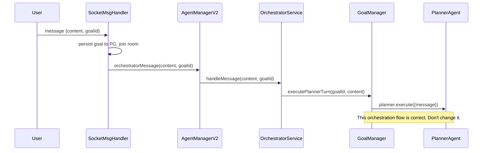
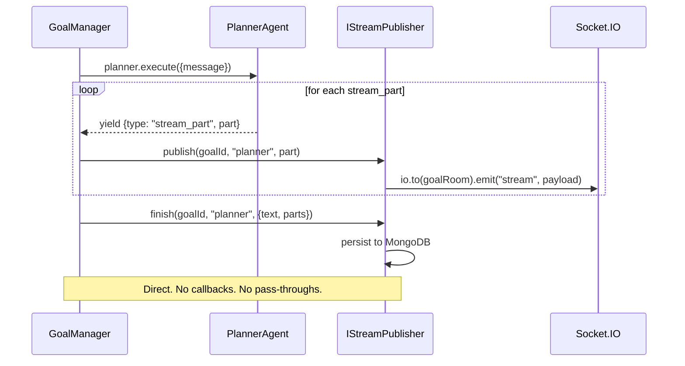
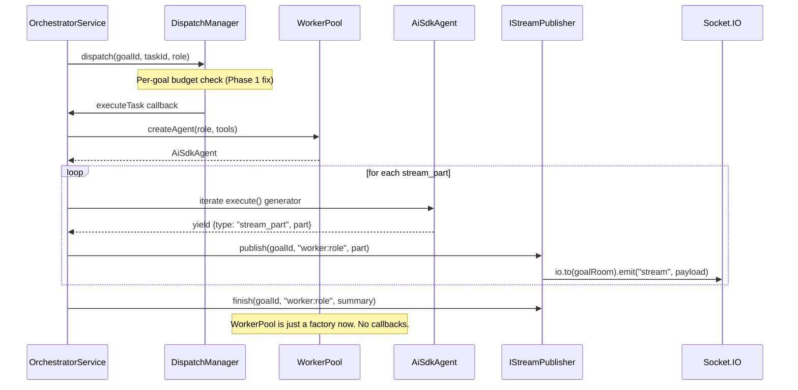
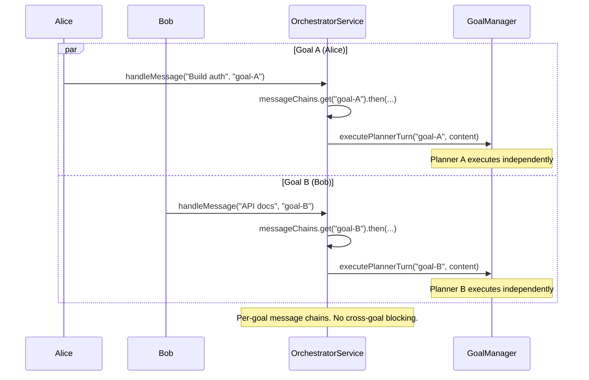
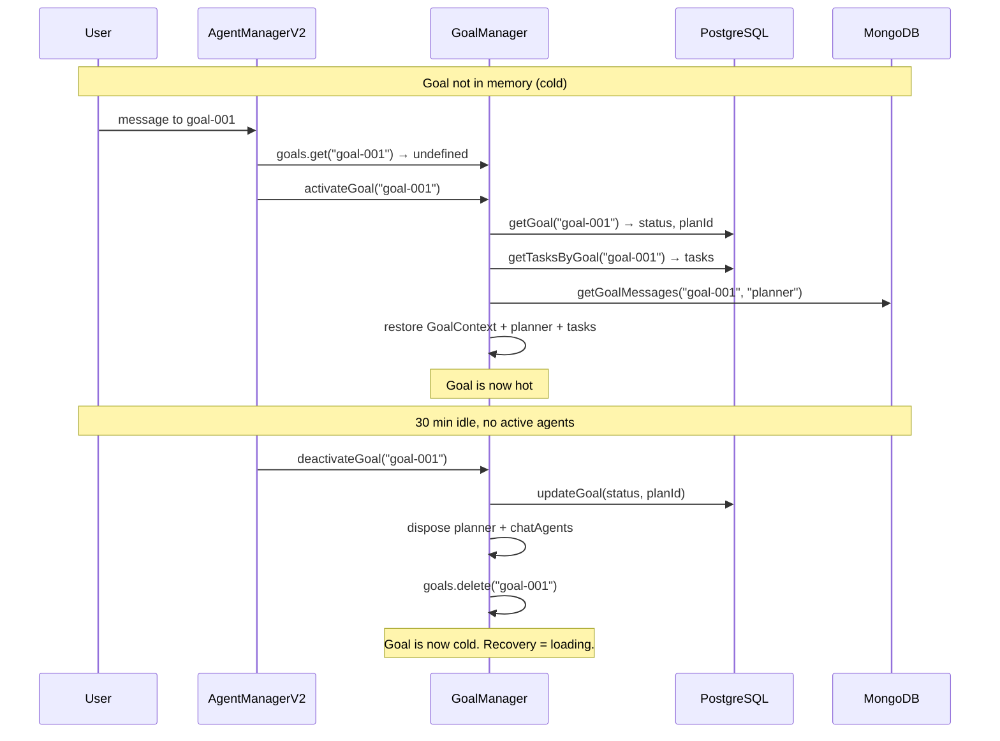

# Multi-User Multi-Goal Sessions — Implementation Plan

**Date:** May 6, 2026
**Status:** Planning
**Research:** [goal-isolation-research.md](../process-isolation/goal-isolation-research.md)

---

## What We Want

```
Alice (browser)                              Bob (browser)
  ├── Goal: "Build auth" [executing]           ├── Goal: "API docs" [executing]
  │    ├── Planner (streaming)                 │    └── Worker: tech-writer (streaming)
  │    ├── Worker: backend-dev (streaming)     │
  │    └── ChatAgent: researcher (idle)        └── Goal: "iOS push" [planning]
  │                                                 └── Planner (streaming)
  ├── Goal: "Rate limiting" [planning]
  │    └── Planner (streaming)
  │
  └── Goal: "Dashboard" [ready]
       └── (idle — no agents active)
```

Multiple users, multiple goals per user, each goal independent, per-agent streaming, session persistence.

---

## What Already Works

The existing architecture (GoalManager + OrchestratorService + AgentManagerV2) is already correct for the session model:

- GoalManager has `Map<goalId, GoalContext>` — each goal has its own planner + chatAgents
- OrchestratorService handles message → planner → plan → dispatch → worker flow
- DispatchManager handles concurrency + retry
- TaskStore has `goalId` on every task, `getByGoal()` filter exists
- SocketEventBroadcaster uses goal-scoped rooms
- Goal persistence in PostgreSQL ✅
- Planner conversation persistence in MongoDB ✅
- ChatAgent dispatch: ready tasks route through ChatAgent → ChatAgent spawns Workers ✅

**We don't need new orchestration classes.** The architecture is right.

---

## What's Broken (7 Scalar Bugs)

These 7 values block multi-goal. Each is a scalar that should be per-goal:

| # | File | Bug | Fix |
|---|------|-----|-----|
| B1 | `GoalManager.ts` | `FF_PARALLEL_PLANS` clears all goals when 2nd arrives | Remove the if block |
| B2 | `GoalManager.ts` | `activeGoalId` scalar — 8 methods fall back to it | Remove field, require explicit goalId |
| B3 | `DispatchManager.ts` | `activeDispatches: Set` — global max=2 across all goals | Change to `Map<goalId, Set>` |
| B4 | `DispatchManager.ts` | `deferredDispatches: Array` — global queue, no goal fairness | Change to `Map<goalId, Array>` |
| B5 | `OrchestratorService.ts` | `messageChain: Promise` — serializes ALL goals' planner turns | Change to `Map<goalId, Promise>` |
| B6 | `WorkerPool.ts` | `currentGoalId: string` — overwritten on each approvePlan | Resolve from `taskStore.get(taskId).goalId` |
| B7 | `WorkerPool.ts` | `crdtTaskSync` scalar — wrong goal's CRDT context | Resolve per-goal from CrdtProxy |

**Total effort: 3-4 days. No new files. No new classes.**

---

## What's Missing (3 Capabilities)

### 1. Remove Streaming Pass-Throughs (1-2 days)

The streaming chain has 2 pass-throughs that add zero logic:

```
CURRENT: 4 hops, 2 pass-throughs

WorkerPool.runTask() yields stream_part
  → this.callbacks.onStream(data)                     ← WorkerPool fires
    → OrchestratorService.callbacks.onStream(data)    ← PASS-THROUGH (just forwards)
      → AgentManagerV2.streamCallbacks.onStream(data) ← PASS-THROUGH (just forwards)
        → SocketEventBroadcaster.onStream(data)       ← does actual work

Same for planner streaming:
GoalManager.onPlannerStream(data)
  → config.onPlannerStream callback                   ← set in AgentManagerV2
    → this.streamCallbacks?.onStream?.(data)          ← PASS-THROUGH
      → SocketEventBroadcaster.onStream(data)         ← does actual work
```

**Fix:** Inject `IStreamPublisher` into WorkerPool and GoalManager directly. They call `publish()` instead of firing callbacks up the chain.

```typescript
// NEW: IStreamPublisher interface (15 lines)
interface IStreamPublisher {
  publish(teamId: string, goalId: string, agentKey: string, part: StreamPart): void;
  finish(teamId: string, goalId: string, agentKey: string, summary: FinishData): Promise<void>;
}

// SocketStreamPublisher — replaces SocketEventBroadcaster (40 lines)
class SocketStreamPublisher implements IStreamPublisher {
  publish(teamId, goalId, agentKey, part) {
    this.io.to(`team:${teamId}:goal:${goalId}`).emit("stream", {
      agentId: agentKey, goalId, part, timestamp: Date.now()
    });
  }
  async finish(teamId, goalId, agentKey, summary) {
    await this.chatService.addMessage({ teamId, goalId, ...summary });
  }
}
```

```typescript
// WorkerPool — BEFORE:
this.callbacks.onStream?.({ taskId, agentId: roleKey, part, goalId });

// WorkerPool — AFTER:
this.streamPublisher.publish(this.teamId, goalId, roleKey, event.part);

// GoalManager — BEFORE:
this.onPlannerStream({ goalId, taskId: sessionId, agentId: "planner", part: event.part });

// GoalManager — AFTER:
this.streamPublisher.publish(this.teamId, goalId, "planner", event.part);
```

**WorkerPool stays as-is.** It still iterates, still assembles tools, still synthesizes Channel B events. Only the `onStream` callback becomes a `streamPublisher.publish()` call.

**What gets removed:**
- `OrchestratorService.callbacks.onStream` (pass-through) 
- `AgentManagerV2.streamCallbacks.onStream` (pass-through)
- `AgentManagerV2.registerStreamCallbacks()` method
- `SocketEventBroadcaster.ts` (replaced by SocketStreamPublisher)
- `GoalManager.onPlannerStream` callback config

**What stays unchanged:**
- WorkerPool.runTask() — still iterates, still assembles tools, still does Channel B
- All task lifecycle callbacks (onAgentComplete, onStatusUpdate, onBounce, etc.)
- All domain events (GoalEventBus)
- OrchestratorService orchestration flow
- GoalManager plan/dispatch flow

**Also fixes ChatAgent unicast bug** — ChatAgent streaming currently goes through a separate `socket.emit()` path in SocketMessageHandler. With IStreamPublisher injected, ChatAgent streaming uses the same `publish()` path → broadcasts to goal room.

**Files changed:**

| File | Change |
|------|--------|
| `session/IStreamPublisher.ts` | **New** — interface (15 lines) |
| `backend/api/SocketStreamPublisher.ts` | **New** — impl (40 lines) |
| `WorkerPool.ts` | `this.callbacks.onStream(...)` → `this.streamPublisher.publish(...)` (2 lines) |
| `GoalManager.ts` | `this.onPlannerStream(...)` → `this.streamPublisher.publish(...)` (2 lines) |
| `OrchestratorService.ts` | Remove `onStream` pass-through from `workerPool.setCallbacks()` and from `callbacks` config |
| `AgentManagerV2.ts` | Remove `streamCallbacks` field, `registerStreamCallbacks()`, planner `onPlannerStream` pass-through |
| `SocketMessageHandler.ts` | ChatAgent path — inject `streamPublisher`, use `publish()` instead of `socket.emit()` |
| `SocketEventBroadcaster.ts` | **Delete** (replaced by SocketStreamPublisher) |

```
AFTER: 2 hops, 0 pass-throughs

WorkerPool.runTask() yields stream_part
  → this.streamPublisher.publish(goalId, role, part)  ← direct
    → io.to(goalRoom).emit("stream", payload)         ← done

GoalManager.executePlannerTurn() yields stream_part
  → this.streamPublisher.publish(goalId, "planner", part)  ← direct
    → io.to(goalRoom).emit("stream", payload)              ← done
```
  }
}
```

**Also fixes ChatAgent unicast bug** — ChatAgent streaming currently goes `socket.emit()` (unicast) instead of `io.to(room).emit()` (broadcast). With IStreamPublisher, all agents use the same path.

**Files changed:**

| File | Change |
|------|--------|
| `session/IStreamPublisher.ts` | **New** — interface (15 lines) |
| `backend/api/SocketStreamPublisher.ts` | **New** — impl (40 lines) |
| `WorkerPool.ts` | `runTask()` becomes `createAgent()` — remove iteration + callback firing |
| `OrchestratorService.ts` | `dispatchTask()` — iterate agent directly, call `streamPublisher.publish()` |
| `GoalManager.ts` | `executePlannerTurn()` — call `streamPublisher.publish()` instead of `onPlannerStream` callback |
| `AgentManagerV2.ts` | Remove `streamCallbacks` field + `registerStreamCallbacks()` |
| `SocketEventBroadcaster.ts` | Delete (replaced by SocketStreamPublisher) |
| `SocketMessageHandler.ts` | ChatAgent path — use `streamPublisher` instead of `socket.emit()` |

### 2. Session Lifecycle — onActivate / onDeactivate (1 week)

Add lifecycle hooks to GoalManager so sessions can load from cold storage and unload when idle:

```typescript
// GoalManager — new methods:
async activateGoal(goalId: string): Promise<void> {
  // Load from PG
  const goalRow = await this.pgGoals.getGoal(goalId);
  const tasks = await this.pgTasks.getTasksByGoal(goalId);
  
  // Restore GoalContext
  const goal = this.getOrCreateGoal(goalId, goalRow.title);
  goal.state = goalRow.status;
  goal.currentPlanId = goalRow.planId;
  
  // Restore tasks
  for (const task of tasks) this.taskStore.create(task);
  
  // Restore planner conversation
  const messages = await this.chatService.getGoalMessages(teamId, goalId, "planner");
  if (messages.length > 0) {
    goal.planner = await this.createPlannerFn(goalId);
    goal.planner.restoreConversation(messages);
  }
  
  // Resume executing tasks
  if (goal.state === "executing") {
    this.dagResolver.rebuildForGoal(this.taskStore, goalId);
    // dispatch ready tasks
  }
}

async deactivateGoal(goalId: string): Promise<void> {
  const goal = this.goals.get(goalId);
  if (!goal) return;
  
  // Flush state
  await this.pgGoals.updateGoal(goalId, { status: goal.state, planId: goal.currentPlanId });
  
  // Dispose agents
  goal.planner?.dispose();
  goal.chatAgents.forEach(a => a.dispose());
  goal.chatAgents.clear();
  
  // Remove from memory
  this.goals.delete(goalId);
}
```

Idle timer in AgentManagerV2 or OrchestratorService:

```typescript
// After any goal activity, reset timer:
private resetIdleTimer(goalId: string) {
  clearTimeout(this.idleTimers.get(goalId));
  this.idleTimers.set(goalId, setTimeout(() => {
    if (!this.goalManager.hasActiveAgents(goalId)) {
      this.goalManager.deactivateGoal(goalId);
    }
  }, 30 * 60 * 1000));
}
```

**Files changed:**

| File | Change |
|------|--------|
| `GoalManager.ts` | Add `activateGoal()`, `deactivateGoal()`, `hasActiveAgents()` |
| `OrchestratorService.ts` or `AgentManagerV2.ts` | Idle timer management |

### 3. Multi-User Authorization (1 week)

Goals already have `created_by` in PostgreSQL. Add access control:

```typescript
// SocketMessageHandler — before routing:
const goal = await pgGoals.getGoal(goalId);
if (goal && goal.createdBy !== userId) {
  const role = await pgTeamService.getUserRoleForTeam(userId, teamId);
  if (role !== "owner" && role !== "admin") {
    emitError(socket, { error: "Not authorized for this goal" });
    return;
  }
}

// GET /api/v2/goals — filtered by user:
const goals = isAdmin
  ? await pgGoals.getGoalsByTeam(teamId)
  : await pgGoals.getGoalsByUser(teamId, userId);
```

Per-user concurrency budget (optional, simple):

```typescript
// Before dispatch: check user's total active workers
const userGoals = await pgGoals.getGoalsByUser(teamId, userId);
const totalActive = userGoals.reduce((n, g) => n + activeWorkersForGoal(g.goalId), 0);
if (totalActive >= MAX_WORKERS_PER_USER) return; // queue
```

---

## Implementation Phases

| Phase | What | Effort | Dependencies |
|-------|------|--------|-------------|
| **1** | Fix 7 scalar bugs | 3-4 days | None |
| **2** | IStreamPublisher — remove streaming pass-throughs | 1-2 days | None (parallel with 1) |
| **3** | Session lifecycle (activate/deactivate) | 1 week | Phase 1 |
| **4** | Multi-user authorization | 1 week | Phase 1 |
| **5** | Redis Streams (swap IStreamPublisher impl) | 2 weeks | Phase 2 |
| **6** | Process isolation (child_process.fork) | 3 weeks | Phases 3 + 5 |
| **7** | Multi-server distribution | 3 weeks | Phase 6 |

```
Phase 1 ──┬── Phase 3 (lifecycle) ── Phase 4 (multi-user)
           │
Phase 2 ──┴── Phase 5 (Redis) ── Phase 6 (fork) ── Phase 7 (multi-server)

Phases 1+2 can run in parallel (1 week total)
Multi-user MVP: Phases 1-4 = ~3 weeks
Production scaling: add Phases 5-7 = +8 weeks
```

---

## What Changes Per Phase

### Phase 1: Fix 7 Scalars (3-4 days)

| File | Line(s) | Change |
|------|---------|--------|
| `GoalManager.ts` | `getOrCreateGoal()` | Remove `if (!FF_PARALLEL_PLANS) this.goals.clear()` |
| `GoalManager.ts` | 8 methods | Remove `this.activeGoalId` fallback, require `goalId` param |
| `OrchestratorService.ts` | field | `messageChain: Promise` → `messageChains: Map<goalId, Promise>` |
| `DispatchManager.ts` | 2 fields | `activeDispatches: Set` → `Map<goalId, Set>`, `deferredDispatches` → `Map<goalId, Array>` |
| `WorkerPool.ts` | 1 field | Remove `currentGoalId`, read from `taskStore.get(taskId).goalId` |
| `WorkerPool.ts` | 1 field | Remove `crdtTaskSync` scalar, use `CrdtProxy.resolveForGoal()` |
| `ChatAgent.ts` | 1 line | Filter `onRoleEvent` by goalId |

**Exit criteria:** Two goals run concurrently. `bun run build` clean. Existing tests pass.

### Phase 2: IStreamPublisher (3-4 days)

| File | Action |
|------|--------|
| `session/IStreamPublisher.ts` | **New** — interface |
| `backend/api/SocketStreamPublisher.ts` | **New** — `io.to(room).emit()` + persist on finish |
| `WorkerPool.ts` | `runTask()` → `createAgent()` (factory pattern) |
| `OrchestratorService.ts` | Iterate agent generator + `streamPublisher.publish()` |
| `GoalManager.ts` | Planner streaming via `streamPublisher.publish()` |
| `SocketMessageHandler.ts` | ChatAgent streaming via `streamPublisher.publish()` |
| `AgentManagerV2.ts` | Remove `streamCallbacks` + `registerStreamCallbacks()` |
| `SocketEventBroadcaster.ts` | **Delete** |

**Exit criteria:** Streaming works without callback chain. ChatAgent broadcasts to room (not unicast). One streaming interface for all agent types.

### Phase 3: Session Lifecycle (1 week)

| File | Change |
|------|--------|
| `GoalManager.ts` | Add `activateGoal()`, `deactivateGoal()`, `hasActiveAgents()` |
| `AgentManagerV2.ts` | Add idle timer Map, reset on activity, deactivate on timeout |

**Exit criteria:** Sessions survive server restarts. Idle sessions unload after 30 min. `activateGoal()` restores from PG + MongoDB.

### Phase 4: Multi-User Authorization (1 week)

| File | Change |
|------|--------|
| `SocketMessageHandler.ts` | Goal ownership check before routing |
| `SocketActionHandler.ts` | Goal ownership check before actions |
| `backend/api/routes/goalRoutes.ts` | **New** — `GET /api/v2/goals?teamId=X` filtered by user |

**Exit criteria:** Users see only their own goals. Team admins see all. Per-user concurrency limits.

### Phase 5: Redis Streams (2 weeks)

| File | Change |
|------|--------|
| `session/RedisStreamPublisher.ts` | **New** — `XADD` per-agent stream keys |
| `backend/api/StreamMux.ts` | **New** — `XREAD BLOCK` subscriber → Socket.IO |
| Config | `STREAM_TRANSPORT=socket|redis` env var |

**Exit criteria:** Swap `SocketStreamPublisher` → `RedisStreamPublisher` via config. Same interface.

### Phase 6-7: Process Isolation + Multi-Server (6 weeks)

Defer until needed. Same code, different runtime deployment.

---

## Sequence Diagrams

### Current Flow (What Stays the Same)



### Streaming Fix (Phase 2)



### Task Dispatch (Phase 2)



### Multi-Goal Concurrency (Phase 1)



### Session Lifecycle (Phase 3)



---

## Cost

| Phase | Infrastructure | Monthly Cost |
|-------|---------------|-------------|
| 1-4 | PG (Neon free) + MongoDB (Atlas M0) | $0 |
| 5 | + Redis (Docker / Upstash free) | $0 |
| 6-7 | + Multiple servers | ~$50-100/mo |

---

## Risk

| Risk | Phase | Mitigation |
|------|-------|------------|
| GoalManager scalar fixes break existing flow | 1 | Test each fix independently. Feature flag for `FF_PARALLEL_PLANS` removal. |
| WorkerPool factory change breaks tool wiring | 2 | Tools are assembled in `runTask()` — move to `createAgent()` params. |
| Planner conversation restore loses context | 3 | Already implemented in v1.2 — just needs to be called from `activateGoal()`. |
| Redis Streams add latency | 5 | Keep SocketStreamPublisher as fallback. Benchmark before switching. |
