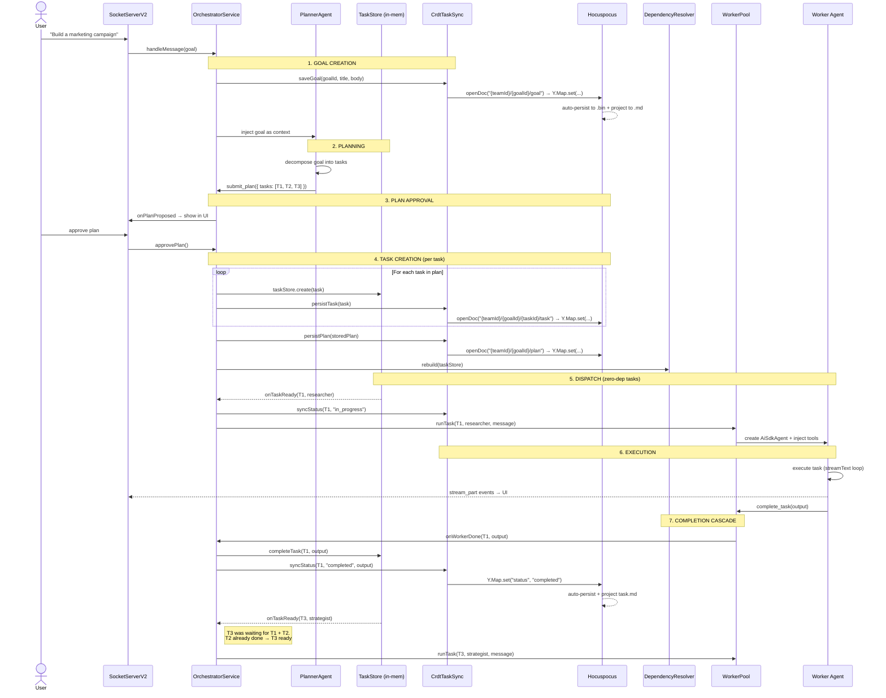

```mermaid
sequenceDiagram
    actor User
    participant Socket as SocketServerV2
    participant Orch as OrchestratorService
    participant Planner as PlannerAgent
    participant TS as TaskStore (in-mem)
    participant CRDT as CrdtTaskSync
    participant Hocus as Hocuspocus
    participant DAG as DependencyResolver
    participant WP as WorkerPool
    participant Agent as Worker Agent

    User->>Socket: "Build a marketing campaign"
    Socket->>Orch: handleMessage(goal)
    
    Note over Orch,CRDT: 1. GOAL CREATION
    Orch->>CRDT: saveGoal(goalId, title, body)
    CRDT->>Hocus: openDoc("{teamId}/{goalId}/goal") → Y.Map.set(...)
    Hocus-->>Hocus: auto-persist to .bin + project to .md
    
    Orch->>Planner: inject goal as context
    
    Note over Planner,TS: 2. PLANNING
    Planner->>Planner: decompose goal into tasks
    Planner->>Orch: submit_plan({ tasks: [T1, T2, T3] })
    
    Note over Orch,Hocus: 3. PLAN APPROVAL
    Orch->>Socket: onPlanProposed → show in UI
    User->>Socket: approve plan
    Socket->>Orch: approvePlan()
    
    Note over Orch,Hocus: 4. TASK CREATION (per task)
    loop For each task in plan
        Orch->>TS: taskStore.create(task)
        Orch->>CRDT: persistTask(task)
        CRDT->>Hocus: openDoc("{teamId}/{goalId}/{taskId}/task") → Y.Map.set(...)
    end
    Orch->>CRDT: persistPlan(storedPlan)
    CRDT->>Hocus: openDoc("{teamId}/{goalId}/plan") → Y.Map.set(...)
    Orch->>DAG: rebuild(taskStore)
    
    Note over TS,Agent: 5. DISPATCH (zero-dep tasks)
    TS-->>Orch: onTaskReady(T1, researcher)
    Orch->>CRDT: syncStatus(T1, "in_progress")
    Orch->>WP: runTask(T1, researcher, message)
    WP->>Agent: create AiSdkAgent + inject tools
    
    Note over Agent,CRDT: 6. EXECUTION
    Agent->>Agent: execute task (streamText loop)
    Agent-->>Socket: stream_part events → UI
    Agent->>WP: complete_task(output)
    
    Note over WP,DAG: 7. COMPLETION CASCADE
    WP->>Orch: onWorkerDone(T1, output)
    Orch->>TS: completeTask(T1, output)
    Orch->>CRDT: syncStatus(T1, "completed", output)
    CRDT->>Hocus: Y.Map.set("status", "completed")
    Hocus-->>Hocus: auto-persist + project task.md
    TS-->>Orch: onTaskReady(T3, strategist)
    Note right of Orch: T3 was waiting for T1 + T2.<br/>T2 already done → T3 ready
    Orch->>WP: runTask(T3, strategist, message)
```
