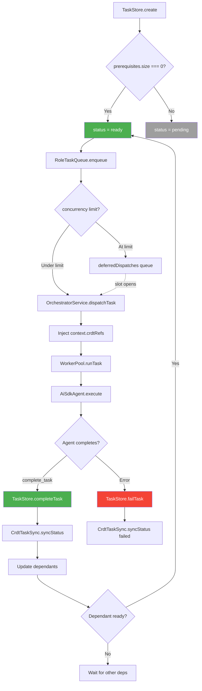

```mermaid
flowchart TD
    A[TaskStore.create] --> B{prerequisites.size === 0?}
    B -->|Yes| C[status = ready]
    B -->|No| D[status = pending]
    C --> E[RoleTaskQueue.enqueue]
    E --> F{concurrency limit?}
    F -->|Under limit| G[OrchestratorService.dispatchTask]
    F -->|At limit| H[deferredDispatches queue]
    G --> I[Inject context.crdtRefs]
    I --> J[WorkerPool.runTask]
    J --> K[AiSdkAgent.execute]
    K --> L{Agent completes?}
    L -->|complete_task| M[TaskStore.completeTask]
    M --> N[CrdtTaskSync.syncStatus]
    N --> O[Update dependants]
    O --> P{Dependant ready?}
    P -->|Yes| C
    P -->|No| Q[Wait for other deps]
    L -->|Error| R[TaskStore.failTask]
    R --> S[CrdtTaskSync.syncStatus failed]
    
    H -.->|slot opens| G

    style C fill:#4CAF50,color:white
    style D fill:#9E9E9E,color:white
    style M fill:#4CAF50,color:white
    style R fill:#f44336,color:white
```
