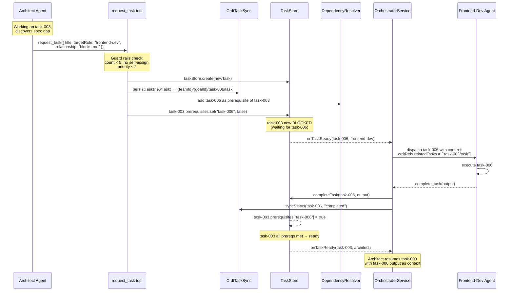

```mermaid
sequenceDiagram
    participant ArchAgent as Architect Agent
    participant RT as request_task tool
    participant CRDT as CrdtTaskSync
    participant TS as TaskStore
    participant DAG as DependencyResolver
    participant Orch as OrchestratorService
    participant FEAgent as Frontend-Dev Agent

    Note over ArchAgent: Working on task-003,<br/>discovers spec gap

    ArchAgent->>RT: request_task({ title, targetRole: "frontend-dev",<br/>relationship: "blocks-me" })
    
    Note over RT: Guard rails check:<br/>count < 5, no self-assign,<br/>priority ≤ 2
    
    RT->>TS: taskStore.create(newTask)
    RT->>CRDT: persistTask(newTask) → {teamId}/{goalId}/task-006/task
    RT->>DAG: add task-006 as prerequisite of task-003
    RT->>TS: task-003.prerequisites.set("task-006", false)
    
    Note over TS: task-003 now BLOCKED<br/>(waiting for task-006)
    
    TS-->>Orch: onTaskReady(task-006, frontend-dev)
    Orch->>FEAgent: dispatch task-006 with context:<br/>crdtRefs.relatedTasks = ["task-003/task"]
    
    FEAgent->>FEAgent: execute task-006
    FEAgent-->>Orch: complete_task(output)
    
    Orch->>TS: completeTask(task-006, output)
    Orch->>CRDT: syncStatus(task-006, "completed")
    TS-->>TS: task-003.prerequisites["task-006"] = true
    
    Note over TS: task-003 all prereqs met → ready
    
    TS-->>Orch: onTaskReady(task-003, architect)
    Note over Orch: Architect resumes task-003<br/>with task-006 output as context
```
