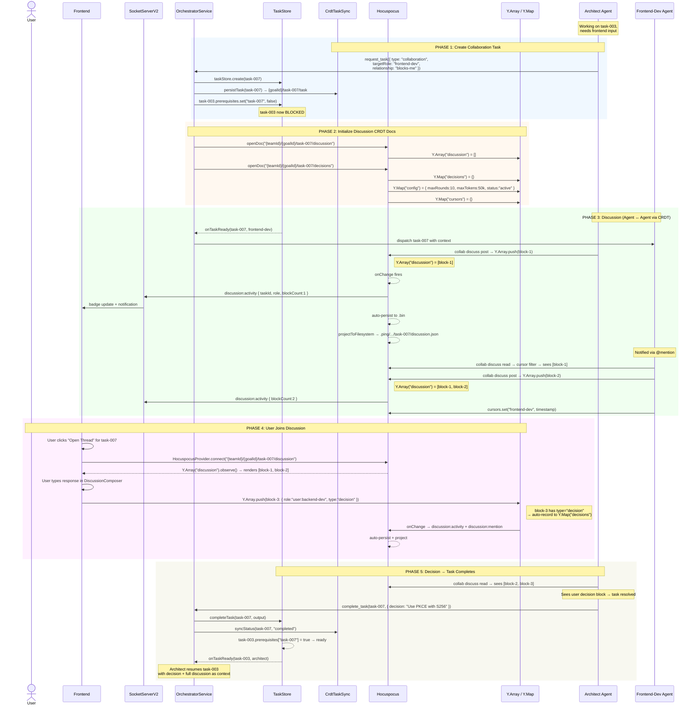

```mermaid
sequenceDiagram
    actor User
    participant UI as Frontend
    participant Socket as SocketServerV2
    participant Orch as OrchestratorService
    participant TS as TaskStore
    participant CRDT as CrdtTaskSync
    participant Hocus as Hocuspocus
    participant ColShared as Y.Array / Y.Map
    participant ArchAgent as Architect Agent
    participant FEAgent as Frontend-Dev Agent

    Note over ArchAgent: Working on task-003,<br/>needs frontend input

    rect rgb(240, 248, 255)
    Note over ArchAgent,CRDT: PHASE 1: Create Collaboration Task
    ArchAgent->>Orch: request_task({ type: "collaboration",<br/>targetRole: "frontend-dev",<br/>relationship: "blocks-me" })
    Orch->>TS: taskStore.create(task-007)
    Orch->>CRDT: persistTask(task-007) → {goalId}/task-007/task
    Orch->>TS: task-003.prerequisites.set("task-007", false)
    Note over TS: task-003 now BLOCKED
    end

    rect rgb(255, 248, 240)
    Note over Orch,ColShared: PHASE 2: Initialize Discussion CRDT Docs
    Orch->>Hocus: openDoc("{teamId}/{goalId}/task-007/discussion")
    Hocus->>ColShared: Y.Array("discussion") = []
    Orch->>Hocus: openDoc("{teamId}/{goalId}/task-007/decisions")
    Hocus->>ColShared: Y.Map("decisions") = {}
    Hocus->>ColShared: Y.Map("config") = { maxRounds:10, maxTokens:50k, status:"active" }
    Hocus->>ColShared: Y.Map("cursors") = {}
    end

    rect rgb(240, 255, 240)
    Note over ArchAgent,FEAgent: PHASE 3: Discussion (Agent ↔ Agent via CRDT)
    TS-->>Orch: onTaskReady(task-007, frontend-dev)
    Orch->>FEAgent: dispatch task-007 with context

    ArchAgent->>Hocus: collab discuss post → Y.Array.push(block-1)
    Note right of Hocus: Y.Array("discussion") = [block-1]
    Hocus-->>Hocus: onChange fires
    Hocus->>Socket: discussion:activity { taskId, role, blockCount:1 }
    Socket->>UI: badge update + notification
    Hocus-->>Hocus: auto-persist to .bin
    Hocus-->>Hocus: projectToFilesystem → .ping/.../task-007/discussion.json

    Note over FEAgent: Notified via @mention
    FEAgent->>Hocus: collab discuss read → cursor filter → sees [block-1]
    FEAgent->>Hocus: collab discuss post → Y.Array.push(block-2)
    Note right of Hocus: Y.Array("discussion") = [block-1, block-2]
    Hocus->>Socket: discussion:activity { blockCount:2 }
    FEAgent->>Hocus: cursors.set("frontend-dev", timestamp)
    end

    rect rgb(255, 240, 255)
    Note over User,ColShared: PHASE 4: User Joins Discussion
    UI->>UI: User clicks "Open Thread" for task-007
    UI->>Hocus: HocuspocusProvider.connect("{teamId}/{goalId}/task-007/discussion")
    Hocus-->>UI: Y.Array("discussion").observe() → renders [block-1, block-2]
    UI->>UI: User types response in DiscussionComposer
    UI->>ColShared: Y.Array.push(block-3: { role:"user:backend-dev", type:"decision" })
    Note right of ColShared: block-3 has type="decision"<br/>→ auto-record to Y.Map("decisions")
    ColShared->>Hocus: onChange → discussion:activity + discussion:mention
    Hocus-->>Hocus: auto-persist + project
    end

    rect rgb(248, 248, 240)
    Note over ArchAgent,TS: PHASE 5: Decision → Task Completes
    ArchAgent->>Hocus: collab discuss read → sees [block-2, block-3]
    Note over ArchAgent: Sees user decision block → task resolved
    ArchAgent->>Orch: complete_task(task-007, { decision: "Use PKCE with S256" })
    Orch->>TS: completeTask(task-007, output)
    Orch->>CRDT: syncStatus(task-007, "completed")
    TS-->>TS: task-003.prerequisites["task-007"] = true → ready
    TS-->>Orch: onTaskReady(task-003, architect)
    Note over Orch: Architect resumes task-003<br/>with decision + full discussion as context
    end
```
