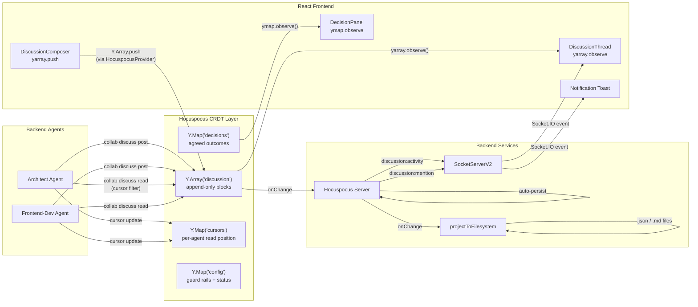

**Key separation of concerns:**
- **CRDT (Hocuspocus)** — all discussion content. Agents read/write via `collab discuss`. Frontend reads via `yarray.observe()`, writes via `Y.Array.push()`.
- **Socket.IO** — notifications only. `discussion:activity` (badge counts), `discussion:mention` (@mention alerts). Does NOT carry discussion content.
- **projectToFilesystem** — read-only file projections for human browsing and post-mortem.
