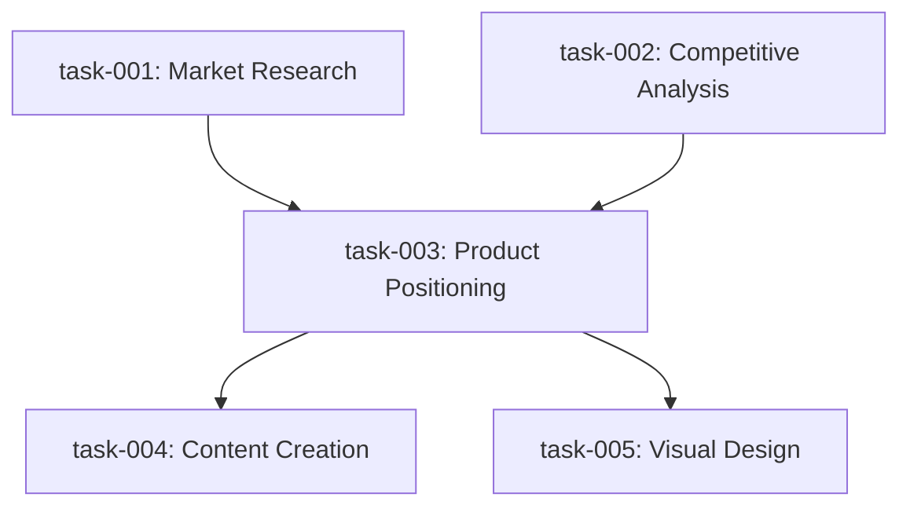

# Markdown-Based Tasks & Agent-Initiated Collaboration — Architecture

**Status:** Draft  
**Date:** April 11, 2026  
**Parent:** [Task Orchestration Architecture](../feature_architecture.md)  
**Related:** [Agent ↔ Collab Docs](../../agent-collab-docs/feature_architecture.md), [Team Registry](../../team-registry/feature_architecture.md)

---

## Problem

Three problems converge:

1. **Tasks are opaque JSON** — stored in `Map<string, Task>`, invisible to agents, humans, and tools. No agent can browse past tasks, learn from them, or reference them as context. JSON is a runtime format, not a knowledge format.

2. **Only the Planner can create tasks** — worker agents can't ask each other for help, request reviews, or spawn subtasks. They're trapped in their single-task sandbox. If a researcher discovers the architect's API spec is wrong, it can't create a "fix this" task — it just puts it in `output`.

3. **Collaboration has no structure** — the GroupChatManager is a stub. Agents can't say "I need to discuss X with agent Y using document Z." There's no protocol for initiating collaboration, sharing working documents, or tracking discussion outcomes within the task DAG.

---

## Design: Task.md + Plan.md Files

### Why Markdown Over JSON

| | JSON (current) | Markdown + Frontmatter |
|---|---|---|
| **Human readability** | Need tooling to inspect | Open in any editor, read in PR reviews |
| **Agent readability** | Must deserialize, parse fields | Natural language body — agents treat it as context |
| **Git-friendly** | Diffs are noisy, merge conflicts common | Clean diffs, mergeable, tells a story |
| **Extensible context** | `context: Record<string, any>` — unstructured blob | Body is freeform markdown — acceptance criteria, examples, diagrams |
| **Discoverable** | Only via `getTask(id)` API | `workspace_list_files(".ping/tasks/")` — agents browse freely |
| **Matchable to skills** | Skill.md exists but tasks are JSON — format mismatch | Same format → same parser (`gray-matter`), same loader pattern |
| **Post-mortem value** | Throw-away runtime state | Persistent artifacts — "what did we do and why" |

**JSON still has value for:** runtime state machine (status transitions, prerequisite tracking, queue position). The answer isn't "drop JSON" — it's **Markdown as the source of truth, JSON as the runtime projection**.

```
Task.md (persisted, human/agent-readable)
    │
    │  Frontmatter Parser (gray-matter)
    │
    ▼
Task object (runtime, in TaskStore Map)
    │
    │  On status change
    │
    ▼
Task.md frontmatter updated (status field)
```

### Task.md Format

```yaml
---
id: task-003
title: "Design REST API endpoints"
assignedRole: architect
status: pending          # pending | ready | in_progress | completed | failed
priority: 2              # 1-5 (1=highest)
complexity: medium       # low | medium | high
type: work               # work | review | collaboration | subtask
dependencies:
  - task-001             # blocks: can't start until these complete
  - task-002
softDependencies:        # informs: can start without, output injected if available
  - task-006
createdBy: planner       # planner | agent:{role} | user
parentTask: null         # for subtasks
planId: plan-001
expectedOutput: "API specification document with endpoint definitions"
onDependencyFail: replan # fail | skip | replan
artifacts: []            # paths to output files
---

# Design REST API endpoints

## Context
The product requires a REST API for the B2B SaaS platform. Market research (task-001)
identified 12 competitors. Competitive analysis (task-002) found a gap in self-serve
onboarding.

## Acceptance Criteria
- [ ] All CRUD endpoints defined
- [ ] Authentication flow documented
- [ ] Rate limiting strategy included
- [ ] OpenAPI spec generated

## Notes
Consider the gap in self-serve onboarding found by the researcher ---
this should influence the API's provisioning endpoints.
```

### Goal.md Format

The Goal is the team-level objective --- what the user asked the team to do. It's a first-class `.md` file so every agent in the team can read it for context. The Planner creates it when the user submits a goal, and all agents reference it as their north star.

```yaml
---
id: goal-001
title: "Build a marketing campaign for product X"
teamId: marketing-team
status: planning         # pending | planning | executing | completed | failed
submittedBy: user        # user | system
planId: plan-001         # linked plan (set after planning)
createdAt: 2026-04-11T09:30:00Z
completedAt: null
---

# Build a marketing campaign for product X

## User Intent
Build a comprehensive marketing campaign for product X targeting B2B SaaS mid-market.
Focus on content marketing and SEO. Budget is limited --- prioritize organic channels.

## Success Criteria
- Campaign plan with timeline and channel strategy
- 5 blog post drafts targeting identified keywords
- Landing page copy with A/B test variants
- Social media content calendar for 4 weeks

## Constraints
- No paid advertising in phase 1
- Must align with existing brand guidelines
- Launch within 2 weeks
```

**Why Goal.md matters:**
- Every agent reads `.ping/goals/goal-001.md` as context before starting any task
- Agents can check whether their work aligns with the original intent
- Post-mortem: the goal + its linked plan + tasks tell the complete story
- Multiple goals can be active simultaneously (each gets its own plan)

**Relationship:** Goal.md (what) -> Plan.md (how) -> Task.md files (who does what)

### Plan.md Format

```yaml
---
planId: plan-001
goalId: goal-001         # links back to the Goal.md
goal: "Build a marketing campaign for product X"
teamId: marketing-team
status: executing        # pending | approved | executing | completed | failed
version: 1
parentPlanId: null       # for replan chains
createdAt: 2026-04-11T10:00:00Z
taskCount: 5
---

# Marketing Campaign Plan

## Goal
Build a comprehensive marketing campaign for product X targeting B2B SaaS mid-market.

## Task Graph


## Tasks
1. **task-001** — Market Research (researcher, P2)
2. **task-002** — Competitive Analysis (researcher, P2)  
3. **task-003** — Product Positioning (strategist, P1) — depends on 001, 002
4. **task-004** — Content Creation (writer, P3) — depends on 003
5. **task-005** — Visual Design (designer, P3) — depends on 003

## Strategy Notes
Parallel research phase (001 + 002), then sequential positioning → execution.
Critical path: 001/002 → 003 → 004.
```

### File Layout

```
.ping/
├── goals/
│   ├── goal-001.md              # Active goal (user's top-level request)
│   └── _archive/
│       └── goal-000.md          # Completed/failed goals
├── plans/
│   ├── plan-001.md              # Active plan
│   └── _archive/
│       └── plan-000.md          # Previous plans (never deleted)
├── tasks/
│   ├── task-001.md
│   ├── task-002.md
│   ├── task-003.md
│   ├── task-004.md              # Planner-created tasks
│   ├── task-005.md
│   ├── task-006-subtask.md      # Agent-created subtask
│   └── task-007-collab.md       # Agent-created collaboration task
├── collab/                          # CRDT docs (via Hocuspocus)
│   │   # Runtime: Y.Doc per collab task, stored in data/collab/yjs/
│   │   # Projected to .ping/collaboration/ as readable files:
│   ├── collab-task-007.json         # Y.Map + Y.Array → JSON projection
│   ├── doc-api-spec-collab-007.md   # Y.XmlFragment → markdown projection
│   └── doc-code-review-collab-008.md
└── outputs/
    ├── task-001.json             # Output manifests (existing)
    └── task-002.json
```

---

## Storage & Distribution — How .md Files Flow

### Where Plans and Tasks Live

| What | Current (JSON) | New (Markdown) |
|---|---|---|
| Plans | `data/plans/{teamId}/{goalId}/{planId}.json` | `.ping/plans/plan-001.md` |
| Tasks (runtime) | In-memory `Map<string, Task>` — lost on restart | `.ping/tasks/task-003.md` → parsed into in-memory Map |
| Tasks (backup) | `data/tasks/{teamId}/tasks.json` (optional debounced dump) | Not needed — `.md` files ARE the backup |
| Task output | `.ping/outputs/{taskId}.json` | No change — keeps JSON manifest |

**`.ping/` lives in the workspace repo root.** Every agent with workspace tools can read any file in it.

### How Agents Get Planner-Created Tasks

```
User sends goal → Planner decomposes
    │
    ├── 1. Planner writes .ping/plans/plan-001.md (Plan.md with frontmatter)
    ├── 2. Planner writes .ping/tasks/task-001.md ... task-005.md (one file per task)
    ├── 3. TaskSyncer parses all Task.md frontmatter → hydrates TaskStore in-memory Map
    ├── 4. TaskStore.create() checks prerequisites → marks ready tasks → onTaskReady fires
    │
    ▼
    OrchestratorService.dispatchTask()
    │
    ├── 5. Enriches description with upstream outputs (existing flow)
    ├── 6. Injects file paths into task context (new)
    ├── 7. Calls WorkerPool.runTask({ description, context, ... })
    │
    ▼
    Worker agent starts on task-003 — paths are in the prompt, no guessing needed
```

### Task Context — File Paths Injected Automatically

The `dispatchTask` step injects all relevant paths into `task.context` before handing to WorkerPool. The agent receives these paths directly in its prompt — no browsing `.ping/` required:

```typescript
// TaskSyncer builds context paths when dispatching
interface TaskDispatchContext {
  // File paths — injected into agent prompt
  paths: {
    task: string;              // ".ping/tasks/task-003.md" — own task (full detail)
    plan: string;              // ".ping/plans/plan-001.md" — the plan this belongs to
    dependencies: string[];    // [".ping/tasks/task-001.md", ".ping/tasks/task-002.md"]
    dependants: string[];      // [".ping/tasks/task-004.md"] — who depends on you
    outputs: string[];         // [".ping/outputs/task-001.json"] — completed upstream outputs
    collab?: string;           // "collab/task-007/discussion" — CRDT doc if collaboration type
    relatedTasks: string[];    // agent-created refs, cross-plan refs
  };

  // Existing context (unchanged)
  previousOutputs: Array<{ taskId: string; output: any }>;
  artifacts: string[];
  notes: string[];
  expectedOutput: string;
}
```

The agent's prompt includes these paths as structured context:

```markdown
## Your Task
task-003: Design REST API endpoints

## File Paths
- **Your task:** .ping/tasks/task-003.md (read for full acceptance criteria & notes)
- **Plan:** .ping/plans/plan-001.md
- **Completed dependencies:**
  - .ping/tasks/task-001.md (output: .ping/outputs/task-001.json)
  - .ping/tasks/task-002.md (output: .ping/outputs/task-002.json)
- **Downstream (depends on you):** .ping/tasks/task-004.md, .ping/tasks/task-005.md

## Context from previous tasks:
- task-001 (researcher): "Found 12 competitors, 3 direct threats..."
- task-002 (researcher): "Top 3 competitors analyzed..."

## Expected output: API specification document with endpoint definitions
```

The agent can `workspace_read_file` any path it needs — but the paths are handed to it, not discovered by browsing.

### How Agents Get Agent-Created Tasks

Same pipeline — `request_task()` creates the Task.md, TaskSyncer parses it, dispatch injects paths:

```
Agent (architect, working on task-003) calls request_task()
    │
    ├── 1. System writes .ping/tasks/task-006.md (createdBy: agent:architect)
    ├── 2. TaskSyncer parses frontmatter → creates Task in TaskStore
    ├── 3. DependencyResolver adds to DAG (new edges if blocks-me)
    │
    ▼
    TaskStore.create() triggers same pipeline:
    │
    ├── prerequisites met → onTaskReady → dispatch with paths:
    │     paths.task = ".ping/tasks/task-006.md"
    │     paths.relatedTasks = [".ping/tasks/task-003.md"]  ← creator's task for context
    │
    ├── blocks-me → adds task-006 as prerequisite to task-003
    │   (architect's task pauses until task-006 completes)
    │
    ▼
    Target agent (frontend-dev) starts task-006, prompt includes:
    │
    │   ## File Paths
    │   - **Your task:** .ping/tasks/task-006.md (created by: agent:architect)
    │   - **Related:** .ping/tasks/task-003.md (architect's task — why this was created)
    │
    └── Completes → task-003 prerequisite met → architect resumes
```

**Same pipeline for planner-created and agent-created tasks.** The only difference is `createdBy` in the frontmatter.

---

## Pre-Plan Tasks — Planner Research Phase

### The Problem

The planner often receives a goal it can't decompose without more information:

```
User: "Build a payment system for our SaaS"

Planner thinks:
  - What's the current tech stack? (need to ask someone)
  - What compliance requirements apply? (PCI-DSS? SOC2?)
  - What payment providers are already integrated?
  
Currently: Planner either guesses (bad plans) or asks the user (blocks on human response).
```

### The Solution: Pre-Plan Research Tasks

The planner can create tasks **before** creating a plan. These are `type: "research"` tasks that block plan creation — the planner can't submit a plan until all pre-plan tasks complete or are cancelled.

```typescript
// Planner calls submit_research (new tool) INSTEAD of submit_plan
submit_research({
  tasks: [
    {
      id: "pre-001",
      title: "Investigate current tech stack",
      description: "List all backend frameworks, databases, and APIs currently in use",
      assignedRole: "researcher",
      expectedOutput: "Tech stack inventory document",
    },
    {
      id: "pre-002", 
      title: "Identify payment compliance requirements",
      description: "What PCI-DSS and SOC2 requirements apply to our payment processing?",
      assignedRole: "security-reviewer",
      expectedOutput: "Compliance requirements summary",
    },
  ],
  reason: "Need tech stack and compliance context before planning payment system",
})
```

### Lifecycle

```
User sends goal
    │
    ▼
Planner receives goal → decides it needs research first
    │
    ├── Calls submit_research() with 1-N research tasks
    ├── Planner state: "researching" (new state)
    │
    ▼
Research tasks dispatch via normal pipeline:
    │
    ├── Task.md files written to .ping/tasks/pre-001.md, pre-002.md
    ├── createdBy: planner, type: research, planId: null
    ├── Workers execute, stream results
    │
    ▼
Meanwhile, planner is NOT blocked from user interaction:
    │
    ├── ✅ Can chat with user ("I'm researching your tech stack first...")
    ├── ✅ Can answer questions about the goal
    ├── ❌ Cannot call submit_plan (blocked until research completes)
    ├── ❌ Cannot create work tasks (no plan exists yet)
    │
    ▼
Research tasks complete:
    │
    ├── Outputs flow into planner context (via onTaskComplete callback)
    ├── Planner state: "researching" → "planning"
    ├── Planner now has context → creates informed plan
    │
    ▼
Plan submitted with full context ("Based on research: stack is Node.js + Postgres,
PCI-DSS Level 1 applies, Stripe is already integrated...")
```

### State Machine Extension

```
OrchestratorService states:

  idle → researching → planning → executing → completed
           │                                      │
           │   (user cancels research tasks)       │
           └──────────→ planning ←────────────────┘
                           │                 (replan)
                           │
                           ▼
                       executing
```

The `researching` state is new. In this state:
- Research tasks are dispatched normally via TaskStore
- Planner's `submit_plan` tool returns an error: "Cannot submit plan while research tasks are pending"
- Planner can still process user messages (chat, answer questions, clarify goals)
- User can cancel individual research tasks → if all cancelled/completed, state transitions to `planning`

### User Control

User can intervene during the research phase:

```
┌─────────────────────────────────────────────┐
│  🔬 Researching before planning             │
│                                              │
│  ⏳ pre-001: Investigate tech stack          │
│     researcher · in progress                 │
│     [Cancel]                                 │
│                                              │
│  ✅ pre-002: Payment compliance              │
│     security-reviewer · completed            │
│     → PCI-DSS Level 1, SOC2 Type II needed  │
│                                              │
│  [Skip Research → Plan Now]  [Add Research]  │
└─────────────────────────────────────────────┘
```

- **Cancel** a research task → removed from requirements
- **"Skip Research → Plan Now"** → cancels all pending research, transitions to planning with whatever context is available
- **"Add Research"** → user can add more research tasks (typed in chat)

### Task.md for Research Tasks

```yaml
---
id: pre-001
title: "Investigate current tech stack"
assignedRole: researcher
status: in_progress
priority: 1              # research tasks are high priority — they block planning
type: research           # new type
createdBy: planner
planId: null             # no plan yet — this IS the pre-plan phase
expectedOutput: "Tech stack inventory document"
phase: pre-plan          # distinguishes from plan tasks
---

# Investigate current tech stack

## Context
User wants to build a payment system. Before planning, we need to understand
the existing infrastructure.

## What to investigate
- Backend frameworks and languages
- Database systems
- Existing API integrations
- Authentication/authorization systems
- Current deployment infrastructure
```

---

## Agent-Created Tasks

### The Problem

Currently only the Planner creates tasks via `submit_plan` / `add_tasks`. Worker agents are isolated — they can only:
- Complete their task and put notes in `output.nextSteps`
- Hope the Planner reads those notes and acts

This is like an employee who can only write memos to their boss and hope the boss forwards them. In real teams, people create tickets for each other directly.

### The Mechanism: `request_task` Tool

Give worker agents a `request_task` tool that creates a Task.md file and registers it in the runtime DAG.

```typescript
// New tool available to all worker agents
request_task({
  title: "Fix API auth endpoint — missing OAuth2 PKCE flow",
  description: "The auth endpoint only supports basic OAuth2. Needs PKCE for SPAs.",
  targetRole: "architect",         // who should do it
  type: "work",                    // work | review | collaboration
  priority: 2,
  context: {
    reason: "Discovered during implementation — the spec is incomplete",
    files: [".ping/tasks/task-003.md"],   // reference current task
    artifacts: ["src/api/auth.ts"],       // relevant files
  },
  relationship: "independent",    // independent | subtask | blocks-me
})
```

### Relationship Types

| Relationship | Meaning | DAG effect |
|---|---|---|
| `independent` | "Someone should do this, it doesn't block me" | New task, no dependency edge |
| `subtask` | "I need this done as part of my work" | New task with `parentTask: {my-task-id}` |
| `blocks-me` | "I can't continue until this is done" | New task, my task gets a new prerequisite |

### What happens to the plan?

**Agent-created tasks DO NOT modify the Plan.md.** The plan is the Planner's artifact — it represents the original decomposition. Agent-created tasks are an addendum.

However, the Planner is **notified** via its tooling:
- `get_status` tool reflects agent-created tasks (they appear with `createdBy: agent:{role}`)
- Planner can choose to incorporate them into a replan, or leave them as ad-hoc

```
Original Plan:           Agent additions:
  task-001 ──→ task-003    task-001 ──→ task-003
  task-002 ──→ task-003    task-002 ──→ task-003
                           task-003 .....→ task-006 (subtask created by architect)
                           task-003 .....→ task-007 (collab request by architect)
```

Dotted lines = agent-created edges. They integrate into the DAG but don't rewrite the plan.

### Guard Rails

- **No infinite loops**: `maxAgentCreatedTasks` per agent per plan (default: 5)
- **No self-assignment**: Agents can't assign tasks to their own role (prevents infinite subtask chains)
- **Priority ceiling**: Agent-created tasks can't exceed priority 2 (priorities 1 are reserved, see below)
- **Planner veto**: Planner can cancel agent-created tasks via `cancel_task`
- **Audit trail**: `createdBy: agent:{role}` in Task.md — always traceable

---

## Reserved Priorities & Collaboration Tasks

### Priority System

| Priority | Name | Who Creates | Purpose |
|---|---|---|---|
| **0** | `SYSTEM` | Runtime only | Internal bookkeeping — plan approval, health checks |
| **1** | `CRITICAL` | Planner only | Blocking the entire goal — must execute next |
| **2** | `HIGH` | Planner or Agent | Important work, user-facing deliverables |
| **3** | `NORMAL` | Anyone | Default for most tasks |
| **4** | `LOW` | Anyone | Nice-to-have, non-blocking improvements |
| **5** | `DEFERRED` | Anyone | Backlog — won't execute unless explicitly promoted |

### Reserved Task Types for Collaboration

Beyond `work` tasks, we introduce structured collaboration task types:

| Type | Purpose | Created by |
|---|---|---|
| `work` | Standard task — produce output | Planner / Agent |
| `review` | Review another agent's output | Planner / Agent |
| `collaboration` | Multi-agent discussion + shared doc editing | Agent (primary) |
| `subtask` | Child of another task | Agent |
| `decision` | Needs a decision from planner/user before proceeding | Agent |

### Collaboration Task — The Full Protocol

When Agent A needs to collaborate with Agent B (and optionally Agent C or the Planner):

#### Step 1: Agent A Creates a Collaboration Task

```typescript
request_task({
  title: "Align API spec with frontend requirements",
  type: "collaboration",
  targetRole: "frontend-dev",       // primary collaborator
  priority: 2,
  collaboration: {
    initiator: "architect",          // self
    participants: ["frontend-dev"],  // can include multiple roles
    includePlanner: false,           // true if planner should join
    includeUser: false,              // true if human should participate
    documents: {
      shared: ["api-spec.md"],       // docs both can read/write
      readOnly: ["requirements.md"], // docs participants can read only
    },
    discussionTopic: "The auth endpoints need PKCE — does the frontend SDK support it?",
    expectedOutcome: "Agreed auth flow with updated API spec",
    // Guard rails:
    maxRounds: 10,                   // max discussion blocks per agent (default: 10)
    maxTokens: 50000,                // total token budget across all participants (default: 50k)
    timeoutMinutes: 15,              // auto-escalate if no resolution (default: 15)
    mode: "auto",                    // auto | manual — auto = agents respond immediately
  },
  relationship: "blocks-me",        // architect can't continue until resolved
})
```

---

### Discussion Guard Rails

Without limits, two agents can discuss forever — burning tokens and blocking dependent tasks. Every discussion has hard caps:

| Guard | Default | What happens when hit |
|---|---|---|
| **maxRounds** | 10 per agent | Agent can't post more blocks. If no decision, escalate to planner. |
| **maxTokens** | 50,000 total | Token meter across all participants. At 80% → warn agents ("wrap up"). At 100% → force-close, escalate. |
| **timeoutMinutes** | 15 | No new blocks for N minutes → Decision Escalation triggers (planner → user). |
| **maxParticipants** | 5 | Prevents runaway multi-agent discussions. |

**Token tracking:** Each DiscussionBlock records `tokens: number` (estimated from content length). The `discuss` action sums all blocks' tokens and rejects new posts past the limit.

```typescript
interface DiscussionBlock {
  id: string;
  role: string;
  timestamp: string;
  content: string;
  mentions: string[];
  replyTo?: string;
  type: "message" | "decision" | "question";
  tokens: number;           // estimated token count of this block
}

// Guard rail state stored in Y.Map("config") on the collab doc:
{
  maxRounds: 10,
  maxTokens: 50000,
  timeoutMinutes: 15,
  totalTokensUsed: 12450,   // running sum
  roundsPerAgent: {
    "architect": 3,
    "frontend-dev": 2
  },
  mode: "auto",
  status: "active" | "wrapping-up" | "closed" | "escalated"
}
```

**Auto mode (default for discussions):** When `mode: "auto"`, agents respond to new blocks immediately — no waiting for planner or user to trigger turns. This is the natural mode for agent-to-agent collaboration. Manual mode is for when a human wants to control the pace.

---

### User Participation in Discussions

Humans can participate in any discussion — agent-to-agent, task-level, or plan-level.

**"User" is not one person.** Each agent role has a corresponding human stakeholder — the backend developer who oversees the backend agent, the designer who oversees the design agent. When an agent says `includeUser: true`, it means "invite my human counterpart."

#### User Identity in Discussions

The system currently has `User` (userId, lastActive) but no role-to-user mapping. For discussions, we introduce a lightweight identity:

```typescript
interface DiscussionUser {
  userId: string;         // from auth system
  displayName: string;    // "Roshan" / "Sarah"
  agentRole?: string;     // which agent role this user is associated with (optional)
                          // e.g., "backend-dev" — this user oversees the backend agent
}
```

When a user posts in a discussion, their block includes both identity and role context:

```typescript
{
  id: "block-5",
  role: "user:backend-dev",       // "user:{agentRole}" — identifies which human
  userId: "usr_abc123",           // auth identity
  displayName: "Roshan",
  timestamp: "2026-04-11T11:00:00Z",
  content: "Use JWT with short-lived tokens. Session cookies add CSRF complexity.",
  mentions: ["architect"],
  type: "decision",
  tokens: 42,
}
```

The `role: "user:{agentRole}"` convention means:
- `"user:backend-dev"` — the human who owns the backend agent
- `"user:designer"` — the human who owns the design agent
- `"user"` (no suffix) — a general observer without a specific agent role

Agents parse the role prefix to understand who's talking: an agent peer, their own human, or someone else's human.

#### How Users Join

1. **Explicitly invited:** `includeUser: true` in the collaboration task config — notifies the human(s) associated with participant roles
2. **Self-join:** Any team member clicks "Join Discussion" in the DiscussionThread UI — they choose which role context they're joining as (or "observer")
3. **@mentioned:** Agent tags `mentions: ["user:backend-dev"]` → notification targets that specific user

#### How Users See Discussions — Frontend UX

When a user has active discussions, they see them in three places:

**1. Notification badge (top-level)**
```
┌─────────────────────────────────────────────┐
│  🔔 2 discussions need your input           │
│  • collab/task-007: "API auth flow" (2 new) │
│  • task/task-003: "@you — review needed"    │
└─────────────────────────────────────────────┘
```
Driven by Socket.IO `discussion:mention` events. Badge count = unread blocks where user is mentioned or invited.

**2. DetailPanel → Discussions tab**
```
┌─────────────────────────────────────────────┐
│  Events │ Agents │ Tasks │ Discussions │ ⚙   │
│  ───────────────────────────────────────────│
│  📌 Active                                  │
│  ┌─────────────────────────────────────┐    │
│  │ 🔴 API Auth Flow (collab/task-007)  │    │
│  │    architect ↔ frontend-dev         │    │
│  │    3 blocks · awaiting your input   │    │
│  │    [Open Thread]                    │    │
│  └─────────────────────────────────────┘    │
│  ┌─────────────────────────────────────┐    │
│  │ 🟡 DB Schema Review (task/task-003) │    │
│  │    backend-dev · 2 new blocks       │    │
│  │    [Open Thread]                    │    │
│  └─────────────────────────────────────┘    │
│                                             │
│  ✅ Resolved (3)                            │
│  └── ...                                    │
└─────────────────────────────────────────────┘
```

**3. Inline DiscussionThread (expanded view)**
```
┌─────────────────────────────────────────────┐
│  API Auth Flow · collab/task-007             │
│  architect ↔ frontend-dev · You: backend-dev │
│  ─────────────────────────────────────────── │
│                                              │
│  🤖 architect · 10:30 AM                    │
│  We need PKCE (RFC 7636) for SPAs.          │
│  Questions:                                  │
│  1. Does the SDK handle code_verifier?       │
│  2. What redirect URI scheme?                │
│                                              │
│  🤖 frontend-dev · 10:31 AM                 │
│  SDK uses @auth0/auth0-spa-js — PKCE native.│
│  Redirect: window.location.origin + /callback│
│                                              │
│  👤 Roshan (backend-dev) · 11:00 AM         │
│  Use JWT with short-lived tokens.            │
│  Session cookies add CSRF complexity.        │
│  ✅ DECISION                                │
│                                              │
│  ─────────────────────────────────────────── │
│  [Message ▾] [@mention ▾] [Type: message ▾] │
│  ┌──────────────────────────────────┐ [Send] │
│  │ Type your response...            │        │
│  └──────────────────────────────────┘        │
│                                              │
│  ⚡ Auto mode · 3/10 rounds · 12k/50k tokens│
└─────────────────────────────────────────────┘
```

Key UI elements:
- **Agent blocks** show 🤖 + role name
- **Human blocks** show 👤 + display name + (role context)
- **Decision blocks** get a ✅ badge
- **Status bar** at bottom shows mode, round count, token usage
- **Composer** has @mention autocomplete (agent roles + team users), type selector (message/question/decision)

#### How Users Post

The `DiscussionComposer` component pushes directly to `Y.Array("discussion")` via HocuspocusProvider:

```typescript
// Frontend — user types in DiscussionComposer, clicks send
const discussion = provider.document.getArray("discussion");
discussion.push([{
  id: crypto.randomUUID(),
  role: `user:${currentUserAgentRole}`,  // "user:backend-dev"
  userId: currentUser.id,
  displayName: currentUser.name,
  timestamp: new Date().toISOString(),
  content: userInput,
  mentions: parseMentions(userInput),  // extract @role from text
  type: selectedType,              // message | decision | question
  tokens: estimateTokens(userInput),
}]);
```

Agents see user blocks just like any other block — via the cursor protocol. The `role: "user:*"` prefix lets them distinguish human input from agent input and identify which human.

#### User Decisions Override

If a user posts a block with `type: "decision"`, it auto-records to `Y.Map("decisions")` and can override quorum requirements — a human decision is final unless the planner explicitly overrides.

#### User as Tiebreaker

Decision Escalation (guard rail #3) has a two-step flow:
1. No response for N minutes → notify Planner
2. Planner doesn't resolve → notify User(s) associated with participant roles
3. User posts a decision block → discussion closes

**Any user participation resets/stops the timeout timer.** When a human posts a block (any type — message, question, or decision), the `timeoutMinutes` timer resets to zero. The discussion is no longer "stalled" — a human is actively engaged. The timer only runs when no one (agent or human) has posted for N minutes.

```typescript
// In discuss action — on new block pushed:
const config = doc.getMap("config");
config.set("lastActivity", new Date().toISOString());  // resets timeout timer

// If the poster is a user, also pause auto-escalation:
if (block.role.startsWith("user:")) {
  config.set("escalationPaused", true);  // user is here, don't escalate
}

// Escalation resumes only when user leaves (no user blocks for 2× timeout)
```

This keeps humans as the last resort, not the bottleneck. Once a human joins, the system trusts them to drive the discussion.

#### Step 2: System Creates CRDT Collaboration Space

When a `collaboration` task is dispatched, the system opens a CRDT document via the existing `CollaborationSpace`:

1. Opens CRDT doc `collab-{taskId}` via `space.openDoc("collab-{taskId}")`
2. Initializes a `Y.Array("discussion")` — the discussion thread
3. Initializes a `Y.Map("shared-docs")` — references to co-editable documents
4. Initializes a `Y.Map("decisions")` — recorded outcomes
5. Opens shared working documents as `doc-*` BlockNote editors (Y.XmlFragment)
6. Assigns the task to `targetRole` (frontend-dev picks it up)

All of this uses the existing Hocuspocus server already running on port 1234.

---

### Y.js + BlockNote Primer — How The Pieces Fit

Before diving into the discussion protocol, here's how Y.js types relate to what you see in BlockNote.

#### What is a Y.Doc?

A `Y.Doc` is a container — like a database with named "tables." Each "table" is a **shared type** that automatically syncs between everyone connected.

```
Y.Doc (one per document)
├── getMap("my-data")       → Y.Map    (key-value, like a JS Map)
├── getArray("my-list")     → Y.Array  (ordered list, like a JS Array)
├── getText("my-text")      → Y.Text   (collaborative plain text)
└── getXmlFragment("content") → Y.XmlFragment (collaborative rich text / BlockNote)
```

You get a shared type by name. Same name = same data everywhere. Two agents calling `doc.getArray("discussion")` both see and modify the **same** array.

#### Y.js Shared Types — When to Use What

| Type | What it's like | Use for | Concurrent writes? |
|---|---|---|---|
| **Y.Map** | `new Map()` / JS object | Structured data: `{status: "busy", role: "architect"}` | Auto-merged per key. Two agents set different keys → both appear. Same key → last-write-wins. |
| **Y.Array** | `[]` / JS array | Ordered lists: discussion blocks, chat messages, action items | Auto-merged. Two agents push at same time → both items appear in order. Never lose a write. |
| **Y.Text** | `""` / string | Plain collaborative text (like Google Docs but plain text) | Character-level merge. Two agents type in different places → both edits appear. |
| **Y.XmlFragment** | DOM tree | **This is what BlockNote uses.** Rich text with blocks, headings, paragraphs. | Block-level merge. Two agents insert blocks → both appear. |

#### How BlockNote Uses Y.XmlFragment

BlockNote doesn't store text as a string. It stores a tree of XML elements:

```
Y.XmlFragment("content")
└── blockGroup
    ├── blockContainer (id="abc123")
    │   └── heading (level=2)
    │       └── Y.XmlText("API Design Notes")
    ├── blockContainer (id="def456")
    │   └── paragraph
    │       └── Y.XmlText("We need PKCE for SPAs...")
    └── blockContainer (id="ghi789")
        └── bulletListItem
            └── Y.XmlText("Support S256 method")
```

When an agent calls `collab({ action: "write-block", docName: "doc-api-spec", value: "# API Design\nWe need PKCE..." })`:
1. The `write-block` handler parses the markdown
2. Creates `Y.XmlElement("heading")` + `Y.XmlElement("paragraph")` nodes
3. Inserts them into the `Y.XmlFragment("content")`
4. Hocuspocus syncs the change to all connected clients
5. The human sees new blocks appear in their BlockNote editor
6. Other agents calling `read-block` see the text immediately

**The key insight: BlockNote pages ARE Y.XmlFragments. Blocks ARE Y.XmlElements. It's not "blocks create pages and that's it" — blocks are the individual CRDT-synced nodes inside the fragment tree.**

#### Why CRDT Handles Concurrency

Two agents writing to the same Y.Array at the same time:

```
Agent A pushes: { role: "architect", text: "We need PKCE" }     ← at T=100ms
Agent B pushes: { role: "frontend-dev", text: "SDK supports it" } ← at T=105ms

Without CRDT:
  Agent A reads file, appends, writes file → File has A's message
  Agent B reads file, appends, writes file → File has only B's message (A's lost!)

With CRDT (Y.Array):
  Agent A's push sent as Y.js update → merged into shared state
  Agent B's push sent as Y.js update → merged into shared state
  Result: Array has BOTH messages. Order determined by Y.js CRDT algorithm.
  No data loss. No locks. No file I/O race conditions.
```

This is possible because Y.js uses a CRDT algorithm (YATA) that can merge any two concurrent operations without conflicts. The merge happens at the data structure level, not the file level.

---

#### Step 3: CRDT-Based Discussion Protocol

The discussion uses a `Y.Array("discussion")` — an append-only ordered list of message blocks.

Each block is a plain object pushed to the array:

```typescript
interface DiscussionBlock {
  id: string;              // unique block ID
  role: string;            // "architect", "frontend-dev"
  timestamp: string;       // ISO 8601
  content: string;         // markdown text (can include @role inline mentions)
  mentions: string[];      // ["frontend-dev", "planner"] — machine-parseable tags
  replyTo?: string;        // optional: ID of block being replied to
  type: "message" | "decision" | "question";
}
```

**Agent tagging:** The `mentions` array is the machine-readable tag. When a block with `mentions: ["frontend-dev"]` is pushed, Hocuspocus `onChange` fires → backend routes a notification to that agent's worker via Socket.IO `progress` channel. The `@role` text in content is just human-readable sugar.

**Agent writes a discussion block:**
```typescript
collab({
  action: "write",
  docName: "collab/task-007/discussion",    // scoped to collaboration task
  key: "discussion",
  value: {
    id: "block-3",
    role: "architect",
    timestamp: "2026-04-11T10:32:45Z",
    content: "Updated the spec:\n- `/authorize` now accepts `code_challenge`\n- No `client_secret` for public clients with PKCE\n\n**Decision:** Use PKCE with S256.",
    mentions: [],
    type: "decision"
  }
})
```

Under the hood, this pushes to the `Y.Array("discussion")`. Hocuspocus syncs instantly.

#### How "Read From Last Write" Works — The Cursor

Each agent needs to know: "what have I already read?" This is the **cursor**.

The cursor is stored in a `Y.Map("cursors")` on the same CRDT doc. We use **timestamps** (not array indices) because timestamps are robust even if the array ever gets compacted:

```typescript
// Y.Map("cursors") in the collab doc:
{
  "architect": "2026-04-11T10:32:45Z",    // last read timestamp
  "frontend-dev": "2026-04-11T10:31:15Z"   // last read timestamp
}
```

When an agent enters the discussion:

```typescript
// 1. Read my cursor (timestamp-based)
const cursors = doc.getMap("cursors");
const myLastRead = cursors.get(agentRole) ?? "1970-01-01T00:00:00Z";

// 2. Read discussion array
const discussion = doc.getArray("discussion");
const allBlocks = discussion.toJSON();

// 3. Get only NEW blocks (after my last read timestamp)
const newBlocks = allBlocks.filter(b => b.timestamp > myLastRead);

// 4. After reading, update my cursor to now
cursors.set(agentRole, new Date().toISOString());
```

**Why timestamps over indices:**
- Index-based breaks if items are ever deleted/compacted. Timestamps never break.
- Agents can be offline for hours — timestamp still correctly filters to unread.

**This is fully concurrent-safe because:**
- Reading `Y.Array.toJSON()` returns a snapshot — non-blocking
- Writing to `Y.Map("cursors")` only touches MY key — no conflict with other agents
- Pushing to `Y.Array("discussion")` appends — never overwrites
- Two agents reading simultaneously both get consistent snapshots
- Two agents writing simultaneously both succeed — Y.Array merges both pushes

**Frontend vs Backend patterns:**

| Consumer | Pattern | Why |
|---|---|---|
| **Agents (backend)** | Cursor + `filter()` on each entry | Agents are request-response — they enter, read new stuff, respond, leave |
| **Frontend (React)** | `yarray.observe()` event-driven | Frontend is always connected — `.observe()` fires a React state update on every new block, no polling |

#### Example Discussion Flow

```
T=0    Collaboration task created for "collab/task-007/discussion"
       Y.Array("discussion") = []
       Y.Map("cursors") = {}

T=1    Architect enters discussion:
       cursors.get("architect") = undefined → defaults to epoch
       discussion is empty → nothing new to read
       Architect writes block:
         discussion.push([{ id: "b1", role: "architect", mentions: ["frontend-dev"],
           timestamp: "2026-04-11T10:30:00Z", content: "We need PKCE..." }])
       cursors.set("architect", "2026-04-11T10:30:01Z")
       
       State: discussion = [b1], cursors = { architect: "...T10:30:01Z" }

T=2    Frontend-dev enters (notified via mentions):
       cursors.get("frontend-dev") = undefined → defaults to epoch
       allBlocks.filter(b => b.timestamp > epoch) → [b1]  ← sees architect's message
       Frontend-dev writes:
         discussion.push([{ id: "b2", role: "frontend-dev",
           timestamp: "2026-04-11T10:31:15Z", content: "SDK supports PKCE..." }])
       cursors.set("frontend-dev", "2026-04-11T10:31:16Z")

       State: discussion = [b1, b2], cursors = { architect: "...T10:30:01Z", frontend-dev: "...T10:31:16Z" }

T=3    Architect re-enters:
       cursors.get("architect") = "...T10:30:01Z"
       allBlocks.filter(b => b.timestamp > "...T10:30:01Z") → [b2]  ← sees ONLY new message
       Architect writes decision:
         discussion.push([{ id: "b3", role: "architect", type: "decision",
           timestamp: "2026-04-11T10:32:45Z", content: "Use PKCE with S256" }])
       cursors.set("architect", "2026-04-11T10:32:46Z")

       State: discussion = [b1, b2, b3], cursors = { architect: "...T10:32:46Z", frontend-dev: "...T10:31:16Z" }
```

**T=2 and T=3 could happen simultaneously** — Y.Array handles it. Both blocks appear.

#### Shared Working Documents — BlockNote Editors

For actual co-editing (API specs, diagrams, code reviews), the collaboration task opens `doc-*` documents:

```typescript
// Architect creates shared API spec as a BlockNote doc
collab({
  action: "write-block",
  docName: "task/task-003/doc-api-spec",   // scoped to task, doc- prefix = BlockNote
  key: "Auth Endpoints",
  value: "# Auth Endpoints\n## /authorize\n- Accepts code_challenge param\n- Supports S256 method"
})
```

This creates blocks in a `Y.XmlFragment("content")` — which renders as a rich text editor in the frontend via `CollaborativeEditor.tsx`. Both agents and humans can edit it simultaneously.

The difference from discussion:
- **Discussion (Y.Array):** Append-only log. Each entry is immutable once written. Like a chat thread.
- **Shared doc (Y.XmlFragment):** Mutable rich text. Agents and humans co-edit blocks. Like Google Docs.

---

### How to VIEW Each Y.js Type

Y.Map, Y.Array, and Y.XmlFragment are **data structures, not visual documents**. Each needs a different rendering approach:

| Y.js Type | Example | Frontend renders with | How to subscribe |
|---|---|---|---|
| `Y.XmlFragment` | Shared API spec docs | **BlockNote editor** (already built — `CollaborativeEditor.tsx`) | BlockNote handles it automatically |
| `Y.Array` | Discussion threads | **Custom `DiscussionThread` component** — renders blocks as a chat timeline | `yarray.observe(callback)` — fires on every push, drives React state |
| `Y.Map` | Decisions, agent statuses, cursors | **Custom `DecisionPanel` / status component** — renders key-value cards | `ymap.observe(callback)` — fires on set/delete, drives React state |

**You do NOT need Y.XmlFragment to view Y.Array/Y.Map.** They are separate rendering concerns:

```tsx
// Discussion thread (Y.Array → chat-like UI)
function DiscussionThread({ provider, docName }: Props) {
  const [blocks, setBlocks] = useState<DiscussionBlock[]>([]);

  useEffect(() => {
    const discussion = provider.document.getArray<DiscussionBlock>("discussion");

    const update = () => setBlocks(discussion.toJSON());
    discussion.observe(update);       // real-time — fires on every push
    provider.on("synced", update);    // initial sync from server
    update();

    return () => discussion.unobserve(update);
  }, [provider, docName]);

  return (
    <div className="discussion-thread">
      {blocks.map(block => (
        <div key={block.id} className={`block block-${block.type}`}>
          <span className="role-badge">{block.role}</span>
          <time>{block.timestamp}</time>
          {block.mentions?.length > 0 && (
            <span className="mentions">@{block.mentions.join(", @")}</span>
          )}
          <Markdown>{block.content}</Markdown>
        </div>
      ))}
    </div>
  );
}

// Decisions panel (Y.Map → card UI)
function DecisionPanel({ provider }: Props) {
  const [decisions, setDecisions] = useState<Record<string, Decision>>({});

  useEffect(() => {
    const decMap = provider.document.getMap<Decision>("decisions");
    const update = () => {
      const { _meta, ...rest } = decMap.toJSON();
      setDecisions(rest);
    };
    decMap.observe(update);
    return () => decMap.unobserve(update);
  }, [provider]);

  return (
    <div>{Object.entries(decisions).map(([key, d]) => (
      <div key={key}>✅ {d.decision} — by {d.decidedBy}</div>
    ))}</div>
  );
}
```

**Summary: each Y.js type has its own component. `.observe()` is the subscription mechanism — it replaces `doc.on("update")` + polling that `CollaborativeEditor.tsx` currently uses.**

---

### CRDT Document Scoping — Plan & Task Hierarchy

**Problem:** Flat doc naming (`collab-task-007`, `doc-api-spec-collab-007`) becomes a mess with many plans and tasks. Need natural grouping for:
- Listing all docs for a task
- Cleaning up when a plan/task completes
- Filesystem projection that makes sense

**Solution:** Hierarchical naming convention within the existing `{teamId}/{goalId}/` prefix.

Hocuspocus doc names are just strings — slashes are allowed. `CollaborationSpace` already applies the `{teamId}/{goalId}/` prefix, so agents just use a path-like name:

```
CollaborationSpace prefix: {teamId}/{goalId}/         (existing, automatic)
│
├── agent-statuses                                     (well-known, existing)
├── chat-outcomes                                      (well-known, existing)
│
├── plan/{planId}/discussion                           ← plan-level discussion
├── plan/{planId}/decisions                            ← plan-level decisions
│
├── task/{taskId}/discussion                           ← task-level discussion  
├── task/{taskId}/decisions                            ← task-level decisions
├── task/{taskId}/doc-{name}                           ← task-level shared BlockNote doc
│
└── collab/{collabTaskId}/discussion                   ← collaboration task discussion
    collab/{collabTaskId}/decisions                     ← collaboration task decisions
    collab/{collabTaskId}/doc-{name}                    ← collaboration shared docs
```

**Full Hocuspocus doc name example:**
```
team-1/build-app/task/task-003/discussion
│        │          │      │        │
teamId  goalId    scope  taskId   docType
```

**Agent usage:**
```typescript
// Agent opens its own task's discussion
space.openDoc("task/task-003/discussion")

// Agent opens collaboration task discussion
space.openDoc("collab/task-007/discussion")

// Agent opens plan-level discussion (e.g., to discuss the overall plan with planner)
space.openDoc("plan/plan-001/discussion")

// Agent opens a shared working doc scoped to a collaboration task
space.openDoc("collab/task-007/doc-api-spec")

// List all docs for a specific task
const docs = await space.listDocs();
const taskDocs = docs.filter(d => d.startsWith("task/task-003/"));
// → ["task/task-003/discussion", "task/task-003/decisions", "task/task-003/doc-api-spec"]
```

**Benefits:**
- **Natural cleanup:** Archive a plan → archive all `plan/{planId}/*` docs. Task completes → snapshot all `task/{taskId}/*` docs.
- **Scoped listing:** `docs.filter(d => d.startsWith("task/task-003/"))` = free scoped query.
- **Filesystem projection follows the hierarchy:** `.ping/collaboration/task/task-003/discussion.json` — the Hocuspocus `projectToFilesystem` already splits by `/` and creates directories.
- **No naming collisions:** Tasks and plans are namespaced. Two tasks can both have a `discussion` doc without conflict.
- **Frontend routing:** URL `#/team/team-1/goal/build-app/task/task-003` → subscribe to `task/task-003/*` docs.

#### Persistence & Projection

Everything persists automatically through the existing infrastructure:

1. **Binary persistence:** Hocuspocus `Database` extension saves Y.Doc state to `data/collab/yjs/{docName}.bin`
2. **Filesystem projection:** Hocuspocus `onChange` callback projects to readable files:
   - `Y.Map` → `.ping/collaboration/{name}.json`
   - `Y.Array` → `.ping/collaboration/{name}/{id}.json` (one file per item)
   - `Y.XmlFragment` → `.ping/collaboration/{name}.md` (markdown rendering)
3. **Crash recovery:** On restart, Hocuspocus loads `.bin` files → full state restored

So you get the best of both worlds: **CRDT for real-time concurrent access, projected `.md`/`.json` for git-friendliness and human readability.**

#### Step 4: Completion

The collaboration task completes when:
- All participants have posted at least one block (check `Y.Array("discussion")`)
- A decision block exists with `type: "decision"` in the discussion array
- OR: a key is set in `Y.Map("decisions")` with the agreed outcome
- OR: a guard rail is hit (maxRounds/maxTokens/timeout) → auto-escalate
- The initiator marks the task complete (or the Planner does, or a user decision closes it)

Decisions map:
```typescript
// Y.Map("decisions") in the collab doc:
{
  "auth-flow": {
    decision: "Use PKCE with S256",
    decidedBy: "architect",
    agreedBy: ["frontend-dev"],
    timestamp: "2026-04-11T10:32:45Z"
  }
}
```

Output goes to the task's `output` field and downstream dependants get it via normal context flow. The projected `.json`/`.md` files in `.ping/collaboration/` remain as persistent artifacts.

---

## Architecture Options

### Option A: Pure Markdown (File-System Tasks)

**Implementation:** Tasks and plans are `.md` files in `.ping/`. TaskStore reads/writes files directly. No in-memory Map — file system IS the store.

**Pros:**
- Maximum simplicity — files are the truth
- Agents use existing workspace tools, no new tools needed
- Git-native — every task change is a commit

**Cons:**
- File I/O on every status check (performance for large plans)
- No atomic multi-task updates
- Concurrent writes need file-level locking

### Option B: Markdown Source + Runtime Projection (Recommended)

**Implementation:** Task.md/Plan.md are the persistent source of truth. On plan approval, frontmatter is parsed into TaskStore's in-memory Map for fast runtime operations. Status changes write back to the `.md` frontmatter.

```
                    ┌─────────────┐
   Plan approved    │  Plan.md    │  Source of truth
        │           │  Task.md×N  │  (persisted, git-friendly)
        │           └──────┬──────┘
        │                  │ parse (gray-matter)
        ▼                  ▼
   ┌──────────┐     ┌──────────┐
   │ TaskStore │◄────│ Loader   │  Hydrates runtime from .md files
   │ (Map)     │     └──────────┘
   └─────┬────┘
         │ status change
         ▼
   ┌──────────┐
   │ Syncer   │  Writes status/output back to Task.md frontmatter
   └──────────┘
```

**Pros:**
- Fast runtime (in-memory DAG, O(1) lookups)
- Persistent artifacts (`.md` files survive restarts)
- Agents can browse/read task files with existing tools
- Crash recovery — reload from `.md` files
- Same parser as skills (gray-matter) — consistent pattern

**Cons:**
- Sync complexity (must keep Map ↔ files in sync)
- Slightly more code than pure JSON

### Option C: JSON Runtime + Markdown Snapshots

**Implementation:** Keep current JSON-based TaskStore. Periodically snapshot to `.md` format for human/agent readability. Snapshots are read-only views.

**Pros:**
- Least change to existing code
- Snapshots are just a view layer

**Cons:**
- Two sources of truth (which is authoritative?)
- Agents read snapshots that could be stale
- Doesn't solve the "tasks are opaque" problem (agents still can't write tasks as .md)

---

## Recommended: Option B (Markdown Source + Runtime Projection)

It's the right trade-off:
- Follows the team-registry pattern (`.md` → parse → runtime objects)
- Uses the same `gray-matter` parser already planned for skills and agents
- Every task is a readable document that agents and humans can inspect
- Runtime performance stays fast (in-memory Map)
- Crash recovery is free (re-parse `.md` files)
- Agent-created tasks just write a new `.md` file — naturally integrated

### Runtime Sync Strategy

```typescript
class TaskSyncer {
  // Parse .md → Task object (on startup / plan approval)
  async loadTask(filePath: string): Promise<Task> {
    const raw = await fs.readFile(filePath, 'utf-8');
    const { frontmatter, body } = parseFrontmatter(raw);
    return {
      id: frontmatter.id,
      description: body,              // markdown body = rich description
      assigned_role: frontmatter.assignedRole.toLowerCase(),
      status: frontmatter.status,
      priority: frontmatter.priority,
      prerequisites: new Map(
        (frontmatter.dependencies || []).map(d => [d, false])
      ),
      // ...
    };
  }

  // Task status change → update .md frontmatter
  async syncStatus(taskId: string, newStatus: TaskStatus): Promise<void> {
    const filePath = `.ping/tasks/${taskId}.md`;
    const raw = await fs.readFile(filePath, 'utf-8');
    const { frontmatter, body } = parseFrontmatter(raw);
    frontmatter.status = newStatus;
    if (newStatus === 'completed') {
      frontmatter.completedAt = new Date().toISOString();
    }
    await fs.writeFile(filePath, serializeFrontmatter(frontmatter, body));
  }
}
```

---

## Integration Points

### Existing Components

| Component | Change |
|---|---|
| **TaskStore** | Add `TaskSyncer` — load from `.md`, sync status back |
| **OrchestratorService** | `approvePlan()` writes Plan.md + Task.md files before hydrating TaskStore |
| **WorkerPool** | Inject `request_task` tool into all worker agents |
| **RoleTaskQueue** | No change — still handles runtime dispatch |
| **DependencyResolver** | Handle agent-created task edges (dynamic DAG mutation) |
| **Frontmatter Parser** | Reuse from team-registry (same `gray-matter` based parser) |
| **Workspace Tools** | Agents use existing `read_file`/`write_file` to browse `.ping/tasks/` |
| **Collab Tool** | Add `discuss` action for Y.Array discussion + cursor protocol. Existing `write`/`read` actions handle Y.Map data. Existing `write-block`/`read-block` handle shared BlockNote docs. |

### New Components

| Component | Purpose |
|---|---|
| **TaskSyncer** | Bidirectional `.md` ↔ runtime sync |
| **`request_task` tool** | AI SDK tool for agents to create tasks |
| **`discuss` collab action** | New action in existing `collab` tool — read/write discussion Y.Array with cursor tracking |
| **CollabTaskDispatcher** | Specialized dispatch for `collaboration` type tasks — opens CRDT doc, initializes Y.Array/Y.Map |

### Frontend Impact

#### New Components

| Component | Location | What it renders | Data source |
|---|---|---|---|
| **`DiscussionThread`** | Main content area (full view) + DetailPanel inline (compact) | Chat-like timeline of discussion blocks — role badge, timestamp, markdown content, @mention chips | `Y.Array("discussion")` via `yarray.observe()` — real-time |
| **`DecisionPanel`** | Inline within DiscussionThread + Plan view sidebar | Decision cards with ✅ status, decided-by, agreed-by list, quorum progress | `Y.Map("decisions")` via `ymap.observe()` — real-time |
| **`DiscussionComposer`** | Bottom of DiscussionThread | Text input + @mention autocomplete + decision/question type selector. For humans to participate in agent discussions. | Pushes to `Y.Array("discussion")` via HocuspocusProvider |
| **`AgentStatusBar`** | DetailPanel "Agents" tab (SwarmView extension) | Per-agent row: role, current task, discussion status (reading block N, writing response, idle) | `Y.Map("agent-statuses")` — extend with `discussionState` field |
| **`DiscussionListPanel`** | DetailPanel "Discussions" tab (5th tab) | Active/resolved thread list with badges, participants, unread counts | Hocuspocus doc listing + Socket.IO `discussion:activity` events |

#### Layout — Two Viewing Modes

Discussions support both **full view** (main content area) and **side-by-side** (split pane). The user chooses based on context.

**Mode A: Full View (Discussion replaces main content)**

"Discussions" is a 4th nav item in the sidebar (alongside Chat / Tasks / Collaborate). Clicking a thread from the DetailPanel's Discussions tab — or clicking the sidebar nav — switches the main content column to the full DiscussionThread.

```
┌─────────┬──────────────────────────┬──────────────┐
│SIDEBAR  │   DISCUSSION THREAD      │ DETAIL PANEL │
│         │   (full width, flex-1)   │ (w-80)       │
│Nav:     │                          │              │
│ Chat    │   API Auth Flow          │ Discussions  │
│ Tasks   │   architect ↔ fe-dev     │ tab: other   │
│ Collab  │   You: backend-dev       │ active       │
│🆕Discuss│                          │ threads      │
│         │   🤖 architect · 10:30   │              │
│         │   We need PKCE...        │ 🔴 API Auth  │
│Agents   │                          │ 🟡 DB Schema │
│list     │   🤖 frontend-dev · 10:31│ ✅ Resolved  │
│         │   SDK supports PKCE      │              │
│         │                          │              │
│         │   👤 Roshan · 11:00      │              │
│         │   Use JWT. ✅ DECISION   │              │
│         │                          │              │
│         │   ────────────────────   │              │
│         │   [Composer + @mention]  │              │
│         │   ⚡3/10 rounds · 12k/50k│              │
└─────────┴──────────────────────────┴──────────────┘
```

Best for: focused discussion, long threads, when you're actively participating.

**Mode B: Split Pane (Discussion alongside Chat)**

When a discussion is active and the user is in Chat view, a "pin thread" button opens the thread as a split pane alongside the chat. Same pattern as IDE terminal panels.

```
┌─────────┬───────────────┬──────────┬──────────────┐
│SIDEBAR  │ CHAT AREA     │ THREAD   │ DETAIL PANEL │
│         │ (flex-1)      │ (w-96,   │ (w-80)       │
│Nav:     │               │ resizable│              │
│ Chat ← │ Messages...   │ 🤖 arch  │ Discussions  │
│ Tasks   │               │ 🤖 fe-dev│ tab          │
│ Collab  │               │ 👤 Roshan│              │
│ Discuss │ [Chat input]  │ [compose]│              │
└─────────┴───────────────┴──────────┴──────────────┘
```

Best for: monitoring a discussion while continuing to chat, quick check-ins, observer mode.

**How to switch between modes:**
- **DetailPanel → Discussions tab → "Open Thread"** → Mode A (full view)
- **DetailPanel → Discussions tab → "Pin Thread"** (📌 icon) → Mode B (split pane alongside current view)
- **Sidebar → Discussions nav** → Mode A (shows thread list, click to open)
- **Chat message badge → click** → Mode B (split pane from chat context)
- Thread panel in Mode B has a **"↗ Full View"** button to switch to Mode A
- Mode A has a **"⇐ Split"** button to switch to Mode B (if coming from Chat)

#### Integration Points

| Existing Component | Change |
|---|---|
| **Sidebar** | Add 4th nav item: **"Discussions"** with unread badge count |
| **DetailPanel** | Add 5th tab: **"Discussions"** — compact thread list with status badges. "Open Thread" → Mode A. "📌 Pin Thread" → Mode B. |
| **App.tsx (view switching)** | Add `discussions` to the `activeView` state. Renders `DiscussionThread` in main content column (Mode A). Add split-pane state for Mode B. |
| **Tasks tab (DetailPanel)** | Add 💬 badge per task showing discussion count. Click opens thread in Mode A. |
| **PlanApproval** | Add 📝 discussion icon per task. Pre-execution discussions happen here — user can comment on tasks before approving. |
| **SwarmView (Agents tab)** | Extend agent cards with discussion status: "discussing with frontend-dev", "reading collab/task-007 block 3", "waiting for response" |
| **Task panel** | Show `createdBy` (planner vs agent), task type badges (work/review/collaboration/decision) |
| **Plan view** | Show agent-created tasks as dotted-edge additions to DAG |

#### Agent Status — What They're Reading

Extend the existing `agent-statuses` CRDT doc with discussion state:

```typescript
// Y.Map("agent-statuses") — extended
{
  "architect": {
    role: "architect",
    status: "busy",                    // existing
    lastUpdated: "2026-04-11T10:32:45Z",
    // New fields:
    discussionState: {
      activeDoc: "collab/task-007/discussion",   // which discussion they're in
      action: "reading" | "writing" | "idle",    // what they're doing
      lastBlock: "b2",                            // last block they read
      with: ["frontend-dev"],                     // who they're discussing with
    }
  }
}
```

Frontend `SwarmView` subscribes to this Y.Map and shows live status like:
- 🟢 **architect** — working on task-003
- 💬 **architect** — discussing with frontend-dev (reading response...)
- ⏳ **frontend-dev** — writing response in collab/task-007
- ✅ **researcher** — idle

#### Socket.IO Events (New)

| Event | Direction | Payload | Purpose |
|---|---|---|---|
| `discussion:activity` | server → client | `{ taskId, docName, role, action, blockCount }` | Lightweight ping when any discussion has new activity — drives badge counts |
| `discussion:mention` | server → client | `{ fromRole, toRole, taskId, blockId }` | Notification when user is @mentioned in a discussion |

Note: the actual discussion content syncs via Hocuspocus WebSocket (CRDT), NOT Socket.IO. Socket.IO only delivers notifications/badges. This keeps the two concerns separate — CRDT for data, Socket.IO for presence/notifications.

---

## Builder/Hacker Ideas — Alignment Analysis

Each idea evaluated against: (a) does infrastructure already exist? (b) is it a low-hanging fruit? (c) does it align with the vision of non-blocking parallel work + agent-initiated collaboration?

### ✅ Include in v1 — Low-Hanging Fruit

#### 1. Agent Tagging (@ Mentions) — INCLUDE

**Effort:** Low — add `mentions[]` to DiscussionBlock, hook into existing NotificationQueue.  
**Infra exists:** NotificationQueue already debounces/routes task events. Just add `onChange` listener that reads `mentions` from new Y.Array entries.  
**Vision alignment:** Core to collaboration — agents must be able to page each other. Without this, discussions are passive.

```typescript
// Agent pushes a discussion block with tags
collab({
  action: "discuss",
  docName: "collab/task-007/discussion",
  value: {
    content: "@architect I found conflicting requirements. See market-data.md §4.",
    mentions: ["architect"],     // machine-parseable — triggers notification
    type: "question"
  }
})
```

**Notification flow:** Y.Array push → Hocuspocus `onChange` → backend reads `mentions` array → routes notification:
- If mentioned agent is currently executing a task → queued as interrupt context
- If mentioned agent is idle → micro-task created for response
- Planner always sees all mentions via `get_status` tool
- Frontend receives via Socket.IO `progress` channel → shows notification badge

#### 2. Decision Escalation — INCLUDE

**Effort:** Low — timer on collaboration tasks, existing NotificationQueue handles routing.  
**Infra exists:** NotificationQueue has debounce/batching. Planner already has `get_status` + `get_blocked` tools.  
**Vision alignment:** Directly prevents discussions from stalling. Aligns with "unknowns resolved in parallel" — if agents can't resolve, escalate to planner/human rather than blocking forever.

If a collaboration task stalls (no new blocks for N minutes), auto-escalate:
- First: notify Planner → Planner can inject a decision or reframe the question
- Then: notify user → human breaks the tie

#### 3. "Help Wanted" / Decision Tasks — INCLUDE

**Effort:** Low — it's just a `request_task` with `type: "decision"` and `targetRole: "planner"`. No new infrastructure.  
**Infra exists:** `request_task` tool (this feature), priority queue, planner tools.  
**Vision alignment:** Core to "agents start doing known things immediately" — the agent works on what it knows and raises a decision task for what it doesn't. Non-blocking by design.

```typescript
request_task({
  title: "Need clarification: should auth use JWT or session cookies?",
  type: "decision",
  targetRole: "planner",    // escalate to planner
  priority: 1,              // CRITICAL — planner handles next
  relationship: "blocks-me",
})
```

This is how an agent "raises its hand" without stopping work on other non-blocked parts.

#### 4. Task Bouncing — INCLUDE

**Effort:** Low — `reassign_task` tool already exists in planMutationTools. Just expose a simplified `bounce_task` wrapper to worker agents.  
**Infra exists:** `createReassignTaskTool()` in planMutationTools.ts handles role reassignment with reason.  
**Vision alignment:** Prevents wasted LLM calls on misassigned tasks. Agent discovers it lacks expertise → bounces immediately instead of producing poor output.

```typescript
bounce_task({
  taskId: "task-006",
  reason: "This requires database expertise I don't have",
  suggestedRole: "dba",
})
```

The task goes back to the queue with a note. Planner can reassign or create a new role.

#### 5. Cross-Plan Task References — INCLUDE

**Effort:** Low — PlanStore.listAllPlans() already queries across all goals. Just add a `references` field to Task.md frontmatter and inject referenced task outputs as context.  
**Infra exists:** PlanStore has cross-goal queries. Output manifests at `.ping/outputs/` provide task results.  
**Vision alignment:** Enables learning across goals. Agents don't repeat work that was done in a previous plan.

```yaml
# In Task.md frontmatter
references:
  - plan-000/task-003    # "We did something similar last time"
```

On dispatch, TaskSyncer loads the referenced task output and injects it as `context.references[]`.

#### 6. Collaboration Quorum — INCLUDE

**Effort:** Low — add `quorumRequired` to collaboration task config. Completion check: count unique roles in `decisions` Y.Map's `agreedBy[]` arrays.  
**Infra exists:** Y.Map("decisions") already stores `agreedBy: string[]`. Just add a guard in completion logic.  
**Vision alignment:** Multi-agent decisions need a clear "done" signal. Without quorum, one agent can force a decision over others.

```yaml
collaboration:
  participants: [architect, frontend-dev, security-reviewer]
  quorumRequired: 2    # at least 2 must agree
```

#### 7. Micro-Collaborations (Quick Ask) — INCLUDE

**Effort:** Medium-low — uses existing CRDT discussion pattern but with a timeout wrapper. No new infra, just a lightweight tool that creates a scoped discussion doc, waits for a response, and falls back.  
**Infra exists:** Collab tool with Y.Array discussion + cursor protocol. Just needs timeout logic.  
**Vision alignment:** Critical for "unknowns resolved in parallel" without the overhead of a full collaboration task. Quick questions shouldn't require plan-level coordination.

```typescript
quick_ask({
  targetRole: "frontend-dev",
  question: "What's the max payload size your client handles?",
  timeout: 60,  // seconds — if no response, continue with default
  default: "10MB",
})
```

Implemented as: create `task/{myTaskId}/quick-ask-{uuid}` discussion doc → push question → start timer → poll for response → timeout returns default. The quick-ask doc is scoped to the current task.

### ⏳ Defer — Higher Effort or Future Vision

#### 8. Task Inheritance via Templates — DEFER to v2

**Effort:** Medium — need template directory, loader, template resolution in TaskSyncer.  
**Infra exists:** ❌ None. No template system in the codebase.  
**Why defer:** Useful but not critical. Agents can describe acceptance criteria inline. Templates add value when you have many recurring task patterns — premature until enough tasks exist to identify patterns.

#### 9. Workspace Merging After Collaboration — DEFER to collab-docs feature

**Effort:** High — git branch merging, conflict resolution, multi-branch coordination.  
**Infra exists:** Workspace L1 has git ops, but no multi-branch merge orchestration.  
**Why defer:** This is squarely in the agent-collab-docs feature scope (L1 workspace coordination). Collaboration tasks from this feature write to CRDT docs, not git branches. The merge problem exists only when collab docs produce code changes — which requires the full dual-agent architecture.

#### 10. Agent Reputation — DEFER to v2+

**Effort:** Medium — need tracking, aggregation, persistence, planner integration.  
**Infra exists:** ⚠️ Partial — RoleTaskQueue tracks `tasksCompleted`, `tasksFailed`, `avgCompletionTime` per role. But no per-agent tracking or usefulness scoring.  
**Why defer:** Useful for mature systems with many plans executed. Premature until agent-created tasks are frequent enough to measure signal vs noise. Can be retrofitted from existing task history without upfront design.

---

### Summary: What's In vs Out

| Idea | Verdict | Effort | Key Reason |
|---|---|---|---|
| Agent Tagging (@mentions) | ✅ v1 | Low | Core to collaboration — already built into DiscussionBlock |
| Decision Escalation | ✅ v1 | Low | Prevents stalls — uses existing NotificationQueue |
| Help Wanted / Decision Tasks | ✅ v1 | Low | Just a `request_task` type — zero new infra |
| Task Bouncing | ✅ v1 | Low | `reassign_task` already exists — just expose to workers |
| Cross-Plan References | ✅ v1 | Low | PlanStore + output manifests already support this |
| Collaboration Quorum | ✅ v1 | Low | Field on task config + completion guard |
| Quick Ask (Micro-Collab) | ✅ v1 | Med-Low | Uses existing CRDT pattern + timeout |
| Task Templates | ⏳ v2 | Medium | No template infra exists, premature |
| Workspace Merging | ⏳ collab-docs | High | Belongs in agent-collab-docs dual-agent feature |
| Agent Reputation | ⏳ v2+ | Medium | Need enough history to be useful |

---

## Summary

| Decision | Choice | Rationale |
|---|---|---|
| Task format | Markdown + frontmatter | Same as skills/agents, git-friendly, agent-readable |
| Runtime | Markdown source + in-memory projection | Performance + persistence + crash recovery |
| Storage location | `.ping/tasks/` and `.ping/plans/` in workspace repo root | All agents can read via workspace tools — no special distribution needed |
| Agent task creation | `request_task` tool with guard rails | Autonomous but bounded — max 5, no self-assign, priority ceiling |
| Pre-plan research | `submit_research` tool — blocks plan creation until tasks complete | Planner gets informed context before decomposing; user can skip/cancel |
| Collaboration protocol | CRDT — Y.Array for discussion, Y.Map for decisions, Y.XmlFragment for shared docs | Concurrent-safe by math, uses existing Hocuspocus + collab tool, real-time sync, no file locking |
| Read tracking | Timestamp cursor in Y.Map("cursors") per agent | Robust to compaction, agents filter by `timestamp > lastRead` |
| Agent tagging | `mentions[]` array in DiscussionBlock + `@role` in content | Machine-parseable for notifications, human-readable in projections |
| CRDT scoping | `plan/{planId}/`, `task/{taskId}/`, `collab/{taskId}/` prefixes | Natural grouping, scoped listing/cleanup, no naming collisions |
| Viewing Y.Array/Y.Map | Custom React components with `.observe()` | BlockNote only renders Y.XmlFragment — discussions/decisions need dedicated components |
| Frontend UI | DiscussionThread + DecisionPanel + DiscussionComposer + AgentStatusBar | 5th DetailPanel tab + 4th sidebar nav + split-pane Mode B |
| Discussion guard rails | maxRounds (10), maxTokens (50k), timeout (15min) | Prevents infinite discussions, auto-escalates on cap hit |
| Discussion mode | Auto by default | Agents respond immediately without waiting for turn management |
| User participation | Users join as `user:{agentRole}`, post blocks, make decisions | Human as tiebreaker, not bottleneck — any user activity stops escalation timer |
| Persistence | Hocuspocus auto-persists to `.bin` + projects to `.ping/collaboration/` as `.json`/`.md` | CRDT for runtime, readable files for git/human access |
| Plan relationship | Agent tasks don't modify Plan.md | Plan is Planner's artifact; agent tasks are addenda to the DAG |
| Priority system | 0-5 with reserved levels | 0=system, 1=critical/planner-only, 2-5=general use |
